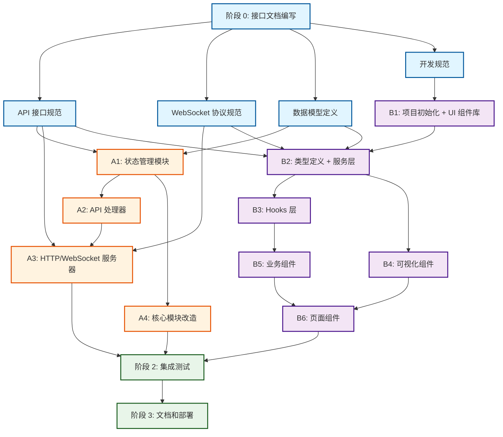

# Console 实现计划 - 并行开发方案

## 1. 依赖关系分析

### 1.1 核心依赖识别

**前端依赖后端的内容**:
- API 接口定义（URL、请求/响应格式）
- WebSocket 事件格式
- 数据模型类型定义

**后端依赖前端的内容**:
- 无（后端独立实现）

**内部依赖关系**:

**后端内部**:
- API 处理器 → 状态管理模块（需要读取状态）
- WebSocket 服务 → 状态管理模块（需要监听状态变化）
- HTTP 服务器 → API 处理器（需要路由到处理器）
- 状态管理模块 → 核心模块改造（需要接收事件）

**前端内部**:
- 页面组件 → 业务组件 → UI 组件
- 业务组件 → Hooks → 服务层
- 服务层 → 类型定义

### 1.2 并行执行分析

**可以完全并行的任务组**:

**组 A - 后端开发**（共享接口文档后）:
- A1: 状态管理模块实现
- A2: API 处理器实现
- A3: HTTP/WebSocket 服务器实现
- A4: 核心模块改造（事件发射）

**组 B - 前端开发**（共享接口文档后）:
- B1: 项目初始化 + UI 组件库
- B2: 类型定义 + 服务层
- B3: Hooks 层
- B4: 可视化组件
- B5: 业务组件
- B6: 页面组件

**必须串行的任务**:
1. **阶段 0**: 接口文档编写（必须最先完成）
2. **阶段 1**: 后端组 A 和前端组 B 并行开发
3. **阶段 2**: 集成测试（必须等待阶段 1 完成）

### 1.3 共享信息需求

在并行开发之前，需要统一以下信息：

1. **API 接口规范**
   - HTTP 端点定义
   - 请求/响应格式
   - 错误码定义

2. **WebSocket 协议规范**
   - 连接 URL
   - 事件类型定义
   - 消息格式

3. **数据模型定义**
   - Employee, Message, Task, Memory, Event 等类型
   - 状态枚举值

4. **开发规范**
   - 代码风格
   - 命名约定
   - 提交规范

### 1.4 依赖关系图

**图例说明**:
- 🔵 蓝色：阶段 0（接口文档）
- 🟠 橙色：后端开发轨道（Track A）
- 🟣 紫色：前端开发轨道（Track B）
- 🟢 绿色：集成测试和部署

**关键观察**:
1. 阶段 0 是所有任务的前置依赖
2. A1 完成后，A2 和 A4 可以并行
3. B2 完成后，B3 和 B4 可以并行
4. 后端轨道（A1-A4）（B1-B6）完全并行
5. 阶段 2 必须等待 A3、A4、B6 全部完成
---

## 2. 实施阶段划分

### 阶段 0: 接口文档编写（串行，1 天）

**目标**: 创建完整的接口规范文档，作为前后端并行开发的契约。

**任务清单**:
- [ ] 编写 API 接口规范文档
- [ ] 编写 WebSocket 协议规范文档
- [ ] 编写数据模型定义文档
- [ ] 编写开发规范文档

**产出物**:
- `docs/API-Spec.md` - API 接口规范
- `docs/WebSocket-Spec.md` - WebSocket 协议规范
- `docs/Data-Models.md` - 数据模型定义
- `DEVELOPMENT.md` - 前端开发规范

**验收标准**:
- [ ] 所有 API 端点都有完整的请求/响应示例
- [ ] 所有 WebSocket 事件都有完整的消息格式
- [ ] 所有数据模型都有 TypeScript 类型定义
- [ ] 前后端开发人员都确认文档清晰可执行

---

### 阶段 1: 并行开发（并行，3-4 天）

#### 1.1 后端开发轨道（Track A）

**A1: 状态管理模块**（1 天）

**任务**:
- [ ] 实现 `EmployeeRegistry` - 员工状态注册表
- [ ] 实现 `EventHistory` - 全局事件历史
- [ ] 实现 `StateManager` - 统一状态管理器
- [ ] 编写单元测试

**产出物**:
- `src/state/EmployeeRegistry.ts`
- `src/state/EventHistory.ts`
- `src/state/StateManager.ts`
- `src/state/index.ts`
- `tests/unit/EmployeeRegistry.test.ts`
- `tests/unit/EventHistory.test.ts`

**验收标准**:
- [ ] 所有测试通过
- [ ] 支持员工状态的增删改查
- [ ] 支持事件历史的记录和查询
- [ ] 线程安全（使用锁或原子操作）

---

**A2: API 处理器实现
**依赖**: A1 完成后开始

**任务**:
- [ ] 实现员工相关 API 处理器
- [ ] 实现消息相关 API 处理器
- [ ] 实现任务相关 API 处理器
- [ ] 实现事件相关 API 处理器
- [ ] 实现雇佣关系 API 处理器
- [ ] 编写单元测试

**产出物**:
- `src/api/employees.ts`
- `src/api/messages.ts`
- `src/api/tasks.ts`
- `src/api/events.ts`
- `src/api/hierarchy.ts`
- `src/api/index.ts`
- `tests/api/employees.test.ts`
- `tests/api/messages.test.ts`
- `tests/api/tasks.test.ts`

**验收标准**:
- [ ] 所有 API 处理器实现完整
- [ ] 返回格式符合接口文档
- [ ] 错误处理完善
- [ ] 所有测试通过

---

**A3: HTTP/WebSocket 服务器**（1.5 天）

**依赖**: 可与 A1/A2 并行，最后集成

**任务**:
- [ ] 实现 HTTP 服务器（Bun.serve）
- [ ] 实现路由分发器
- [ ] 实现 WebSocket 连接管理
- [ ] 实现事件推送机制
- [ ] 实现 CORS 配置
- [ ] 编写集成测试

**产出物**:
- `src/server/index.ts`
- `src/server/router.ts`
- `src/server/websocket.ts`
- `src/server/types.ts`
- `tests/integration/server.test.ts`

**验收标准**:
- [ ] HTTP 服务器正常启动（端口 4097）
- [ ] 所有路由正确分发
- [ ] WebSocket 连接正常建立
- [ ] 事件推送实时生效
- [ ] CORS 配置正确

---

**A4: 核心模块改造**（1 天）

**依赖**: A1 完成后开始

**任务**:
- [ ] 修改 `MessageService` 添加事件发射
- [ ] 修改 `MemoryManager` 添加事件发射
- [ ] 修改 `EventLoop` 添加状态更新
- [ ] 修改 `src/index.ts` 启动 HTTP/WebSocket 服务器
- [ ] 更新相关测试

**产出物**:
- 修改 `src/core/MessageService.ts`
- 修改 `src/core/MemoryManager.ts`
- 修改 `src/core/EventLoop.ts`
- 修改 `src/index.ts`
- 更新 `tests/unit/MessageService.test.ts`
- 更新 `tests/unit/MemoryManager.test.ts`
- 更新 `tests/unit/EventLoop.test.ts`

**验收标准**:
- [ ] 所有事件正确发射到 StateManager
- [ ] 员工状态实时更新
- [ ] 不影响现有功能
- [ ] 所有测试通过

---

#### 1.2 前端开发轨道（Track B）

**B1: 项目初始化 + UI 组件库**（0.5 天）

**任务**:
- [ ] 创建 Vite + React + TypeScript 项目
- [ ] 配置 Tailwind CSS
- [ ] 配置 shadcn/ui
- [ ] 安装必要依赖（D3.js, React Router 等）
- [ ] 初始化 shadcn/ui 组件（Button, Card, Table 等）

**产出物**:
- `console/package.json`
- `console/vite.config.ts`
- `console/tsconfig.json`
- `console/tailwind.config.js`
- `console/components.json`
- `console/src/components/ui/*` - shadcn/ui 组件

**验收标准**:
- [ ] `bun run dev` 正常启动
- [ ] Tailwind CSS 样式生效
- [ ] shadcn/ui 组件可用

---

**B2: 类型定义 + 服务层**（1 天）

**依赖**: B1 完成后开始

**任务**:
- [ ] 根据接口文档定义 TypeScript 类型
- [ ] 实现 HTTP API 客户端
- [ ] 实现 WebSocket 客户端
- [ ] 实现错误处理

**产出物**:
- `console/src/types/index.ts`
- `console/src/services/api.ts`
- `console/src/services/websocket.ts`

**验收标准**:
- [ ] 类型定义与接口文档一致
- [ ] API 客户端支持所有端点
- [ ] WebSocket 客户端支持连接和事件监听
- [ ] 错误处理完善

---

**B3: Hooks 层**（1 天）

**依赖**: B2 完成后开始

**任务**:
- [ ] 实现 `useWebSocket` - WebSocket 连接管理
- [ ] 实现 `useEmployees` - 员工数据管理
- [ ] 实现 `useMessages` - 消息数据管理
- [ ] 实现 `useTasks` - 任务数据管理
- [ ] 实现 `useEvents` - 事件数据管理

**产出物**:
- `console/src/hooks/useWebSocket.ts`
- `console/src/hooks/useEmployees.ts`
- `console/src/hooks/useMessages.ts`
- `console/src/hooks/useTasks.ts`
- `console/src/hooks/useEvents.ts`

**验收标准**:
- [ ] 所有 Hooks 正确封装数据获取逻辑
- [ ] 支持实时更新（通过 WebSocket）
- [ ] 支持加载状态和错误处理

---

**B4: 可视化组件**（1.5 天）

**依赖**: B2 完成后开始（可与 B3 并行）

**任务**:
- [ ] 实现 `HierarchyTree` - D3.js 雇佣关系树状图
- [ ] 实现 `TaskDAG` - D3.js 任务依赖图
- [ ] 实现交互功能（点击、悬停、缩放）
- [ ] 实现状态颜色映射

**产出物**:
- `console/src/components/visualizations/HierarchyTree.tsx`
- `console/src/components/visualizations/TaskDAG.tsx`

**验收标准**:
- [ ] 树状图正确渲染雇佣关系
- [ ] 任务 DAG 正确渲染依赖关系
- [ ] 节点颜色正确反映状态
- [ ] 交互功能正常

---

**B5: 业务组件**（1.5 天）

**依赖**: B3 完成后开始

**任务**:
- [ ] 实现 `GlobalStats` - 全局统计卡片
- [ ] 实现 `EventStream` - 实时事件流
- [ ] 实现 `EmployeeCard` - 员工信息卡片
- [ ] 实现 `MessageList` - 消息列表
- [ ] 实现 `TaskList` - 任务列表
- [ ] 实现 `MemoryView` - 记忆展示
- [ ] 实现 `AgentList` - Agent 执行记录
- [ ] 实现 `EventTimeline` - 事件时间线

**产出物**:
- `console/src/components/dashboard/GlobalStats.tsx`
- `console/src/components/dashboard/EventStream.tsx`
- `console/src/components/employee/EmployeeCard.tsx`
- `console/src/components/employee/MessageList.tsx`
- `console/src/components/employee/TaskList.tsx`
- `console/src/components/employee/MemoryView.tsx`
- `console/src/components/employee/AgentList.tsx`
- `console/src/components/employee/EventTimeline.tsx`

**验收标准**:
- [ ] 所有组件正确展示数据
- [ ] 样式符合设计要求
- [ ] 支持实时更新

---

**B6: 页面组件**（1 天）

**依赖**: B4, B5 完成后开始

**任务**:
- [ ] 实现 `Overview` - 总仪表盘页面
- [ ] 实现 `EmployeeDetail` - 员工详情页面
- [ ] 实现路由配置
- [ ] 实现页面布局

**产出物**:
- `console/src/pages/Overview.tsx`
- `console/src/pages/EmployeeDetail.tsx`
- `console/src/App.tsx`
- `console/src/main.tsx`

**验收标准**:
- [ ] 页面正确组合所有组件
- [ ] 路由跳转正常
- [ ] 布局响应式

---

### 阶段 2: 集成测试（串行，1-2 天）

**依赖**: 阶段 1 所有任务完成

**任务**:
- [ ] 启动后端服务器
- [ ] 启动前端开发服务器
- [ ] 测试所有 API 端点
- [ ] 测试 WebSocket 实时更新
- [ ] 测试完整用户场景
- [ ] 修复发现的问题
- [ ] 性能测试和优化

**测试场景**:
1. 总仪表盘加载和实时更新
2. 员工详情页加载和实时更新
3. 消息发送和接收
4. 任务状态变化
5. Agent 执行状态变化
6. 雇佣关系树状图交互
7. 任务 DAG 图交互

**验收标准**:
- [ ] 所有 API 端点正常工作
- [ ] WebSocket 实时推送正常
- [ ] 所有页面正常渲染
- [ ] 所有交互功能正常
- [ ] 无明显性能问题
- [ ] 无控制台错误

---

### 阶段 3: 文档和部署（串行，0.5 天）

**依赖**: 阶段 2 完成

**任务**:
- [ ] 编写 Console 使用文档
- [ ] 更新主 README
- [ ] 编写部署指南
- [ ] 录制演示视频（可选）

**产出物**:
- `console/README.md`
- 更新 `README.md`
- `docs/Deployment.md`

**验收标准**:
- [ ] 文档清晰完整
- [ ] 部署步骤可执行

---

## 3. 并行开发协调机制

### 3.1 任务分配建议

**后端开发者**:
- 负责 Track A（A1 → A2 → A3 → A4）
- 预计工作量：3-4 天

**前端开发者**:
- 负责 Track B（B1 → B2 → B3 → (B4 || B5) → B6）
- 预计工作量：3-4 天

**如果只有一个开发者**:
- 先完成阶段 0（接口文档）
- 然后选择一个轨道完成（建议先后端再前端）
- 预计工作量：6-8 天

### 3.2 沟通机制

**每日同步**:
- 每天结束时同步进度
- 讨论接口变更需求
- 解决阻塞问题

**接口变更流程**:
1. 提出变更需求
2. 更新接口文档
3. 通知对方开发者
4. 双方确认后实施

### 3.3 版本控制策略

**分支策略**:
- `main` - 主分支
- `feature/console-backend` - 后端开发分支
- `feature/console-frontend` - 前端开发分支

**合并策略**:
- 阶段 1 完成后，先合并后端分支
- 然后合并前端分支
- 解决冲突后进入阶段 2

---

## 4. 风险评估和缓解

### 4.1 风险识别

| 风险 | 等级 | 影响 | 缓解措施 |
|------|------|------|----------|
| 接口文档不完整 | 高 | 前后端对接失败 | 阶段 0 充分讨论，双方确认 |
| WebSocket 连接不稳定 | 中 | 实时更新失败 | 添加重连机制和心跳检测 |
| D3.js 学习曲线 | 中 | 可视化组件延期 | 提前学习，准备备选方案（Mermaid） |
| 性能问题 | 中 | 大量数据时卡顿 | 添加分页、虚拟滚动、防抖 |
| 跨域问题 | 低 | API 调用失败 | 正确配置 CORS |

### 4.2 应急预案

**如果阶段 1 超时**:
- 优先完成核心功能（总仪表盘 + 员工详情）
- 延后次要功能（可视化图表）

**如果集成测试发现重大问题**:
- 回退到阶段 1 修复
- 重新进行集成测试

---

## 5. 时间估算

### 5.1 理想情况（双人并行）

| 阶段 | 时间 | 累计 |
|------|------|------|
| 阶段 0: 接口文档 | 1 天 | 1 天 |
| 阶段 1: 并行开发 | 3-4 天 | 4-5 天 |
| 阶段 2: 集成测试 | 1-2 天 | 5-7 天 |
| 阶段 3: 文档部署 | 0.5 天 | 5.5-7.5 天 |

**总计**: 5.5-7.5 天（双人并行）

### 5.2 单人开发

| 阶段 | 时间 | 累计 |
|------|------|------|
| 阶段 0: 接口文档 | 1 天 | 1 天 |
| 阶段 1A: 后端开发 | 3-4 天 | 4-5 天 |
| 阶段 1B: 前端开发 | 3-4 天 | 7-9 天 |
| 阶段 2: 集成测试 | 1-2 天 | 8-11 天 |
| 阶段 3: 文档部署 | 0.5 天 | 8.5-11.5 天 |

**总计**: 8.5-11.5 天（单人串行）

---

## 6. 成功标准

### 6.1 功能完整性

- [ ] 所有 API 端点实现并测试通过
- [ ] 所有 WebSocket 事件正常推送
- [ ] 总仪表盘所有功能正常
- [ ] 员工详情页所有功能正常
- [ ] 实时更新正常工作

### 6.2 代码质量

- [ ] TypeScript 编译无错误
- [ ] 所有测试通过（后端）
- [ ] 代码格式化完成（Prettier）
- [ ] 遵循项目代码规范

### 6.3 用户体验

- [ ] 页面加载时间 < 2 秒
- [ ] WebSocket 延迟 < 100ms
- [ ] 无明显 UI 卡顿
- [ ] 响应式设计正常

### 6.4 文档完整性

- [ ] 接口文档完整
- [ ] 使用文档清晰
- [ ] 部署文档可执行

---

## 7. 下一步行动

### 立即开始

1. **创建阶段 0 的文档**（优先级最高）
   - API 接口规范
   - WebSocket 协议规范
   - 数据模型定义
   - 开发规范

2. **准备开发环境**
   - 确认 Bun 版本
   - 安装必要工具
   - 创建分支

3. **分配任务**
   - 确定开发人员
   - 分配 Track A 和 Track B

### 开始阶段 1

等待阶段 0 完成并双方确认后，立即开始并行开发。

---

## 8. 附录

### 8.1 技术栈总结

**后端**:
- Bun.serve (HTTP/WebSocket 服务器)
- TypeScript
- YAML (数据存储)

**前端**:
- React 18
- TypeScript
- Vite
- Tailwind CSS
- shadcn/ui
- D3.js
- React Router

### 8.2 参考资料

- [Console 需求文档](../REQUIREMENTS.md)
- [主需求文档](../../REQUIREMENTS.md)
- [Bun.serve 文档](https://bun.sh/docs/api/http)
- [shadcn/ui 文档](https://ui.shadcn.com/)
- [D3.js 文档](https://d3js.org/)
