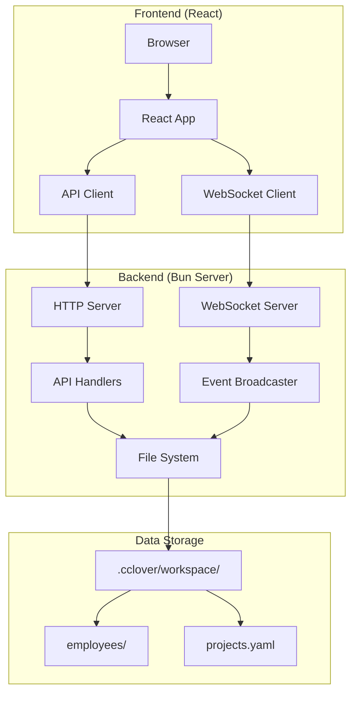
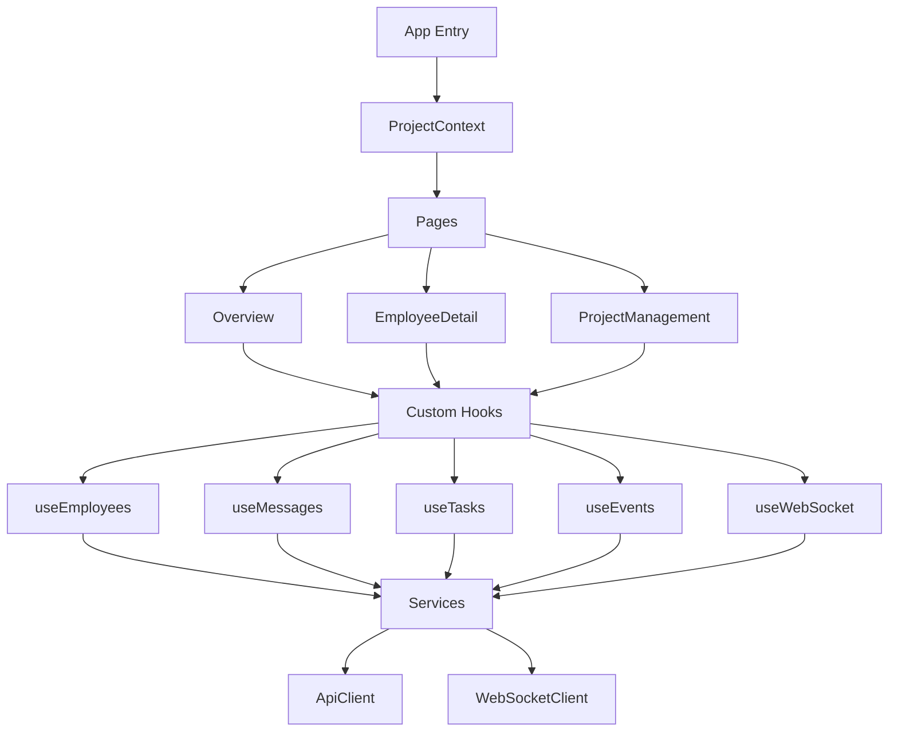
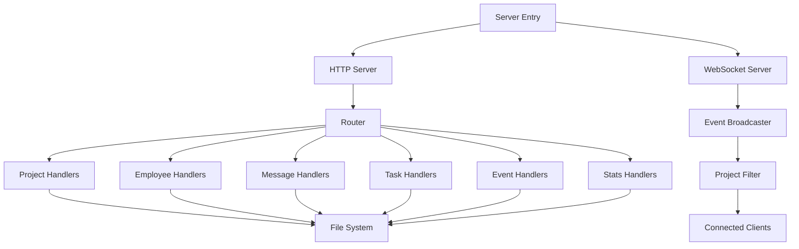

# Architecture

## System Architecture

Console is a web-based management interface for the opencode-cclover multi-agent collaboration system. It provides real-time monitoring and visualization of employee status, message history, task execution, and system events.

### High-Level Architecture



### Architecture Principles1. **Separation of Concerns**: Frontend and backend are decoupled via HTTP/WebSocket APIs
2. **Real-time Updates**: WebSocket for push-based event streaming
3. **Multi-Project Support**: Single console instance manages multiple projects
4. **Stateless Backend**: All state persists in file system
5. **Type Safety**: Shared TypeScript types between frontend and backend

## Module Design

### Frontend Modules



#### Module Responsibilities

**Pages** (`src/pages/`):
- Route-level components
- Compose feature components
- Handle page-level state

**Components** (`src/components/`):
- Reusable UI components
- Feature-specific components (employee, dashboard, visualizations)
- UI primitives (shadcn/ui)

**Hooks** (`src/hooks/`):
- Data fetching and caching
- Real-time update subscriptions
- State management logic

**Services** (`src/services/`):
- HTTP API client
- WebSocket client
- External service integrations

**Contexts** (`src/contexts/`):
- Global state management
- Project selection state

**Types** (`src/types/`):
- TypeScript type definitions
- Shared with backend

### Backend Modules



#### Module Responsibilities

**HTTP Server**:
- RESTful API endpoints
- Request routing
- Response formatting
- Error handling

**WebSocket Server**:
- Real-time event streaming
- Connection management
- Heartbeat mechanism
- Project-based filtering

**File System Layer**:
- Read/write `.cclover/workspace/` data
- YAML parsing
- File locking (via proper-lockfile)

**Event System**:
- Event generation from file changes
- Event broadcasting to WebSocket clients
- Event filtering by project

## Technology Stack

### Frontend

- **Framework**: React 18.3
- **Language**: TypeScript 5.5
- **Build Tool**: Vite 5.4
- **UI Library**: shadcn/ui (Radix UI primitives)
- **Styling**: Tailwind CSS 3.4
- **HTTP Client**: Native Fetch API
- **WebSocket**: Native WebSocket API
- **Routing**: React Router 6.26
- **Visualization**: Mermaid 11.2

### Backend

- **Runtime**: Bun 1.1
- **Language**: TypeScript 5.5
- **HTTP Server**: Bun.serve
- **WebSocket**: Bun WebSocket API
- **File Format**: YAML (via yaml package)
- **File Locking**: proper-lockfile

### Development Tools

- **Package Manager**: Bun
- **Linter**: ESLint
- **Formatter**: Prettier
- **Type Checker**: TypeScript compiler

## Interface Design

### HTTP API Endpoints

**Base URL**: `http://localhost:4097/api`

#### Project Management

| Method | Endpoint | Description |
|--------|----------|-------------|
| GET | `/projects` | Get all projects |
| GET | `/candidate-projects` | Get candidate projects from workspace |
| POST | `/projects` | Add new project |
| POST | `/projects/update` | Update project settings |
| POST | `/projects/delete` | Delete project |

#### Employee Management

| Method | Endpoint | Description |
|--------|----------|-------------|
| GET | `/projects/:projectId/employees` | Get employee list |
| GET | `/projects/:projectId/employees/:name` | Get employee detail |
| GET | `/projects/:projectId/employees/hierarchy` | Get employee hierarchy tree |

#### Message Retrieval

| Method | Endpoint | Description |
|--------|----------|-------------|
| GET | `/projects/:projectId/employees/:name/messages` | Get message history |

Query parameters:
- `peer` (optional): Filter by conversation partner
- `limit` (optional): Limit number of messages (default: 50, max: 200)

#### Task Retrieval

| Method | Endpoint | Description |
|--------|----------|-------------|
| GET | `/projects/:projectId/employees/:name/tasks` | Get task list and executable tasks |

#### Event Retrieval

| Method | Endpoint | Description |
|--------|----------|-------------|
| GET | `/projects/:projectId/events` | Get event history |

Query parameters:
- `limit` (optional): Limit number of events (default: 50, max: 200)
- `employeeName` (optional): Filter by employee

#### Statistics

| Method | Endpoint | Description |
|--------|----------|-------------|
| GET | `/projects/:projectId/stats` | Get global statistics |

#### Health Check

| Method | Endpoint | Description |
|--------|----------|-------------|
| GET | `/health` | Check service health |

### API Response Format

All API responses follow a unified format:

**Success Response**:
```json
{
  "success": true,
  "data": { ... }
}
```

**Error Response**:
```json
{
  "success": false,
  "error": {
    "code": "ERROR_CODE",
    "message": "Error description"
  }
}
```

### Error Codes

| Code | HTTP Status | Description |
|------|-------------|-------------|
| `EMPLOYEE_NOT_FOUND` | 404 | Employee does not exist |
| `PROJECT_NOT_FOUND` | 404 | Project does not exist |
| `INVALID_PARAMETER` | 400 | Invalid request parameter |
| `INTERNAL_ERROR` | 500 | Internal server error |
| `FILE_READ_ERROR` | 500 | File read failed |
| `FILE_WRITE_ERROR` | 500 | File write failed |

### WebSocket Protocol

**Connection URL**: `ws://localhost:4097/ws`

#### Message Format

**Client → Server (Heartbeat)**:
```json
{
  "type": "ping"
}
```

**Server → Client (Heartbeat)**:
```json
{
  "type": "pong"
}
```

**Server → Client (Event)**:
```json
{
  "type": "event",
  "data": {
    "projectId": "project-123",
    "type": "employee_status_changed",
    "timestamp": "2026-03-02T10:00:00.000Z",
    "employeeName": "calculator",
    "details": { ... }
  }
}
```

#### Connection Lifecycle

1. **Connect**: Client establishes WebSocket connection
2. **Heartbeat**: Client sends `ping` every 30 seconds
3. **Timeout**: Server closes connection if no `ping` received for 60 seconds
4. **Reconnect**: Client reconnects with exponential backoff (max 10 attempts)

#### Event Filtering

- Server broadcasts all events to all connected clients
- Client filters events by `projectId` to match current project
- Only events matching current project are processed

## Data Design

### Data Models

All data models are defined in TypeScript and shared between frontend and backend.

#### Project Types

```typescript
export interface Project {
  projectId: string       // Unique project identifier
  projectName: string     // Display name
  directory: string       // Absolute path to .cclover/workspace
}

export interface CandidateProject {
  path: string           // Absolute path to workspace
  firstSeenAt: string    // ISO 8601 timestamp
  lastSeenAt: string     // ISO 8601 timestamp
  seenCount: number      // Number of times seen
}
```

#### Employee Types

```typescript
export type EmployeeStatus = "active" | "idle" | "error" | "inactive"

export interface Employee {
  name: string           // Unique employee identifier
  role: string           // Role name
  status: EmployeeStatus // Current status
  createdAt: string      // ISO 8601 timestamp
  lastActiveAt: string   // ISO 8601 timestamp
  hiredBy?: string       // Parent employee name (null for root)
}

export interface EmployeeDetail extends Employee {
  memory: Memory         // Employee memory
  tasks: Task[]          // Task list
  agents: AgentExecution[] // Agent execution records
}

export interface EmployeeHierarchy {
  name: string           // Employee name
  role: string           // Role name
  status: EmployeeStatus // Current status
  children: EmployeeHierarchy[] // Child employees (recursive)
}
```

#### Message Types

```typescript
export type MessageDirection = "send" | "receive"

export interface Message {
  timestamp: string      // ISO 8601 timestamp
  from: string           // Sender name
  to: string             // Receiver name
  content: string        // Message content
  direction: MessageDirection // Relative to current employee
}
```

#### Task Types

```typescript
export type TaskStatus = "pending" | "in_progress" | "completed" | "cancelled"

export interface Task {
  name: string           // Unique task identifier
  status: TaskStatus     // Current status
  description: string    // Task description
  result?: string        // Task result (when completed)
  dependencies: string[] // Dependent task names
  created: string        // ISO 8601 timestamp
  completed?: string     // ISO 8601 timestamp (optional)
}

export interface TasksResponse {
  tasks: Task[]          // All tasks
  executableTasks: string[] // Tasks with satisfied dependencies
}
```

#### Memory Types

```typescript
export interface Memory {
  knowledge: string[]    // Experience knowledge list
  custom: Record<string, unknown> // Custom fields (JSON object)
}
```

#### Agent Execution Types

```typescript
export type AgentStatus = "running" | "completed" | "failed"

export interface AgentExecution {
  agentId: string        // Agent ID
  taskName: string       // Associated task name
  status: AgentStatus    // Execution status
  createdAt: string      // ISO 8601 timestamp
  completedAt?: string   // ISO 8601 timestamp (optional)
  result?: string        // Execution result (optional)
}
```

#### Event Types

```typescript
export type EventType =
  | "message"                  // Message event
  | "task_completed"           // Task completed
  | "task_failed"              // Task failed
  | "agent_completed"          // Agent completed
  | "agent_failed"             // Agent failed
  | "timer"                    // Timer event
  | "employee_hired"           // Employee hired
  | "employee_status_changed"  // Employee status changed
  | "message_sent"             // Message sent
  | "message_received"         // Message received
  | "task_updated"             // Task updated
  | "agent_updated"            // Agent updated

export interface Event {
  projectId: string      // Project identifier
  type: EventType        // Event type
  timestamp: string      // ISO 8601 timestamp
  employeeName?: string  // Related employee (optional)
  details: Record<string, unknown> // Event details (JSON object)
}
```

#### API Response Types

```typescript
export interface SuccessResponse<T> {
  success: true
  data: T
}

export interface ErrorResponse {
  success: false
  error: {
    code: string         // Error code
    message: string      // Error message
  }
}
```

#### WebSocket Types

```typescript
export type ConnectionStatus =
  | "connecting"
  | "connected"
  | "disconnected"
  | "error"

export interface WebSocketMessage {
  type: "event"
  data: Event
}
```

### Data Storage

#### File System Structure

```
.cclover/workspace/
├── projects.yaml              # Project registry
└── employees/
    └── {employeeName}/
        ├── messages/
        │   └── {peerName}.yaml  # Message history with peer
        └── memory.yaml          # Employee memory (knowledge, tasks, custom)
```

#### Project Registry Format

**File**: `.cclover/workspace/projects.yaml`

```yaml
projects:
  - projectId: "project-123"
    projectName: "My Project"
    directory: "/path/to/project/.cclover/workspace"
    enabled: true
    addedAt: "2026-03-02T10:00:00.000Z"
```

#### Message File Format

**File**: `.cclover/workspace/employees/{name}/messages/{peer}.yaml`

```yaml
messages:
  - timestamp: "2026-03-02T10:00:00.000Z"
    from: "alice"
    to: "calculator"
    content: "Calculate 1+1"
  - timestamp: "2026-03-02T10:00:05.000Z"
    from: "calculator"
    to: "alice"
    content: "Result is 2"
```

#### Memory File Format

**File**: `.cclover/workspace/employees/{name}/memory.yaml`

```yaml
knowledge:
  - "alice often asks math questions"
  - "bob prefers concise answers"

tasks:
  - name: "Calculate 1+1"
    status: "completed"
    description: "Calculate 1+1 for alice"
    result: "2"
    dependencies: []
    created: "2026-03-02T10:00:00.000Z"
    completed: "2026-03-02T10:00:05.000Z"

custom:
  preferences:
    language: "zh-CN"
    timezone: "Asia/Shanghai"
```

### Data Validation

#### Time Format

All timestamps use ISO 8601 format:
- Format: `YYYY-MM-DDTHH:mm:ss.sssZ`
- Example: `"2026-03-02T10:00:00.000Z"`
- Timezone: UTC (Z suffix)

#### String Length Limits

| Field | Max Length |
|-------|------------|
| `Employee.name` | 100 |
| `Employee.role` | 100 |
| `Message.content` | 10000 |
| `Task.name` | 200 |
| `Task.description` | 2000 |
| `Task.result` | 5000 |

#### Array Length Limits

| Field | Max Length |
|-------|------------|
| `Memory.knowledge` | 1000 |
| `Task.dependencies` | 50 |

---

**Version**: 1.0  
**Last Updated**: 2026-03-02  
**Status**: Living Document
