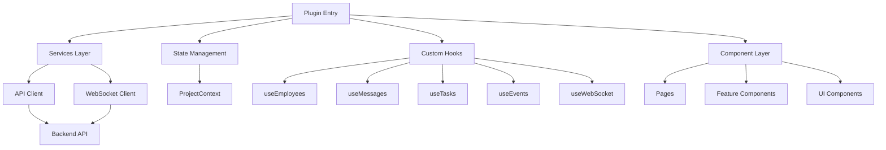
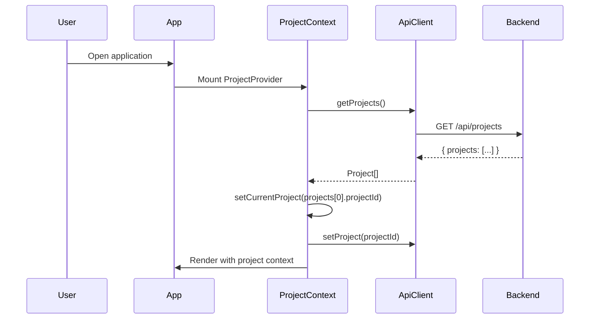
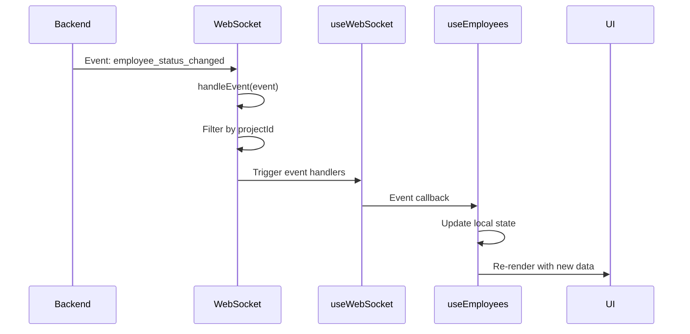
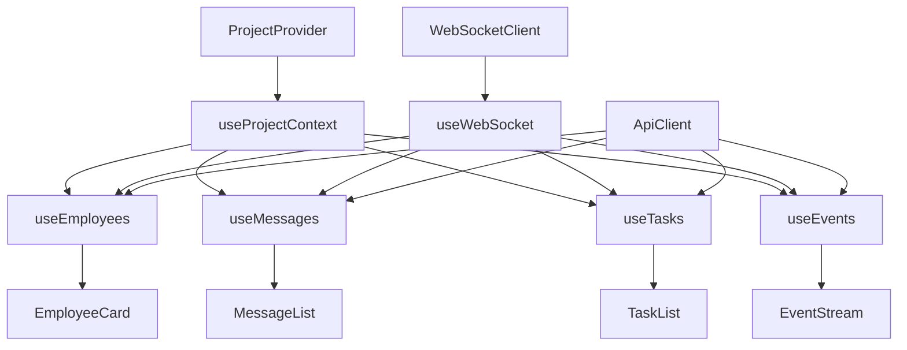

# Design

## Overview

This document describes the detailed design of the Console frontend implementation. The design follows the architecture specified in [Architecture](./architecture.md) and implements the requirements from [Requirements](./requirements.md).

**Module Purpose**: Provide a web-based management interface for real-time monitoring and visualization of the opencode-cclover multi-agent collaboration system.

**Scope**: This design covers the entire Console frontend including services layer, state management, custom hooks, components, and integration patterns.

## Architecture Reference

Implements the Console frontend architecture described in [Architecture - Frontend Modules](./architecture.md#frontend-modules).

**System Architecture**:

**Key Design Principles**:

- **Separation of Concerns**: Clear boundaries between services, state, hooks, and components
- **Real-time Updates**: WebSocket-based event streaming with automatic reconnection
- **Type Safety**: Shared TypeScript types between frontend and backend
- **Performance**: Memoization, lazy loading, virtual scrolling for large datasets
- **Error Resilience**: Comprehensive error handling at all layers

## Module Design

The Console frontend is organized into the following modules:

### Services Layer

Handles external communication with backend API and WebSocket server.

**Detailed Design**: [Services Layer Design](./design-services.md)

**Modules**:

- **API Client**: HTTP client for REST API interactions
- **WebSocket Client**: Real-time event streaming with reconnection and filtering

### State Management Layer

Manages global application state and context.

**Detailed Design**: [State Management and Custom Hooks Design](./design-state-hooks.md)

**Modules**:

- **ProjectContext**: Global project selection state
- **Custom Hooks**: Data fetching and real-time update hooks

### Component Layer

UI components organized by feature and reusability.

**Detailed Design**: [Component Layer Design](./design-components.md)

**Modules**:

- **Pages**: Route-level components (Overview, EmployeeDetail, ProjectManagement)
- **Feature Components**: Employee, dashboard, visualization components
- **UI Components**: Reusable UI primitives (shadcn/ui)

### Integration Patterns

Common patterns for API integration, error handling, and performance optimization.

**Detailed Design**: [Integration Patterns and Optimization](./design-patterns.md)

**Topics**:

- API Integration Patterns (initial load + real-time, polling, on-demand)
- Error Handling (API errors, WebSocket errors, error boundaries)
- Performance Optimization (memoization, lazy loading, virtual scrolling, debouncing)

### Event Timeline Display

Visual representation of employee lifecycle events embedded in message timeline.

**Detailed Design**: [Event Timeline Display Design](./design-event-timeline.md)

**Topics**:

- Event display components (EventItem, Timeline)
- Timeline merging logic (messages + events)
- Visual styling (QQ-style system messages)
- Real-time event updates

### Testing Strategy

Comprehensive testing approach covering unit, integration, and E2E tests.

**Detailed Design**: [Testing Strategy](./design-testing.md)

**Topics**:

- Unit Tests (hooks, services)
- Integration Tests (component + hook integration)
- E2E Tests (complete user workflows)

## Data Flow

### Initial Load Flow

### Real-time Update Flow

### Component Data Flow

## Future Enhancements

### Planned Features

1. **Message Sending**: UI for sending messages to employees
2. **Task Management**: UI for creating/editing tasks
3. **Employee Creation**: UI for hiring new employees
4. **Advanced Filtering**: Filter messages, tasks, events by criteria
5. **Export Functionality**: Export data to JSON/CSV
6. **Dark Mode**: Theme switching support

### Performance Improvements

1. **Virtual Scrolling**: For large message/event lists (10000+ items)
2. **Pagination**: Server-side pagination for large datasets
3. **Caching Layer**: IndexedDB for offline support
4. **Optimistic Updates**: Immediate UI feedback for actions

---

**Version**: 1.0  
**Last Updated**: 2026-03-02  
**Status**: Living Document
