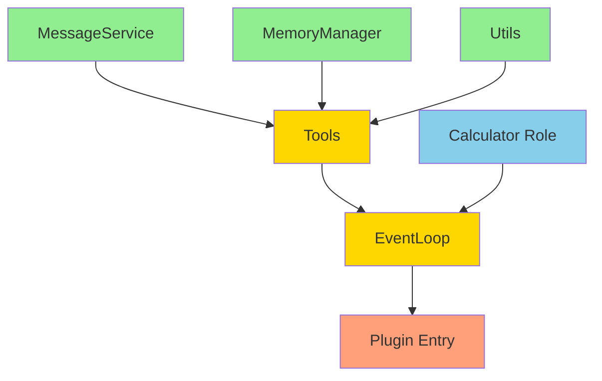

# 实现计划文档 (Implementation Plan)

## 1. 概述

本文档规划从当前状态（简单的 hello world 插件）到完整的多 Agent 协作系统的实现路径。

### 1.1 当前状态

- ✅ 基础插件框架（Plugin 入口）
- ✅ Logger 工具
- ✅ Background task 基础结构
- ❌ 核心业务逻辑（消息、记忆、事件循环等）

### 1.2 目标状态

- ✅ 完整的消息服务（MessageService）
- ✅ 记忆管理系统（MemoryManager）
- ✅ 事件循环（EventLoop）
- ✅ 工具系统（send_message, edit_tasks, create_agent）
- ✅ Calculator 角色
- ✅ 端到端测试通过

---

## 2. 依赖关系分析

### 2.1 模块依赖图



**图例**：
- 🟢 绿色：基础设施层（可并行）
- 🟡 黄色：核心逻辑层（依赖基础设施）
- 🔵 蓝色：配置层（随时可定义）
- 🟠 橙色：集成层（最后实现）

### 2.2 依赖关系表

| 模块 | 依赖 | 可并行 |
|------|------|--------|
| MessageService | 无 | ✅ |
| MemoryManager | 无 | ✅ |
| Utils (Mermaid, Context) | 无 | ✅ |
| Tools | MessageService, MemoryManager | ❌ |
| EventLoop | Tools, MessageService, MemoryManager | ❌ |
| Calculator Role | 无（只是配置） | ✅ |
| Plugin Entry | EventLoop | ❌ |

---

## 3. 实现阶段

### 阶段 1：基础设施层（并行开发）

**目标**：实现独立的基础模块，为核心逻辑提供支撑。

**时间估计**：2-3 天

#### 任务 1.1：MessageService（可并行）

**文件**：`src/core/MessageService.ts`

**功能**：
- 消息文件读写（YAML）
- 消息同步机制
- 未读消息队列管理
- MessageClient API（recv, send, history）

**输入/输出**：
- 输入：员工名称、对方名称、消息内容
- 输出：MessageClient 实例

**测试**：
- 单元测试：消息读写、队列管理
- 集成测试：双方消息同步

**风险**：
- 🟡 中等：文件并发写入冲突（需要加锁）
- 🟢 低：YAML 格式解析错误

**依赖**：无

---

#### 任务 1.2：MemoryManager（可并行）

**文件**：`src/core/MemoryManager.ts`

**功能**：
- 记忆文件读写（YAML）
- DAG 任务依赖分析
- 可执行任务计算
- 记忆更新接口

**输入/输出**：
- 输入：员工名称、记忆数据
- 输出：Memory 对象、可执行任务列表

**测试**：
- 单元测试：DAG 计算、任务状态更新
- 边界测试：循环依赖检测

**风险**：
- 🟡 中等：DAG 算法复杂度（需要拓扑排序）
- 🟢 低：记忆文件格式错误

**依赖**：无

---

#### 任务 1.3：工具系统基础框架（可并行）

**文件**：`src/tools/index.ts`

**功能**：
- 工具注册机制
- 工具权限管理（预留）
- 工具类型定义

**输入/输出**：
- 输入：工具定义
- 输出：OpenCode Plugin Tool 格式

**测试**：
- 单元测试：工具注册、类型检查

**风险**：
- 🟢 低：类型定义错误

**依赖**：无

---

#### 任务 1.4：工具辅助模块（可并行）

**文件**：
- `src/utils/MermaidGenerator.ts`
- `src/utils/ContextBuilder.ts`
- `src/utils/SessionRegistry.ts`
- `src/utils/AgentRegistry.ts`

**功能**：
- Mermaid 图生成（从 tasks 生成）
- 上下文构建（组装 prompt）
- Session 注册表（跟踪活跃 session）
- Agent 注册表（跟踪活跃 agent）

**输入/输出**：
- MermaidGenerator: tasks → Mermaid 字符串
- ContextBuilder: memory + event → prompt 字符串
- SessionRegistry: sessionId ↔ employeeName
- AgentRegistry: agentId ↔ taskName

**测试**：
- 单元测试：Mermaid 生成、上下文格式

**风险**：
- 🟢 低：字符串拼接错误

**依赖**：无

---

### 阶段 2：核心逻辑层（串行开发）

**目标**：实现核心业务逻辑，连接各个模块。

**时间估计**：3-4 天

**前置条件**：阶段 1 完成

#### 任务 2.1：实现具体工具

**文件**：
- `src/tools/SendMessageTool.ts`
- `src/tools/EditTasksTool.ts`
- `src/tools/CreateAgentTool.ts`

**功能**：
- send_message：调用 MessageService.send()
- edit_tasks：调用 MemoryManager.editTasks()
- create_agent：调用 OpencodeClient.session.create()

**输入/输出**：
- 输入：工具参数（args）
- 输出：工具执行结果（string）

**测试**：
- 单元测试：工具参数验证
- 集成测试：工具与 MessageService/MemoryManager 交互

**风险**：
- 🟡 中等：create_agent 的 session 管理复杂
- 🟢 低：参数验证错误

**依赖**：MessageService, MemoryManager, SessionRegistry, AgentRegistry

---

#### 任务 2.2：EventLoop 实现

**文件**：`src/core/EventLoop.ts`

**功能**：
- 事件等待机制（waitForEvent）
- Session 生命周期管理
- AI 调用和工具执行循环
- 记忆总结触发

**输入/输出**：
- 输入：员工名称、角色、MessageClient、MemoryManager、OpencodeClient
- 输出：持续运行的事件循环

**测试**：
- 单元测试：事件分发逻辑
- 集成测试：完整事件循环

**风险**：
- 🔴 高：事件循环死锁或无限等待
- 🟡 中等：Session 上下文爆炸
- 🟡 中等：工具调用循环处理

**依赖**：MessageService, MemoryManager, Tools, Utils

---

#### 任务 2.3：Calculator 角色定义

**文件**：`src/roles/Calculator.ts`

**功能**：
- 定义 Calculator 的 systemPrompt
- 定义行为模式

**输入/输出**：
- 输出：Role 对象

**测试**：
- 无需单独测试（在集成测试中验证）

**风险**：
- 🟢 低：Prompt 设计不当

**依赖**：无

---

### 阶段 3：集成测试（串行开发）

**目标**：集成所有模块，进行端到端测试。

**时间估计**：2-3 天

**前置条件**：阶段 2 完成

#### 任务 3.1：插件入口集成

**文件**：`src/index.ts`

**功能**：
- 初始化工作空间（.cclover/workspace）
- 初始化 MessageService
- 初始化 MemoryManager
- 启动 Calculator 员工
- 注册工具到 Plugin

**输入/输出**：
- 输入：PluginInput (ctx)
- 输出：Plugin 返回对象（tools）

**测试**：
- 集成测试：插件加载、员工启动

**风险**：
- 🟡 中等：插件初始化失败
- 🟡 中等：工作空间路径错误

**依赖**：所有模块

---

#### 任务 3.2：端到端测试

**测试场景**：

**场景 1：简单计算**
```
用户 -> calculator: "计算 1+1"
calculator -> 用户: "结果是 2"
```

**场景 2：多个请求**
```
用户 -> calculator: "计算 1+1"
用户 -> calculator: "计算 5*6"
calculator -> 用户: "结果是 2"
calculator -> 用户: "结果是 30"
```

**场景 3：复杂计算（使用 Agent）**
```
用户 -> calculator: "计算 (123+456)*789"
calculator 创建 Agent
Agent 完成 -> calculator 收到 AgentEvent
calculator -> 用户: "结果是 456831"
```

**场景 4：记忆总结**
```
多轮对话后，上下文达到阈值
触发记忆总结
验证 knowledge 更新
验证 session 关闭并重新创建
```

**测试方法**：
- 手动测试：在 OpenCode 中加载插件，发送消息
- 自动化测试（可选）：使用 SDK 模拟用户行为

**风险**：
- 🔴 高：端到端流程中断
- 🟡 中等：消息丢失或重复

**依赖**：所有模块

---

## 4. 任务并行性分析

### 4.1 可并行任务组

**组 1（阶段 1）**：
- 任务 1.1：MessageService
- 任务 1.2：MemoryManager
- 任务 1.3：工具系统基础框架
- 任务 1.4：工具辅助模块

**并行策略**：
- 可以由不同开发者同时开发
- 或者使用 subagent 并行实现

---

### 4.2 必须串行的任务

**串行链 1**：
```
阶段 1 完成 → 任务 2.1（具体工具） → 任务 2.2（EventLoop） → 任务 3.1（插件集成） → 任务 3.2（端到端测试）
```

**原因**：
- 工具依赖 MessageService 和 MemoryManager
- EventLoop 依赖工具
- 插件集成依赖 EventLoop
- 测试依赖完整系统

---

## 5. 风险管理

### 5.1 高风险项

| 风险 | 影响 | 缓解措施 |
|------|------|----------|
| EventLoop 死锁 | 系统无法运行 | 1. 添加超时机制<br>2. 详细日志<br>3. 单元测试覆盖 |
| 消息并发冲突 | 消息丢失或重复 | 1. 文件锁机制<br>2. 原子写入<br>3. 重试机制 |
| Session 上下文爆炸 | 性能下降或崩溃 | 1. 设置合理阈值<br>2. 及时总结<br>3. 监控 token 数 |
| 端到端测试失败 | 无法验证系统 | 1. 分阶段测试<br>2. 详细日志<br>3. 回滚机制 |

### 5.2 中风险项

| 风险 | 影响 | 缓解措施 |
|------|------|----------|
| DAG 算法错误 | 任务执行顺序错误 | 1. 单元测试<br>2. 边界测试<br>3. 可视化验证 |
| 工具参数验证错误 | AI 调用失败 | 1. 使用 Zod schema<br>2. 详细错误信息 |
| Prompt 设计不当 | AI 行为异常 | 1. 迭代优化<br>2. 添加示例 |

---

## 6. 实现顺序建议

### 6.1 推荐顺序（单人开发）

```
第 1 周：
  Day 1-2: 任务 1.1 (MessageService)
  Day 3-4: 任务 1.2 (MemoryManager)
  Da.3 + 1.4 (工具框架和辅助模块)

第 2 周：
  Day 1-2: 任务 2.1 (具体工具实现)
  Day 3-5: 任务 2.2 (EventLoop)

第 3 周：
  Day 1-2: 任务 3.1 (插件集成)
  Day 3-5: 任务 3.2 (端到端测试和调试)
```

### 6.2 推荐顺序（多人/Subagent 并行）

```
第 1 周：
  并行启动：
    - Subagent A: 任务 1.1 (MessageService)
    - Subagent B: 任务 1.2 (MemoryManager)
    - Subagent C: 任务 1.3 + 1.4 (工具框架和辅助模块)
  
  Day 1-3: 等待并行任务完成
  Day 4-5: 集成测试阶段 1 模块

第 2 周：
  串行执行：
    Day 1-2: 任务 2.1 (具体工具)
    Day 3-5: 任务 2.2 (EventLoop)

第 3 周：
  串行执行：
    Day 1-2: 任务 3.1 (插件集成)
    Day 3-5: 任务 3.2 (端到端测试)
```

---

## 7. 验收标准

### 7.1 阶段 1 验收

- [ ] MessageService 单元测试通过
- [ ] MemoryManager 单元测试通过
- [ ] 工具框架可以注册工具
- [ ] Mermaid 生成器输出正确格式
- [ ] 上下文构建器输出完整 prompt

### 7.2 阶段 2 验收

- [ ] 所有工具可以正常调用
- [ ] EventLoop 可以启动并等待事件
- [ ] Calculator 角色定义完整

### 7.3 阶段 3 验收

- [ ] 插件可以在 OpenCode 中加载
- [ ] 场景 1（简单计算）测试通过
- [ ] 场景 2（多个请求）测试通过
- [ ] 场景 3（复杂计算）测试通过
- [ ] 场景 4（记忆总结）测试通过
- [ ] 无内存泄漏或死锁

---

## 8. 技术决策

### 8.1 文件锁机制

**问题**：多个员工同时写入消息文件可能冲突。

**方案**：
- 使用 `proper-lockfile` 库
- 写入前加锁，写入后释放
- 超时机制（5 秒）

### 8.2 事件等待机制

**问题**：如何高效等待多种事件源。

**方案**：
- 使用 `Promise.race()` 并发等待
- 消息：通过 EventEmitter 通知
- Agent 完成：通过 OpenCode Event 订阅
- 定时器：使用 `setTimeout`

### 8.3 记忆总结触发

**问题**：何时触发记忆总结。

**方案**：
- 阈值：10000 tokens 或 20 轮对话
- 总结后关闭 session
- 下次事件创建新 session

### 8.4 工作空间路径

**问题**：消息和记忆文件存储在哪里。

**方案**：
- 使用 `ctx.directory` 作为项目根目录
- 工作空间：`{ctx.directory}/.cclover/workspace/`
- 员工目录：`.cclover/workspace/employees/{employeeName}/`
- 添加到 `.gitignore`

---

## 9. 开发工具和依赖

### 9.1 新增依赖

```json
{
  "dependencies": {
    "yaml": "^2.3.4",           // YAML 解析
    "proper-lockfile": "^4.1.2", // 文件锁
    "eventemitter3": "^5.0.1"   // 事件管理
  },
  "devDependencies": {
    "@types/proper-lockfile": "^4.1.4"
  }
}
```

### 9.2 开发工具

- TypeScript 5.x
- Bun（运行时和包管理）
- OpenCode SDK（已有）

---

## 10. 后续扩展

### 10.1 第二版功能

- 多角色支持（Coder, PM, Researcher）
- hire_employee 工具
- 层级管理

### 10.2 第三版功能

- 权限系统
- 数据库持久化
- 监控和可视化

---

## 11. 附录

### 11.1 文件结构（最终）

```
opencode-cclover/
├── src/
│   ├── index.ts                   # 插件入口
│   ├── core/
│   │   ├── MessageService.ts      # 消息服务
│   │   ├── MemoryManager.ts       # 记忆管理
│   │   └── EventLoop.ts           # 事件循环
│   ├── tools/
│   │   ├── index.ts               # 工具注册
│   │   ├── SendMessageTool.ts     # send_message
│   │   ├── EditTasksTool.ts       # edit_tasks
│   │   └── CreateAgentTool.ts     # create_agent
│   ├── roles/
│   │   ├── index.ts               # 角色注册
│   │   └── Calculator.ts          # Calculator 角色
│   ├── utils/
│   │   ├── MermaidGenerator.ts    # Mermaid 生成
│   │   ├── ContextBuilder.ts      # 上下文构建
│   │   ├── SessionRegistry.ts     # Session 注册表
│   │   └── AgentRegistry.ts       # Agent 注册表
│   └── lib/
│       └── logger.ts              # 日志工具（已有）
├── docs/
│   ├── 00-Overview.md
│   ├── 01-MessageService.md
│   ├── 02-MemoryManager.md
│   ├── 03-EventLoop.md
│   ├── 04-Tools.md
│   ├── 05-Roles.md
│   ├── 06-PluginEntry.md
│   └── 07-ImplementationPlan.md   # 本文档
├── tests/                         # 测试目录
│   ├── unit/                     # 单元测试
│   │   ├── MessageService.test.ts
│   │   ├── MemoryManager.test.ts
│   │   ├── MermaidGenerator.test.ts
│   │   └── ContextBuilder.test.ts
│   ├── integration/               # 集成测试
│   │   ├── tools.test.ts         # 工具集成测试
│   │   └── eventloop.test.ts     # 事件循环集成测试
│   ├── e2e/                       # 端到端测试
│   │   ├── simple-calc.test.ts   # 场景1：简单计算
│   │   ├── multi-request.test.ts # 场景2：多个请求
│   │   ├── complex-calc.test.ts  # 场景3：复杂计算
│   │   └── memory-summary.test.ts # 场景4：记忆总结
│   ├── fixtures/                  # 测试数据
│   │   ├── messages/              # 消息样本
│   │   └── memory/                # 记忆样本
│   └── helpers/                   # 测试辅助工具
│       ├── mock-client.ts        # Mock OpencodeClient
│       └── test-utils.ts         # 测试工具函数
├── package.json
├── tsconfig.json
└── README.md
```

### 11.2 测试目录说明

#### tests/unit/ - 单元测试
测试单个模块的功能，不依赖外部服务。

**命名规范**：`{ModuleName}.test.ts`

**示例**：
```typescript
// tests/unit/MessageService.test.ts
import { describe, test, expect } from 'bun:test'
import { MessageService } from '../../src/core/MessageService'

describe('MessageService', () => {
  test('should send and receive messages', async () => {
    const service = new MessageService('/tmp/test-workspace')
    const client = service.getClient('alice')
    await client.send('bob', 'Hello')
    // ...
  })
})
```

#### tests/integration/ - 集成测试
测试多个模块之间的交互。

**示例**：
```typescript
// tests/integration/tools.test.ts
import { describe, test } from 'bun:test'
import { MessageService } from '../../src/core/MessageService'
import { sendMessageTool } from '../../src/tools/SendMessageTool'

describe('Tools Integration', () => {
  test('send_message tool should call MessageService', async () => {
    // ...
  })
})
```

#### tests/e2e/ - 端到端测试
测试完整的用户场景，从插件加载到最终结果。

**示例**：
```typescript
// tests/e2e/simple-calc.test.ts
import { describe, test, expect } from 'bun:test'
import { createOpencodeClient } from '@opencode-ai/sdk'

describe('E2E: Simple Calculation', () => {
  test('calculator should respond to 1+1', async () => {
    const client = createOpencodeClient()
    // 发送消息给 calculator
    // 等待回复
    // 验证结果
  })
})
```

#### tests/fixtures/ - 测试数据
存放测试用的样本数据（YAML、JSON 等）。

**示例**：
```yaml
# tests/fixtures/messages/alice-bob.yaml
- timestamp: 2026-03-01T10:00:00Z
  direction: send
  content: Hello Bob
```

#### tests/helpers/ - 测试辅助工具
提供 Mock 对象和测试工具函数。

**示例**：
```typescript
// tests/helpers/mock-client.ts
export function createMockOpencodeClient() {
  return {
    session: {
      create: async () => ({ data: { id: 'mock-session' } }),
      prompt: async () => ({ data: { info: { role: 'assistant' } } }),
    },
  }
}
```

#### 运行测试

```bash
# 运行所有测试
bun test

# 运行单元测试
bun test tests/unit

# 运行集成测试
bun test tests/integration

# 运行端到端测试
bun test tests/e2e

# 运行特定文件
bun test tests/unit/MessageService.test.ts

# 查看覆盖率
bun test --coverage
```

### 11.3 关键指标

| 指标 | 目标 |
|------|------|
| 代码行数 | ~2000 行 |
| 单元测试覆盖率 | >80% |
| 端到端测试场景 | 4 个 |
| 开发时间 | 2-3 周 |
| 内存占用 | <100MB |
| 响应延迟 | <1s（简单计算） |

---

## 12. 总结

本实现计划将项目分为 3 个阶段：

1. **阶段 1（基础设施）**：并行开发独立模块，建立基础
2. **阶段 2（核心逻辑）**：串行开发依赖模块，实现业务逻辑
3. **阶段 3（集成测试）**：集成所有模块，验证系统

**关键成功因素**：
- 清晰的模块边界和接口定义
- 充分的单元测试
- 分阶段验收
- 风险提前识别和缓解

**下一步**：
- 开始阶段 1 的并行任务
- 或者先实现 MessageService 作为第一个里程碑
