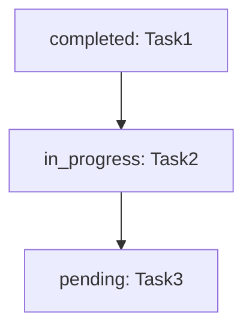
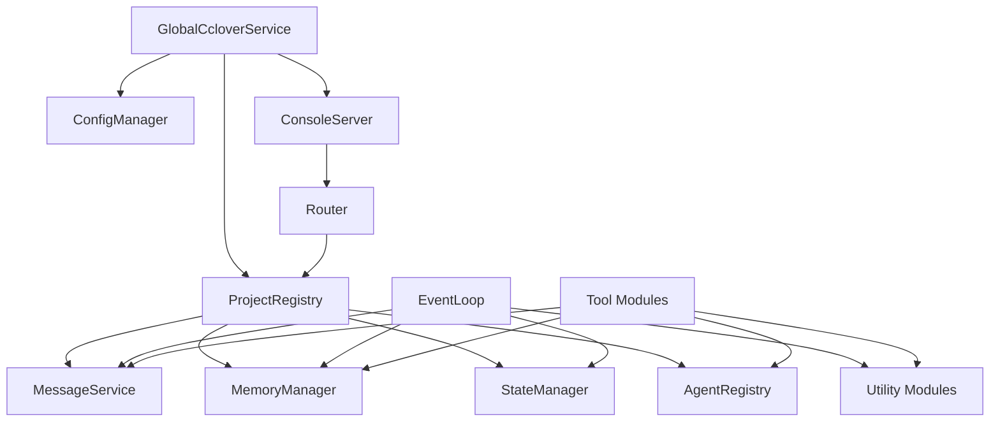

# Module Design Details

This document provides detailed specifications for all modules in the opencode-cclover system.

## Core Modules

### ConfigManager

**Location**: `src/config/ConfigManager.ts`

**Responsibilities**:
- Read and parse configuration file
- Validate configuration format
- Provide configuration update interface

**Interface**:
```typescript
export interface ProjectConfig {
  name: string
  path: string
  enabled: boolean
}

export interface CcloverConfig {
  projects: ProjectConfig[]
}

export class ConfigManager {
  private static CONFIG_PATH = path.join(
    os.homedir(),
    '.config/opencode-cclover/config.yaml'
  )
  
  static async load(): Promise<CcloverConfig>
  static async save(config: CcloverConfig): Promise<void>
  static validate(config: CcloverConfig): boolean
}
```

**Configuration File Format**:
```yaml
projects:
  - name: my-app
    path: /home/user/projects/my-app
    enabled: true
  
  - name: blog
    path: /home/user/projects/blog
    enabled: true
  
  - name: api-server
    path: /home/user/projects/api-server
    enabled: false  # Disabled projects won't start employees
```

### GlobalCcloverService

**Location**: `src/server/GlobalServer.ts`

**Responsibilities**:
- Singleton pattern for global service management
- Initialize all projects from configuration
- Start HTTP server
- Start employee event loops
- Provide project query interface

**Interface**:
```typescript
export class GlobalCcloverService {
  private static instance: GlobalCcloverService | null = null
  private projectRegistry: ProjectRegistry
  private httpServer: ConsoleServer | null = null
  private initialized: boolean = false
  
  // Get singleton instance
  static async getInstance(): Promise<GlobalCcloverService>
  
  // Initialize service
  private async initialize(): Promise<void>
  
  // Load config and initialize all projects
  private async loadProjects(): Promise<void>
  
  // Initialize single project
  private async initializeProject(config: ProjectConfig): Promise<void>
  
  // Start project's employees
  private startEmployees(project: ProjectInstance): void
  
  // Get project by directory
  getProject(directory: string): ProjectInstance | undefined
  
  // Get all projects
  getAllProjects(): ProjectInstance[]
}
```

**Initialization Flow**:
1. First plugin instance triggers `getInstance()`
2. Load configuration from `~/.config/opencode-cclover/config.yaml`
3. Initialize each enabled project:
   - Create service instances (MessageService, MemoryManager, etc.)
   - Register in ProjectRegistry
   - Start employee event loops
4. Start HTTP server (port 4097)
5. Subsequent plugin instances reuse singleton

### ProjectRegistry

**Location**: `src/server/ProjectRegistry.ts`

**Responsibilities**:
- Manage all project instances
- Provide project query interface
- Support registration/unregistration

**Interface**:
```typescript
export interface ProjectInstance {
  projectId: string           // Unique ID (hash of path)
  projectName: string         // Project name
  directory: string         // Project path
  workspaceRoot: string       // .cclover/workspace path
  stateManager: StateManager
  messageService: MessageService
  memoryManager: MemoryManager
  agentRegistry: AgentRegistry
}

export class ProjectRegistry {
  private projects: Map<string, ProjectInstance>
  
  register(project: ProjectInstance): void
  unregister(projectId: string): void
  get(projectId: string): ProjectInstance | undefined
  getByPath(directory: string): ProjectInstance | undefined
  getAll(): ProjectInstance[]
}
```

### MessageService

**Location**: `src/core/MessageService.ts`

**Responsibilities**:
- Centralized message sion
- Manage unread message queues
- Provide message client for employees
- File-based storage with locking

**Interface**:
```typescript
class MessageService {
  constructor(workspaceRoot: string, stateManager: StateManager)
  getClient(employeeName: string): MessageClient
  async send(from: string, to: string, content: string): Promise<void>
}

class MessageClient {
  constructor(employeeName: string, service: MessageService)
  async recv(): Promise<Message>
  async history(peer: string, limit?: number): Promise<Message[]>
}
```

**Key Features**:
- Decentralized storage (each employee stores own messages)
- Centralized service (ensures atomic writes)
- Event-driven notification (EventEmitter)
- File locking (proper-lockfile)

**See**: [Messaging System Requirements](./requirements-messaging.md)

### MemoryManager

**Location**: `src/core/MemoryManager.ts`

**Responsibilities**:
- Read/write employee memory files
- Validate task dependencies
- Calculate executable tasks
- Generate Mermaid diagrams

**Interface**:
```typescript
class MemoryManager {
  constructor(workspaceRoot: string, stateManager: StateManager)
  async readMemory(employeeName: string): Promise<Memory>
  async writeMemory(employeeName: string, memory: Memory): Promise<void>
  async editTasks(employeeName: string, operations: TaskOperation[]): Promise<void>
  getExecutableTasks(tasks: Task[]): Task[]
  generateMermaid(tasks: Task[]): string
}
```

**Key Features**:
- YAML-based storage
- Task DAG validation (no circular dependencies)
- Executable task calculation
- Mermaid visualization generation

**See**: [Memory System Requirements](./requirements-memory.md), [Task Management Requirements](./requirements-tasks.md)

### StateManager

**Location**: `src/state/StateManager.ts`

**Responsibilities**:
- Track employee status (active/inactive)
- Record events for monitoring
- Provide state query interface

**Interface**:
```typescript
class StateManager {
  registerEmployee(employee: EmployeeInfo): void
  unregisterEmployee(name: string): void
  updateEmployeeStatus(name: string, status: string): void
  recordEvent(event: Event): void
  getEmployees(): EmployeeInfo[]
  getEvents(options: EventQueryOptions): Event[]
}
```

**Key Features**:
- In-memory state (no persistence)
- Event history for monitoring
- Employee lifecycle tracking

### EventLoop

**Location**: `src/core/EventLoop.ts`

**Responsibilities**:
- Employee main loop
- Wait for events (blocking)
- Build context
- Interact with AI
- Process tool calls
- Manage session lifecycle

**Interface**:
```typescript
class EventLoop {
  constructor(
    employeeName: string,
    role: Role,
    messageClient: MessageClient,
    memoryManager: MemoryManager,
    opcodeClient: OpencodeClient,
    stateManager: StateManager
  )
  async run(): Promise<void>
}
```

**Event Loop Flow**:
1. Wait for event (message, task, agent, timer)
2. Read current memory
3. Generate Mermaid task graph
4. Calculate executable tasks
5. Build context (role + memory + tasks + event)
6. Send prompt to AI with tools
7. Process tool calls (multi-turn)
8. Check context threshold, summarize if needed
9. Continue loop

**See**: [Employee Runtime Requirements](./requirements-runtime.md)

### AgentRegistry

**Location**: `src/lib/AgentRegistry.ts`

**Responsibilities**:
- Track background agents
- Monitor agent completion
- Provide agent query interface

**Interface**:
```typescript
class AgentRegistry {
  register(agentId: string, taskName: string, employeeName: string): void
  unregister(agentId: string): void
  get(agentId: string): AgentInfo | undefined
  getByEmployee(employeeName: string): AgentInfo[]
}
```

### RoleManager

**Location**: `src/roles/RoleManager.ts`

**Responsibilities**:
- Load roles from multiple sources (preset, global, project)
- Apply priority-based merging (project > global > preset)
- Provide role refresh mechanism

**Interface**:
```typescript
class RoleManager {
  constructor(projectPath: string)
  async loadRoles(): Promise<void>
  getRole(name: string): Role | undefined
  listRoles(): string[]
}
```

**Storage Locations**:
- Preset: `src/roles/*.txt`
- Global: `~/.config/opencode-cclover/roles/*.txt`
- Project: `<project>/.cclover/roles/*.txt`

## Tool Modules

### SendMessageTool

**Location**: `src/tools/SendMessageTool.ts`

**Responsibilities**:
- Implement send_message tool
- Validate recipient
- Call MessageService

**Tool Definition**:
```typescript
{
  name: "send_message",
  description: "Send message to other employee",
  parameters: {
    type: "object",
    properties: {
      to: { type: "string", description: "Recipient name" },
      content: { type: "string", description: "Message content" }
    },
    required: ["to", "content"]
  }
}
```

### EditTasksTool

**Location**: `src/tools/EditTasksTool.ts`

**Responsibilities**:
- Implement edit_tasks tool
- Validate operations (add, update, delete)
- Call MemoryManager

**Tool Definition**:
```typescript
{
  name: "edit_tasks",
  description: "Batch edit task list",
  parameters: {
    type: "object",
    properties: {
      operations: {
        type: "array",
        items: {
          type: "object",
          properties: {
            action: { enum: ["add", "update", "delete"] },
            name: { type: "string" },
            description: { type: "string" },
            dependencies: { type: "array", items: { type: "string" } },
            status: { enum: ["pending", "in_progress", "completed", "cancelled"] },
            result: { type: "string" }
          }
        }
      }
    },
    required: ["operations"]
  }
}
```

### CreateAgentTool

**Location**: `src/tools/CreateAgentTool.ts`

**Responsibilities**:
- Implement create_agent tool
- Create OpenCode agent
- Register in AgentRegistry

**Tool Definition**:
```typescript
{
  name: "create_agent",
  description: "Create OpenCode agent to execute task",
  parameters: {
    type: "object",
    properties: {
      task_name: { type: "string", description: "Associated task name" },
      prompt: { type: "string", description: "Prompt for the agent" }
    },
    required: ["task_name", "prompt"]
  }
}
```

### HireEmployeeTool

**Location**: `src/tools/HireEmployeeTool.ts`

**Responsibilities**:
- Implement hire_employee tool
- Validate role
- Initialize employee
- Start event loop

**Tool Definition**:
```typescript
{
  name: "hire_employee",
  description: "Hire new employee",
  parameters: {
    type: "object",
    properties: {
      name: { type: "string", description: "Employee name (unique)" },
      role: { type: "string", description: "Role type" }
    },
    required: ["name", "role"]
  }
}
```

**See**: [Tool System Requirements](./requirements-tools.md)

## Server Modules

### ConsoleServer

**Location**: `src/server/index.ts`

**Responsibilities**:
- HTTP server for Console UI
- WebSocket for real-time updates
- Route requests to handlers

**Interface**:
```typescript
class ConsoleServer {
  constructor(config: ServerConfig, projectRegistry: ProjectRegistry)
  async start(): Promise<void>
  async stop(): Promise<void>
}
```

**Key Changes from Single-Project**:
- Constructor receives `ProjectRegistry` instead of `ServerDependencies`
- Router receives `ProjectRegistry` for project isolation

### Router

**Location**: `src/server/router.ts`

**Responsibilities**:
- Route HTTP requests
- Extract projectId from path
- Query ProjectRegistry
- Delegate to API handlers

**Interface**:
```typescript
class Router {
  constructor(projectRegistry: ProjectRegistry)
  async handle(req: Request): Promise<Response>
}
```

**Route Structure**:
- `/api/health` - Health check (no project)
- `/api/projects` - List all projects (no project)
- `/api/projects/:projectId/*` - Project-specific APIs

**Project Isolation**:
1. Extract `projectId` from path
2. Query `ProjectRegistry` for project instance
3. Build `ServerDependencies` from project instance
4. Delegate to API handler with dependencies

### API Handlers

**Location**: `src/api/*.ts`

**Modules**:
- `employees.ts` - Employee queries
- `messages.ts` - Message queries
- `tasks.ts` - Task queries
- `events.ts` - Event queries
- `stats.ts` - Statistics
- `health.ts` - Health check
- `hierarchy.ts` - Employee hierarchy

**Key Point**: API handlers remain unchanged, still receive service instances as parameters. Router is responsible for extracting project instance and building dependencies.

## Utility Modules

### MermaidGenerator

**Location**: `src/utils/MermaidGenerator.ts`

**Responsibilities**:
- Generate Mermaid diagrams from tasks
- Format nodes and edges
- Handle status colors

**Interface**:
```typescript
export function generateMermaid(tasks: Task[]): string
```

**Output Format**:


### ContextBuilder

**Location**: `src/utils/ContextBuilder.ts`

**Responsibilities**:
- Build AI context from components
- Format role prompt, memory, tasks, event
- Generate final prompt string

**Interface**:
```typescript
export function buildContext(options: ContextOptions): string

interface ContextOptions {
  rolePrompt: string
  memory: Memory
  mermaidGraph: string
  executableTasks: Task[]
  event: Event
}
```

### SessionRegistry

**Location**: `src/utils/SessionRegistry.ts`

**Responsibilities**:
- Map sessionID to employeeName
- Support tool context resolution

**Interface**:
```typescript
class SessionRegistry {
  register(sessionID: string, employeeName: string): void
  unregister(sessionID: string): void
  getEmployeeName(sessionID: string): string | undefined
}
```

**Purpose**: OpenCode doesn't provide employee context in tool calls, so we maintain this mapping to resolve which employee is calling the tool.

## Module Dependencies



## References

- [Architecture Overview](./architecture.md)
- [Requirements](./requirements.md)
- [Messaging System Requirements](./requirements-messaging.md)
- [Memory System Requirements](./requirements-memory.md)
- [Task Management Requirements](./requirements-tasks.md)
- [Tool System Requirements](./requirements-tools.md)
- [Employee Runtime Requirements](./requirements-runtime.md)
