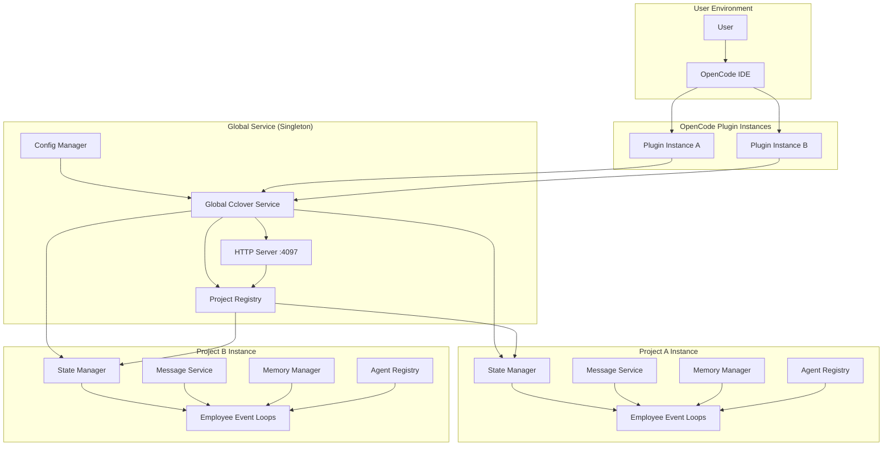

# Architecture

## System Architecture

### High-Level Overview

The system implements a multi-project, multi-agent collaboration framework with a global singleton service managing all project instances. Each project has independent employees, memory, and workspace, while sharing common role definitions and infrastructure.



### Architecture Principles

**Multi-Project Isolation**:
- Each project is an independent workspace with its own employees
- Projects are like separate companies - completely isolated
- No cross-project communication or shared state

**Global Service Management**:
- Single HTTP service manages all projects (avoids port conflicts)
- Employees run continuously, independent of project open/close state
- Configuration-based project discovery

**Plugin Integration**:
- Plugin instances register tools to OpenCode
- Tools query global service for project-specific instances
- Lightweight plugin instances (no service startup)

### Architecture Layers

```
┌─────────────────────────────────────────────────────────────┐
│ Configuration: ~/.config/opencode-cclover/config.yaml       │
│ projects:                                                    │
│   - na                                          │
│     path: /path/to/my-app                                   │
│     enabled: true                                           │
└─────────────────────────────────────────────────────────────┘
                          ↓ Read
┌─────────────────────────────────────────────────────────────┐
│ GlobalCcloverService (Singleton)                            │
│ ├─ Read config, discover all projects                      │
│ ├─ Create service instances for each project               │
│ │  ├─ MessageService                                       │
│ │  ├─ MemoryManager                                        │
│ │  ├─ StateManager                                         │
│ │  └─ AgentRegistry                                        │
│ ├─ Start employee EventLoops for each project              │
│ └─ Provide HTTP/WebSocket API (port 4097)                  │
└─────────────────────────────────────────────────────────────┘
                          ↓ Query
┌─────────────────────────────────────────────────────────────┐
│ OpenCode Plugin Instance (one per project)                  │
│ ├─ Get project instance from global service                │
│ ├─ Create tools (using project's service instances)        │
│ └─ Register tools to OpenCode (return { tool: tools })     │
└─────────────────────────────────────────────────────────────┘
```

**Layer 1: Configuration**
- Configuration file: `~/.config/opencode-cclover/config.yaml`
- Defines which projects to manage
- Enables/disables projects

**Layer 2: Global Service (Singleton)**
- Single instance managing all projects
- Reads configuration and initializes projects
- Provides HTTP/WebSocket API
- Manages project registry

**Layer 3: Project Instances**
- Each project has independent service instances
- Isolated workspaces: `{projectRoot}/.cclover/workspace/`
- Independent employees and memory
- No cross-project communication

**Layer 4: OpenCode Plugin Instances**
- One plugin instance per open project
- Registers tools to OpenCode
- Queries global service for project instance
- Does NOT start services or employees

**Layer 5: Employee Event Loops**
- Run continuously in background
- Independent of project open/close state
- Process events and execute actions
- Maintain memory and state

### Responsibility Distribution

**Global Service (GlobalCcloverService)**:
- Read configuration file, manage all projects
- Create independent service instances for each project
- Start employee EventLoops (run continuously)
- Provide HTTP/WebSocket API

**Plugin Instance (CcloverPlugin)**:
- Get project instance from global service
- Create tools and register to OpenCode
- **That's all** - no service startup, no employee startup

## Module Design

See [Module Design Details](./architecture-modules.md) for comprehensive module specifications.

**Core Modules**:
- ConfigManager: Configuration file management
- GlobalCcloverService: Global singleton service
- ProjectRegistry: Project instance registry
- MessageService: Message synchronization
- MemoryManager: Memory and task management
- StateManager: Employee state tracking
- EventLoop: Employee runtime
- AgentRegistry: Background agent tracking

**Tool Modules**:
- SendMessageTool: send_message implementation
- EditTasksTool: edit_tasks implementation
- CreateAgentTool: create_agent implementation
- HireEmployeeTool: hire_employee implementation

**Server Modules**:
- ConsoleServer: HTTP server for Console UI
- Router: Request routing with project isolation
- API Handlers: Employee, message, task, event queries

**Utility Modules**:
- MermaidGenerator: Task graph visualization
- ContextBuilder: AI context construction
- SessionRegistry: SessionID to employee mapping

## Technology Stack

### Runtime Environment

- **Runtime**: Bun (TypeScript execution and package management)
- **Language**: TypeScript with strict mode
- **Node Version**: Compatible with Node.js 18+

### Core Dependencies

- **@opencode-ai/plugin**: OpenCode plugin SDK
- **@opencode-ai/sdk**: OpenCode client SDK
- **yaml**: YAML parsing and serialization
- **eventemitter3**: Event-driven messaging
- **proper-lockfile**: File locking for concurrency

### Development Dependencies

- **@types/bun**: TypeScript types for Bun
- **prettier**: Code formatting
- **bun:test**: Testing framework

### Storage

- **Format**: YAML files
- **Location**: `{projectRoot}/.cclover/workspace/`
- **Structure**:
  ```
  .cclover/workspace/
  ├── employees/
  │   ├── {employeeName}/
  │   │   ├── messages/
  │   │   │   └── {peerName}/
  │   │   │       └── chat.yaml
  │   │   └── memory.yaml
  ```

### HTTP Server

- **Framework**: Bun's built-in HTTP server
- **Port**: 4097 (configurable)
- **Protocol**: HTTP/1.1, WebSocket

## Interface Design

### Plugin Interface

**Entry Point**: `src/index.ts`

**Export**:
```typescript
export const CcloverPlugin: Plugin = async (ctx: PluginContext) => {
  // 1. Get global service singleton
  const globalService = await GlobalCcloverService.getInstance()
  
  // 2. Get project instance
  const project = globalService.getProject(ctx.directory)
  
  // 3. Create tools
  const tools = createTools({ ... })
  
  // 4. Return tools
  return { tool: tools }
}
```

### HTTP API Interface

**Base URL**: `http://localhost:4097`

**Authentication**: None (local only)

**Response Format**:
```typescript
{
  success: boolean
  data?: any
  error?: {
    code: string
    message: string
  }
}
```

**Routes**:
- `GET /api/health` - Health check
- `GET /api/projects` - List all projects
- `GET /api/projects/:projectId/employees` - List employees
- `GET /api/projects/:projectId/employees/:name` - Employee details
- `GET /api/projects/:projectId/employees/:name/messages` - Message history
- `GET /api/projects/:projectId/employees/:name/tasks` - Task list
- `GET /api/projects/:projectId/events` - Event history
- `GET /api/projects/:projectId/stats` - Statistics

### Tool Interface

**Format**: OpenCode tool definition

**Example**:
```typescript
{
  name: "send_message",
  description: "Send message to other employee",
  parameters: {
    type: "object",
    properties: {
      to: { type: "string" },
      content: { type: "string" }
    },
    required: ["to", "content"]
  }
}
```

## Data Design

### Configuration Data

**File**: `~/.config/opencode-cclover/config.yaml`

**Schema**:
```yaml
projects:
  - name: string
    path: string
    enabled: boolean
```

**Purpose**: Define which projects to manage

**Creation**: User manually creates, or CLI tool assists

### Memory Data

**File**: `{workspace}/employees/{name}/memory.yaml`

**Schema**:
```yaml
knowledge:
  - string
tasks:
  - name: string
    status: string
    description: string
    result: string
    dependencies: [string]
    created: string
    completed: string
custom:
  # role-specific fields
```

**See**: [Memory System Requirements](./requirements-memory.md)

### Message Data

**File**: `{workspace}/employees/{name}/messages/{peer}/chat.yaml`

**Schema**:
```yaml
- timestamp: string
  direction: string
  content: string
```

**See**: [Messaging System Requirements](./requirements-messaging.md)

### State Data

**In-Memory Only**

**Schema**:
```typescript
{
  employees: Map<string, EmployeeInfo>
  events: Event[]
}
```

## Deployment Architecture

### Single-Machine Deployment

```
┌─────────────────────────────────────────┐
│ User Machine                             │
│                                          │
│  ┌────────────────────────────────────┐ │
│  │ OpenCode IDE                        │ │
│  │  ├─ Project A (plugin instance)    │ │
│  │  └─ Project B (plugin instance)    │ │
│  └────────────────────────────────────┘ │
│                                          │
│  ┌────────────────────────────────────┐ │
│  │ Global Cclover Service (singleton) │ │
│  │  ├─ HTTP Server :4097              │ │
│  │  ├─ Project A Instance             │ │
│  │  │   └─ Employee Event Loops       │ │
│  │  └─ Project B Instance             │ │
│  │      └─ Employee Event Loops       │ │
│  └────────────────────────────────────┘ │
│                                          │
│  ┌────────────────────────────────────┐ │
│  │ File System                         │ │
│  │  ├─ ~/.config/opencode-cclover/    │ │
│  │  │   └─ config.yaml                │ │
│  │  ├─ /project-a/.cclover/workspace/ │ │
│  │  └─ /project-b/.cclover/workspace/ │ │
│  └────────────────────────────────────┘ │
└─────────────────────────────────────────┘
```

### Process Model

- **OpenCode Process**: Main IDE process
- **Plugin Instances**: Run in OpenCode process
- **Global Service**: Singleton in first plugin instance
- **Employee Event Loops**: Background tasks in global service
- **HTTP Server**: Runs in global service

### Resource Usage

- **Memory**: ~50MB per project instance
- **CPU**: Minimal (event-driven, mostly idle)
- **Disk**: ~1MB per employee (messages + memory)
- **Network**: Local HTTP only (port 4097)

## Security Considerations

### Local-Only Access

- HTTP server binds to localhost only
- No external network access
- No authentication required

### File System Security

- Workspace files owned by user
- Standard file permissions
- No sensitive data in files

### Process Isolation

- Plugin runs in OpenCode process
- No separate daemon process
- Inherits OpenCode's security context

## Scalability Considerations

### Project Scalability

- **Current**: 10+ projects supported
- **Bottleneck**: Memory usage (50MB per project)
- **Mitigation**: Lazy loading, project enable/disable

### Employee Scalability

- **Current**: 10+ employees per project
- **Bottleneck**: Event loop overhead
- **Mitigation**: Efficient event waiting, session reuse

### Message Scalability

- **Current**: 1000+ messages per employee
- **Bottleneck**: File I/O, memory usage
- **Mitigation**: Message history limit, pagination

### Task Scalability

- **Current**: 1000+ tasks per employee
- **Bottleneck**: DAG calculation, Mermaid generation
- **Mitigation**: Efficient algorithms, caching

## Design Rationale

### Why Global Singleton Service?

- **Avoids port conflicts**: Only one HTTP server
- **Continuous employee operation**: Independent of project open/close
- **Unified management**: Single point for all projects
- **Resource efficiency**: Shared infrastructure

### Why Project-Level Isolation?

- **Clear boundaries**: Projects are like separate companies
- **Independent workspaces**: No cross-project interference
- **Scalability**: Easy to add/remove projects
- **Simplicity**: No complex cross-project coordination

### Why Configuration-Based Discovery?

- **Explicit control**: User decides which projects to manage
- **Flexibility**: Easy to enable/disable projects
- **Reliability**: No automatic discovery issues
- **Simplicity**: Clear project list

### Why File-Based Storage?

- **Simplicity**: Easy to implement and debug
- **Human-readable**: YAML format
- **No dependencies**: No database required
- **Sufficient performance**: For current scale

## Future Architecture Evolution

### Phase 1: Current (Multi-Instance)

- File-based storage
- Single-machine deployment
- Local HTTP API

### Phase 2: Database Storage

- Replace YAML with SQLite/PostgreSQL
- Improve query performance
- Support larger scale

### Phase 3: Distributed Deployment

- Separate service process
- Remote API access
- Multi-machine support

### Phase 4: Cloud Deployment

- Cloud-hosted service
- Multi-user support
- Authentication and authorization

## References

- [Requirements](./requirements.md)
- [Module Design Details](./architecture-modules.md)
- [API Documentation](./architecture-api.md)
