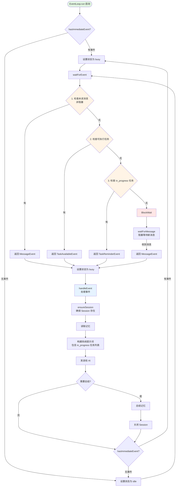
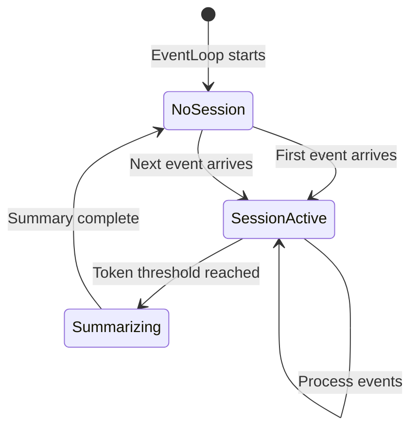
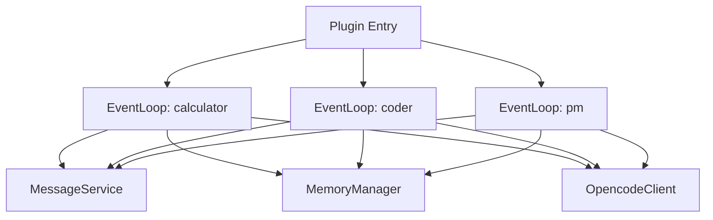

# EventLoop Design

## Overview

EventLoop is the core runtime mechanism for employees, responsible for waiting for events, processing events, invoking AI, and managing session lifecycle.

**Module Purpose**: Implement event-driven employee behavior, enabling autonomous decision-making through continuous event processing and AI interaction.

**Key Responsibilities**:
- Event waiting and dispatching
- Session lifecycle management
- Context building and AI invocation
- Memory summarization triggering
- Tool execution coordination

## Architecture Reference

Implements the employee runtime requirements specified in [Requirements - Employee Runtime](./requirements-runtime.md).

**Design Principles**:
- **Event-Driven**: Employee actions triggered by events (messages, task reminders, etc.)
- **Async Non-Blocking**: Use async/await for concurrency
- **Session Reuse**: Session persists until token threshold reached
- **Auto-Summarization**: Automatically summarize memory when threshold exceeded

## Interface

### Public API

#### EventLoop Class

```typescript
class EventLoop {
  constructor(
    private employeeName: string,
    private role: Role,
    private messageClient: MessageClient,
    private memoryManager: MemoryManager,
    private opcodeClient: OpencodeClient
  )
  
  // Main loop (never returns)
  async run(): Promise<void>
}
```

#### Event Types

```typescript
type Event = MessageEvent | TaskAvailableEvent | TaskReminderEvent

interface MessageEvent {
  type: 'message'
  from: string
  content: string
  timestamp: string
}

interface TaskAvailableEvent {
  type: 'task_available'
  tasks: Task[]
  timestamp: string
}

interface TaskReminderEvent {
  type: 'task_reminder'
  tasks: Task[]
  timestamp: string
}
```

### Creating Instance

```typescript
import { EventLoop } from './core/EventLoop'
import { CalculatorRole } from './roles/Calculator'

// Create event loop for calculator employee
const eventLoop = new EventLoop(
  'calculator',                    // Employee name
  CalculatorRole,                  // Role definition
  messageClient,                   // MessageClient instance
  memoryManager,                   // MemoryManager instance
  opcodeClient                     // OpenCode SDK client
)

// Start event loop (runs forever)
await eventLoop.run()
```

## Internal Design

### Component Architecture

```mermaid
graph TD
    A[EventLoop] --> B[waitForEvent]
    A --> C[handleEvent]
    A --> D[Session Manager]
    A --> E[Summarization]
    
    B --> F[MessageClient.recv]
    B --> G[Task Reminder Events]
    
    C --> H[ensureSession]
    C --> I[buildEventMessage]
    C --> J[OpencodeClient.prompt]
    
    D --> K[createSession]
    D --> L[closeSession]
    
    E --> M[checkTokenThreshold]
    E --> N[requestSummaE --> O[MemoryManager.summarize]
```

### Internal Components

#### 1. Main Event Loop

```typescript
async run(): Promise<void> {
  console.log(`[${this.employeeName}] Starting event loop...`)
  
  while (true) {
    try {
      // 1. Wait for event (blocking)
      const event = await this.waitForEvent()
      
      // 2. Handle event
      await this.handleEvent(event)
      
      // 3. Check if summarization needed
      await this.summarizeIfNeeded()
      
    } catch (error) {
      console.error(`[${this.employeeName}] Error in event loop:`, error)
      // Continue loop, don't exit
    }
  }
}
```

#### 2. Event Waiting

**Priority Order**: Messages > Executable Tasks > In-Progress Tasks

```typescript
private async waitForEvent(): Promise<Event> {
  // 1. Non-blocking check for unread messages
  const messageService = (this.messageClient as any).service
  const unreadQueue = messageService.getUnreadQueue(this.employeeName)
  if (unreadQueue.length > 0) {
    const msg = unreadQueue.shift()!
    return {
      type: 'message' as const,
      from: msg.from,
      content: msg.content,
      timestamp: msg.timestamp
    }
  }

  // 2. Check for executable tasks
  const executableTasks = await this.memoryManager.getExecutableTasks(
    this.employeeName
  )
  if (executableTasks.length > 0) {
    return {
      type: 'task_available',
      tasks: executableTasks,
      timestamp: new Date().toISOString()
    }
  }

  // 3. Check for in_progress tasks (reminder to continue or block)
  const inProgressTasks = await this.memoryManager.getInProgressTasks(
    this.employeeName
  )
  if (inProgressTasks.length > 0) {
    return {
      type: 'task_reminder',
      tasks: inProgressTasks,
      timestamp: new Date().toISOString()
    }
  }

  // 4. Block and wait for messages
  return this.waitForMessage()
}
```

#### 3. Event Handling

```typescript
private async handleEvent(event: Event): Promise<void> {
  console.log(`[${this.employeeName}] Received event:`, event.type)
  
  // 1. Ensure session exists
  const session = await this.ensureSession()
  
  // 2. Build event message
  const eventMessage = this.buildEventMessage(event)
  
  // 3. Send to AI with tools
  await this.opcodeClient.session.prompt({
    path: { id: session.id },
    body: {
      parts: [
        { type: 'text', text: eventMessage }
      ],
      tools: {
        'send_message': true,
        'edit_tasks': true,
        'create_employee_work_session': true
      }
    }
  })
  
  // Increment message count
  this.messageCount++
  
  // AI will automatically call tools, execution completes when tools return
  console.log(`[${this.employeeName}] Event handled`)
}
```

#### 4. Session Management

```typescript
private currentSession: Session | null = null
private messageCount: number = 0

private async ensureSession(): Promise<Session> {
  if (this.currentSession) {
    return this.currentSession
  }
  
  // Try to recover session from memory
  const memory = await this.memoryManager.read(this.employeeName)
  if (memory.sessionId) {
    try {
      const session = await this.opcodeClient.session.get({ path: { id: memory.sessionId } })
      this.currentSession = session.data
      // Recover message count from API
      const messages = await this.opcodeClient.session.messages({ path: { id: memory.sessionId } })
      this.messageCount = messages.data.length
      console.log(`[${this.employeeName}] Recovered session: ${memory.sessionId}`)
      return this.currentSession
    } catch (error) {
      console.log(`[${this.employeeName}] Failed to recover session, creating new one`)
    }
  }
  
  // Create new session
  const systemPrompt = await this.buildSystemPrompt()
  
  const response = await this.opcodeClient.session.create({
    body: {
      title: `${this.employeeName} - ${new Date().toISOString()}`,
      system: systemPrompt
    }
  })
  
  this.currentSession = response.data
  this.messageCount = 0
  
  // Persist session ID to memory
  memory.sessionId = this.currentSession.id
  await this.memoryManager.write(this.employeeName, memory)
  
  // Register session in registry
  sessionRegistry.register(this.currentSession.id, this.employeeName)
  
  console.log(`[${this.employeeName}] Created session: ${this.currentSession.id}`)
  
  return this.currentSession
}

private async closeSession(): Promise<void> {
  if (!this.currentSession) return
  
  console.log(`[${this.employeeName}] Closing session: ${this.currentSession.id}`)
  this.currentSession = null
  this.messageCount = 0
  // sessionId is cleared by summarize() in MemoryManager
}
```

#### 5. Context Building

```typescript
private async buildSystemPrompt(): Promise<string> {
  return await this.memoryManager.buildSystemPrompt(
    this.employeeName,
    this.role.systemPrompt
  )
}

export function buildEventMessage(event: Event): string {
  switch (event.type) {
    case 'message':
      return `收到来自 ${event.from} 的消息：\n\n${event.content}`

    case 'employee_work_session_status_changed':
      return `你创建的 Agent 已完成任务 "${event.taskName}"。\n\n结果：\n${event.result}`

    case 'task_available':
      const taskList = event.tasks.map((t) => `- ${t.name}: ${t.description}`).join("\n")
      return `有 ${event.tasks.length} 个任务的依赖已满足，可以开始执行：\n\n${taskList}\n\n请选择一个任务开始执行，或创建 Agent 来并行处理。`

    case 'task_reminder':
      return `你有 ${event.tasks.length} 个正在进行的任务。\n- 如果可以继续，请继续完成任务\n- 如果需要等待其他员工的消息或决策，请使用 edit_tasks 将任务状态设为 waiting_for_message 并说明原因`

    default:
      return "未知事件类型"
  }
}
```

#### 6. Summarization Mechanism

```typescript
private async summarizeIfNeeded(): Promise<void> {
  if (!this.currentSession) return
  
  // Get current session token usage
  const session = await this.opcodeClient.session.get({
    path: { id: this.currentSession.id }
  })
  
  const TOKEN_THRESHOLD = 100000  // 100k tokens
  
  if (session.data.tokens.total >= TOKEN_THRESHOLD) {
    console.log(`[${this.employeeName}] Token threshold reached, summarizing...`)
    
    // 1. Request AI to summarize
    const summary = await this.requestSummary()
    
    // 2. Save summary to memory
    await this.memoryManager.summarize(this.employeeName, summary)
    
    // 3. Close current session
    await this.closeSession()
    
    console.log(`[${this.employeeName}] Summary completed`)
  }
}

private async requestSummary(): Promise<{ knowledge: string[], custom: Record<string, any> }> {
  if (!this.currentSession) {
    throw new Error('No active session')
  }
  
  // Use structured output to get summary
  const response = await this.opcodeClient.session.prompt({
    path: { id: this.currentSession.id },
    body: {
      parts: [
        {
          type: 'text',
          text: 'Please summarize your experience knowledge and custom data.'
        }
      ],
      format: {
        type: 'json_schema',
        schema: {
          type: 'object',
          properties: {
            knowledge: {
              type: 'array',
              items: { type: 'string' },
              description: 'List of experience knowledge'
            },
            custom: {
              type: 'object',
              description: 'Custom data'
            }
          },
          required: ['knowledge', 'custom']
        }
      }
    }
  })
  
  return response.data.info.structured as { knowledge: string[], custom: Record<string, any> }
}
```

### Error Handling

**Event Loop Errors**:
- Catch all errors in main loop
- Log error and continue (don't exit)
- Ensures one employee's error doesn't affect others

**Session Errors**:
- Session creation failure → Log and retry on next event
- Prompt failure → Log and continue
- Summarization failure → Log and close session anyway

## Data Flow

### Event Processing Flow



### Session Lifecycle



### Multi-Employee Concurrency



## Performance Considerations

### Optimization Strategies

1. **Parallel Employee Execution**: Each employee runs in independent async context
2. **Session Reuse**: Avoid creating new session for every event
3. **Lazy Summarization**: Only summarize when threshold reached

### Scalability Limitations (Phase 1)

- No limit on number of concurrent employees
- Each employee maintains one active session
- Token threshold is fixed (not configurable)

### Future Optimizations

- Configurable token threshold per role
- Session pooling for faster startup
- Event prioritization (urgent vs normal)
- Graceful shutdown mechanism

## Testing Strategy

### Unit Tests

```typescript
describe('EventLoop', () => {
  test('process message event', async () => {
    const mockMessageClient = createMockMessageClient()
    const mockMemoryManager = createMockMemoryManager()
    const mockOpcodeClient = createMockOpcodeClient()
    
    const eventLoop = new EventLoop(
      'test-employee',
      TestRole,
      mockMessageClient,
      mockMemoryManager,
      mockOpcodeClient
    )
    
    // Simulate message event
    mockMessageClient.recv.mockResolvedValueOnce({
      from: 'user',
      content: 'Hello',
      timestamp: '2026-03-01T10:00:00Z'
    })
    
    // Run one iteration
    await eventLoop.runOnce() // Test helper method
    
    expect(mockOpcodeClient.session.prompt).toHaveBeenCalled()
  })
  
  test('trigger summarization at threshold', async () => {
    const mockOpcodeClient = createMockOpcodeClient()
    mockOpcodeClient.session.get.mockResolvedValue({
      data: { tokens: { total: 150000 } }
    })
    
    const eventLoop = new EventLoop(...)
    
    await eventLoop.summarizeIfNeeded()
    
    expect(mockMemoryManager.summarize).toHaveBeenCalled()
  })
})
```

### Integration Tests

- Test complete event processing with real MessageService
- Test session creation and reuse
- Test summarization trigger and memory update
- Test error recovery and loop continuation

## Implementation Checklist

- [x] EventLoop class
  - [x] Constructor and initialization
  - [x] run() main loop
- [x] Event waiting
  - [x] waitForEvent() method
  - [x] waitForAgentCompletion() method
- [x] Event handling
  - [x] handleEvent() method
  - [x] buildEventMessage() method
- [x] Session management
  - [x] ensureSession() method
  - [x] closeSession() method
- [x] Context building
  - [x] buildSystemPrompt() method
- [x] Summarization
  - [x] summarizeIfNeeded() method
  - [x] requestSummary() method
- [x] Error handling
  - [x] Try-catch in main loop
  - [x] Error logging
- [x] Tests
  - [x] Unit tests
  - [x] Integration tests
