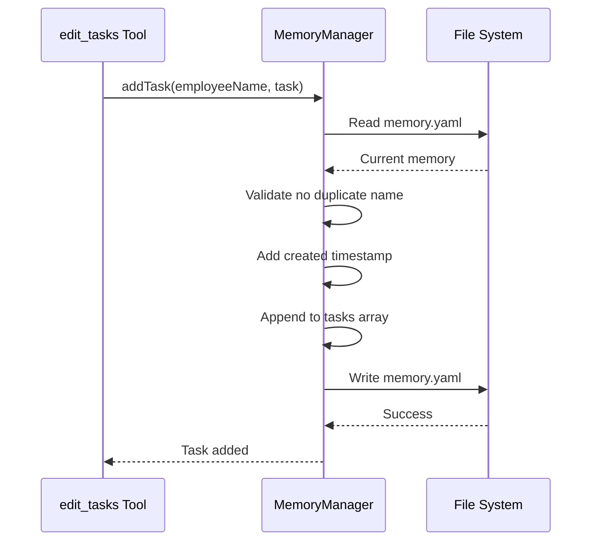
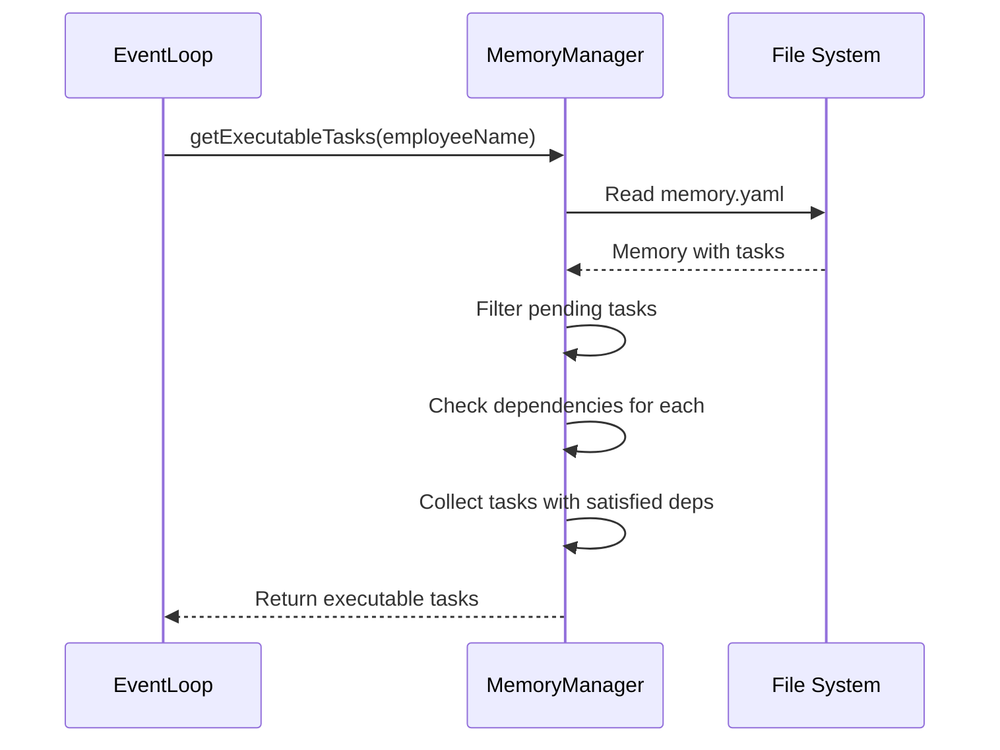
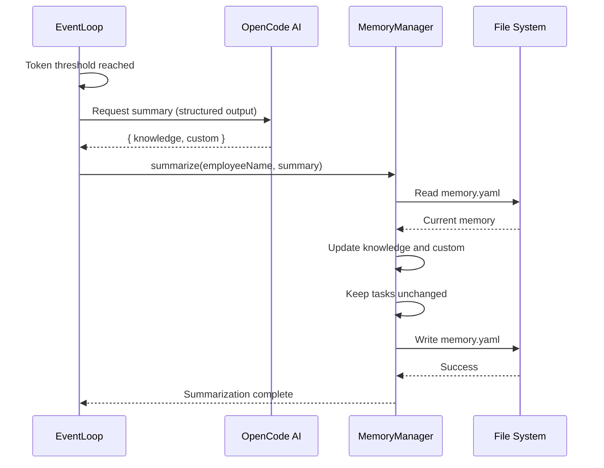

# MemoryManager Design

## Overview

MemoryManager is responsible for maintaining employee experience knowledge, task state, and custom data, supporting persistence and dynamic updates.

**Module Purpose**: Provide structured memory storage for employees, enabling task dependency management (DAG), knowledge accumulation, and role-specific data persistence.

**Key Responsibilities**:
- Memory file read/write operations
- Task state management (CRUD operations)
- Experience knowledge summarization
- Mermaid task graph generation
- System prompt context building

## Architecture Reference

Implements the memory system requirements specified in [Requirements - Memory System](./requirements-memory.md).

**Design Principles**:
- **Structured Storage**: Use YAML format for memory persistence
- **Layered Management**: Separate knowledge (experience), tasks (DAG), and custom (role-specific) data
- **Real-Time Updates**: Task state updates immediately, no waiting for summarization
- **Periodic Summarization**: Knowledge and custom data compressed periodically

## Interface

### Public API

#### MemoryManager Class

```typescript
class MemoryManager {
  constructor(workspaceRoot: string)
  
  // Memory read/write
  read(employeeName: string): Promise<Memory>
  write(employeeName: string, memory: Memory): Promise<void>
  
  // Task management
  addTask(employeeName: string, task: Omit<Task, 'created'>): Promise<void>
  updateTask(employeeName: string, taskName: string, updates: Partial<Task>): Promise<void>
  deleteTask(employeeName: string, taskName: string): Promise<void>
  getTask(employeeName: string, taskName: string): Promise<Task | null>
  
  // Task queries
  getExecutableTasks(employeeName: string): Promise<Task[]>
  generateMermaid(employeeName: string): Promise<string>
  
  // Context building
  buildSystemPrompt(employeeName: string, rolePrompt: string): Promise<string>
  
  // Summarization
  summarize(employeeName: string, summary: { knowledge: string[], custom: Record<string, any> }): Promise<void>
}
```

#### Data Structures

```typescript
interface Memory {
  knowledge: string[]              // Experience knowledge (AI-maintained)
  tasks: Task[]                    // Task list with DAG dependencies
  custom: Record<string, any>      // Role-specific custom data
  sessionId?: string               // Current session ID (persisted for recovery)
}

interface Task {
  name: string                     // Task name (unique identifier, AI-generated)
  status: TaskStatus               // Task status
  description: string              // Task description
  result?: string                  // Task result (filled when completed)
  dependencies: string[]           // List of dependency task names
  created: string                  // Creation timestamp (ISO 8601)
  completed?: string               // Completion timestamp (ISO 8601, optional)
}

type TaskStatus = 'pending' | 'in_progress' | 'completed' | 'cancelled'
```

### Creating Instance

```typescript
import { MemoryManager } from './core/MemoryManager'
import path from 'path'

// Initialize manager
const workspaceRoot = path.join(projectRoot, '.cclover/workspace')
const memoryManager = new MemoryManager(workspaceRoot)

// Read employee memory
const memory = await memoryManager.read('calculator')
console.log(memory.knowledge)
console.log(memory.tasks)

// Add a task
await memoryManager.addTask('calculator', {
  name: 'Calculate1+1',
  status: 'pending',
  description: 'Calculate 1+1 for user',
  dependencies: []
})

// Update task status
await memoryManager.updateTask('calculator', 'Calculate1+1', {
  status: 'completed',
  result: '2',
  completed: new Date().toISOString()
})

// Get executable tasks (dependencies satisfied)
const executableTasks = await memoryManager.getExecutableTasks('calculator')

// Generate Mermaid diagram
const mermaid = await memoryManager.generateMermaid('calculator')
console.log(mermaid)
```

## Internal Design

### File Structure

```
{workspaceRoot}/employees/
└── calculator/
    └── memory.yaml
```

### Memory File Format

```yaml
# calculator/memory.yaml

# Experience knowledge (free text, AI-maintained)
knowledge:
  - User frequently asks me math calculation questions
  - I'm good at handling arithmetic and simple algebra
  - I cannot handle complex calculus problems

# Task state (DAG structure)
tasks:
  - name: "Calculate1+1"
    status: completed
    description: Calculate 1+1 for user
    result: "2"
    dependencies: []
    created: 2026-03-01T10:00:00Z
    completed: 2026-03-01T10:00:05Z
    
  - name: "Calculate3+4"
    status: completed
    description: Calculate 3+4 for user
    result: "7"
    dependencies: []
    created: 2026-03-01T10:01:00Z
    completed: 2026-03-01T10:01:03Z
    
  - name: "SumPreviousResults"
    status: in_progress
    description: Add results from "Calculate1+1" and "Calculate3+4"
    dependencies: ["Calculate1+1", "Calculate3+4"]
    created: 2026-03-01T10:02:00Z

# Role-specific custom fields
custom:
  # Example for PM role:
  # team_members: [alice, bob, calculator]
  # current_sprint: sprint_5

# Current session ID (optional, for recovery after restart)
sessionId: ses_abc123xyz
```

### Internal Components

#### 1. Task DAG Calculation

```typescript
async getExecutableTasks(employeeName: string): Promise<Task[]> {
  const memory = await this.read(employeeName)
  const executable: Task[] = []
  
  for (const task of memory.tasks) {
    // Skip non-pending tasks
    if (task.status !== 'pending') continue
    
    // Check if all dependencies are completed
    const allDepsCompleted = task.dependencies.every(depName => {
      const depTask = memory.tasks.find(t => t.name === depName)
      return depTask && depTask.status === 'completed'
    })
    
    if (allDepsCompleted) {
      executable.push(task)
    }
  }
  
  return executable
}
```

#### 2. Cycle Detection

```typescript
private detectCycle(tasks: Task[]): boolean {
  const visited = new Set<string>()
  const recStack = new Set<string>()
  
  const hasCycle = (taskName: string): boolean => {
    if (recStack.has(taskName)) return true
    if (visited.has(taskName)) return false
    
    visited.add(taskName)
    recStack.add(taskName)
    
    const task = tasks.find(t => t.name === taskName)
    if (task) {
      for (const dep of task.dependencies) {
        if (hasCycle(dep)) return true
      }
    }
    
    recStack.delete(taskName)
    return false
  }
  
  for (const task of tasks) {
    if (hasCycle(task.name)) return true
  }
  
  return false
}
```

#### 3. Mermaid Generation

```typescript
async generateMermaid(employeeName: string): Promise<string> {
  const memory = await this.read(employeeName)
  
  let mermaid = 'graph TD\n'
  
  for (const task of memory.tasks) {
    const nodeId = task.name.replace(/[^a-zA-Z0-9]/g, '_')
    const statusIcon = {
      'pending': '⏳',
      'in_progress': '🔄',
      'completed': '✅',
      'cancelled': '❌'
    }[task.status]
    
    mermaid += `  ${nodeId}["${statusIcon} ${task.name}"]\n`
    
    for (const dep of task.dependencies) {
      const depId = dep.replace(/[^a-zA-Z0-9]/g, '_')
      mermaid += `  ${depId} --> ${nodeId}\n`
    }
  }
  
  return mermaid
}
```

#### 4. System Prompt Building

```typescript
async buildSystemPrompt(employeeName: string, rolePrompt: string): Promise<string> {
  const memory = await this.read(employeeName)
  const mermaid = await this.generateMermaid(employeeName)
  const executableTasks = await this.getExecutableTasks(employeeName)
  
  return `
${rolePrompt}

# Your Memory

## Knowledge
${memory.knowledge.map(k => `- ${k}`).join('\n')}

## Current Tasks

### Task Dependency Graph
\`\`\`mermaid
${mermaid}
\`\`\`

### Executable Tasks (dependencies satisfied)
${executableTasks.map(t => `- ${t.name}: ${t.description}`).join('\n')}

## Custom Data
\`\`\`json
${JSON.stringify(memory.custom, null, 2)}
\`\`\`
`.trim()
}
```

#### 5. Summarization

```typescript
async summarize(
  employeeName: string,
  summary: { knowledge: string[], custom: Record<string, any> }
): Promise<void> {
  const memory = await this.read(employeeName)
  
  // Update knowledge and custom, keep tasks unchanged
  memory.knowledge = summary.knowledge
  memory.custom = summary.custom
  // Clear sessionId after summarization (new session will be created)
  memory.sessionId = undefined
  
  await this.write(employeeName, memory)
}
```

### Error Handling

**Task Operations**:
- Duplicate task name → Throw error
- Task not found → Return null or throw error
- Circular dependency → Throw error with cycle path

**File Operations**:
- `ENOENT`: File doesn't exist → Create with default memory
- Invalid YAML → Throw parse error
- Write failure → Log and throw

## Data Flow

### Task Addition Flow



### Executable Tasks Query Flow



### Summarization Flow



## Performance Considerations

### Optimization Strategies

1. **Lazy Loading**: Only load memory when needed
2. **Incremental Updates**: Update specific fields without rewriting entire memory
3. **In-Memory Caching**: Cache frequently accessed memory (future optimization)

### Scalability Limitations (Phase 1)

- Task list may grow large (1000+ tasks)
- DAG calculation is O(n²) in worst case
- No task archiving mechanism

### Future Optimizations

- Archive completed tasks older than N days
- Implement task pagination for large lists
- Use graph database for efficient DAG queries
- Add indexing for task name lookups

## Testing Strategy

### Unit Tests

```typescript
describe('MemoryManager', () => {
  test('add and retrieve task', async () => {
    const manager = new MemoryManager(workspaceRoot)
    
    await manager.addTask('alice', {
      name: 'Task1',
      status: 'pending',
      description: 'Test task',
      dependencies: []
    })
    
    const task = await manager.getTask('alice', 'Task1')
    expect(task).toBeDefined()
    expect(task!.name).toBe('Task1')
  })
  
  test('detect circular dependencies', async () => {
    const manager = new MemoryManager(workspaceRoot)
    
    await manager.addTask('alice', {
      name: 'Task1',
      status: 'pending',
      description: 'Depends on Task2',
      dependencies: ['Task2']
    })
    
    await expect(
      manager.addTask('alice', {
        name: 'Task2',
        status: 'pending',
        description: 'Depends on Task1',
        dependencies: ['Task1']
      })
    ).rejects.toThrow('Circular dependency')
  })
  
  test('get executable tasks', async () => {
    const manager = new MemoryManager(workspaceRoot)
    
    await manager.addTask('alice', {
      name: 'Task1',
      status: 'completed',
      description: 'Completed task',
      dependencies: []
    })
    
    await manager.addTask('alice', {
      name: 'Task2',
      status: 'pending',
      description: 'Depends on Task1',
      dependencies: ['Task1']
    })
    
    const executable = await manager.getExecutableTasks('alice')
    expect(executable).toHaveLength(1)
    expect(executable[0].name).toBe('Task2')
  })
})
```

### Integration Tests

- Test memory persistence across manager restarts
- Test concurrent task updates
- Test Mermaid generation with complex DAGs
- Test system prompt building with various memory states

## Implementation Checklist

- [x] MemoryManager class
  - [x] Constructor and initialization
  - [x] read() method
  - [x] write() method
- [x] Task management
  - [x] addTask() method
  - [x] updateTask() method
  - [x] deleteTask() method
  - [x] getTask() method
- [x] Task queries
  - [x] getExecutableTasks() method
  - [x] Cycle detection
- [x] Mermaid generation
  - [x] generateMermaid() method
- [x] Context building
  - [x] buildSystemPrompt() method
- [x] Summarization
  - [x] summarize() method
- [x] Tests
  - [x] Unit tests
  - [x] Integration tests
