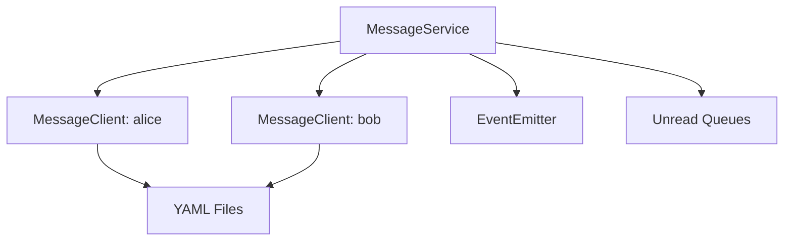
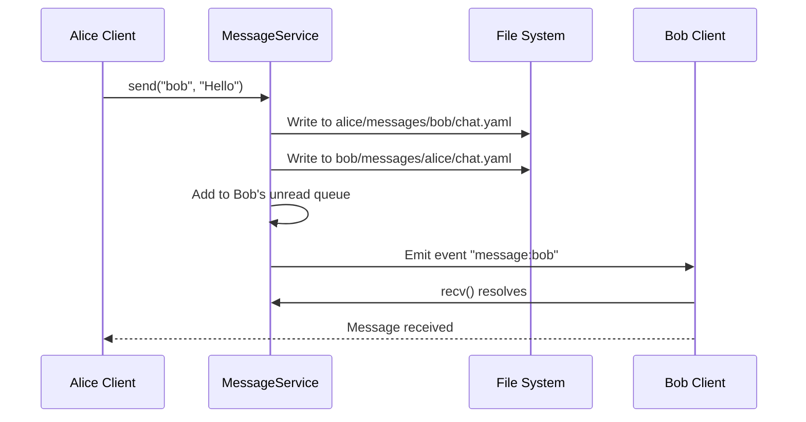
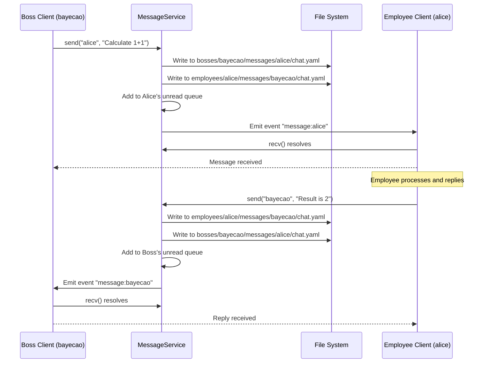
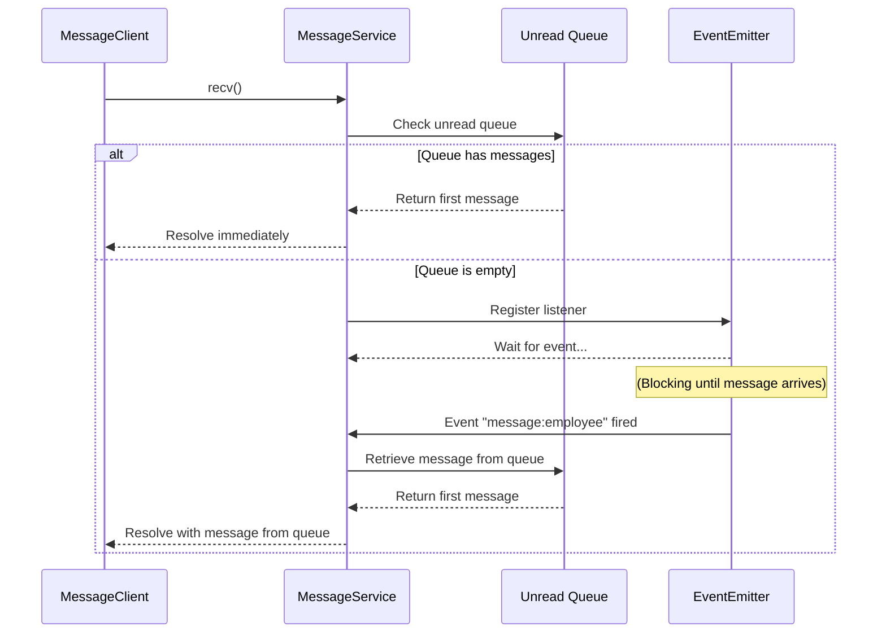
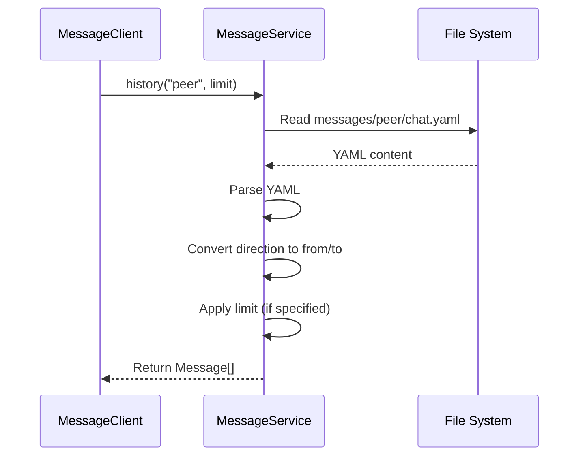

# MessageService Design

## Overview

MessageService is the core communication module for the multi-agent collaboration system, responsible for message sending/receiving and synchronization between employees and bosses (human operators).

**Module Purpose**: Enable decentralized message storage with centralized synchronization, providing event-driven message delivery for employee-to-employee and boss-to-employee communication.

**Key Responsibilities**:
- Message sending and receiving between employees and bosses
- Boss identity management (global entities)
- Unread message queue management
- Message persistence in YAML format

## Architecture Reference

Implements the messaging system requirements specified in [Requirements - Messaging System](./requirements-messaging.md).

**Design Principles**:
- **Decentralized Storage**: Each employee stores their own messages locally
- **Centralized Service**: Unified message service handles synchronization
- **Read-Only Client**: Employees can only read messages, cannot write directly
- **Blocking Receive**: `recv()` blocks until new message arrives
- **Atomic Send**: `send()` writes to both parties' message files atomically
- **Boss Support**: Bosses are global entities (not employees) that can communicate with employees across projects

## Interface

### Public API

#### MessageService Class

```typescript
class MessageService {
  constructor(
    workspaceRoot: string,
    bossManager: BossManager  // NEW: Boss identity management
  )
  
  // Get client for specific employee or boss
  getClient(name: string): MessageClient
  
  // Send message (internal use)
  send(from: string, to: string, content: string): Promise<void>
  
  // Get unread queue (internal use)
  getUnreadQueue(name: string): Message[]
}
```

#### MessageClient Class

```typescript
class MessageClient {
  constructor(
    private employeeName: string,
    private service: MessageService
  )
  
  // Receive message (blocking)
  recv(): Promise<Message>
  
  // Send message to another employee
  send(to: string, content: string): Promise<void>
  
  // Query message history with peer
  history(peer: string, limit?: number): Promise<Message[]>
}
```

#### Message Interface

```typescript
interface Message {
  from: string      // Sender name
  content: string   // Message content
  timestamp: string // ISO 8601 timestamp
}
```

#### BossManager Interface

```typescript
class BossManager {
  constructor(configPath: string)
  
  // Check if a name is a boss
  isBoss(name: string): boolean
  
  // Get all boss names
  getBosses(): string[]
  
  // Reload configuration
  reload(): Promise<void>
}
```

### Creating Instance

```typescript
import { MessageService } from './core/MessageService'
import { BossManager } from './core/BossManager'
import path from 'path'
import os from 'os'

// Initialize boss manager
const configPath = path.join(os.homedir(), '.config/opencode-cclover/config.yaml')
const bossManager = new BossManager(configPath)

// Initialize service
const workspaceRoot = path.join(projectRoot, '.cclover/workspace')
const messageService = new MessageService(workspaceRoot, bossManager)

// Create clients for employees and bosses
const aliceClient = messageService.getClient('alice')
const bobClient = messageService.getClient('bob')
const bossClient = messageService.getClient('bayecao')  // Boss client

// Boss sends message to employee
await bossClient.send('alice', 'Please calculate 1+1')
const message = await aliceClient.recv()
console.log(message.content) // "Please calculate 1+1"

// Employee replies to boss
await aliceClient.send('bayecao', 'The result is 2')
const reply = await bossClient.recv()
console.log(reply.content) // "The result is 2"

## Internal Design

### Component Architecture



### File Structure

```
{workspaceRoot}/
├── employees/
│   ├── alice/
│   │   └── messages/
│   │       ├── bob/
│   │       │   └── chat.yaml      # Alice's view of conversation with Bob
│   │       └── bayecao/
│   │           └── chat.yaml      # Alice's view of conversation with boss bayecao
│   └── bob/
│       └── messages/
│           └── alice/
│               └── chat.yaml      # Bob's view of conversation with Alice
└── bosses/
    └── bayecao/
        └── messages/
            ├── alice/
            │   └── chat.yaml      # Boss bayecao's view of conversation with Alice
            └── bob/
                └── chat.yaml      # Boss bayecao's view of conversation with Bob

### YAML Message Format

```yaml
# alice/messages/bob/chat.yaml
- timestamp: 2026-03-01T10:00:00Z
  direction: send
  content: Hello Bob!

- timestamp: 2026-03-01T10:00:05Z
  direction: receive
  content: Hi Alice!
```

**Fields**:
- `timestamp`: ISO 8601 format timestamp
- `direction`: `send` or `receive` (from owner's perspective)
- `content`: Message text content

**Key Points**:
- Boss messages are stored in `bosses/{bossName}/messages/{employeeName}/` directory
- Employee messages with bosses are stored in `employees/{employeeName}/messages/{bossName}/` directory
- Message format is identical for both employees and bosses

### Internal Components

#### 1. Unread Queue Management

```typescript
private unreadQueues: Map<string, Message[]> = new Map()

private addToUnreadQueue(employeeName: string, message: Message): void {
  if (!this.unreadQueues.has(employeeName)) {
    this.unreadQueues.set(employeeName, [])
  }
  this.unreadQueues.get(employeeName)!.push(message)
}

getUnreadQueue(employeeName: string): Message[] {
  return this.unreadQueues.get(employeeName) || []
}
```

**Key Points**:
- Unread queue is the single source of truth for pending messages
- `getUnreadQueue()` returns the queue reference, allowing direct manipulation (e.g., `shift()`)
- Messages are removed from queue when consumed via `recv()`
- Queue maintains FIFO order for message delivery

#### 1.5. Boss Identity Management

```typescript
private bossManager: BossManager

constructor(workspaceRoot: string, bossManager: BossManager) {
  this.workspaceRoot = workspaceRoot
  this.bossManager = bossManager
  // ... other initialization
}

// Check if a name is a boss
private isBoss(name: string): boolean {
  return this.bossManager.isBoss(name)
}
```

#### 2. Event Notification

```typescript
private eventEmitter = new EventEmitter()

private notifyNewMessage(to: string): void {
  this.eventEmitter.emit(`message:${to}`)
}
```

**Key Points**:
- Event notification does NOT carry message data
- Events serve as wake-up signals only
- Messages are always retrieved from the unread queue (single source of truth)
- This prevents duplicate message delivery

#### 3. File Operations

```typescript
// Get message file path (supports both employees and bosses)
private getMessageFilePath(owner: string, peer: string): string {
  // Check if owner is a boss
  if (this.bossManager.isBoss(owner)) {
    return path.join(
      this.workspaceRoot,
      'bosses',           // Boss directory
      owner,
      'messages',
      peer,
      'chat.yaml'
    )
  }
  
  // Owner is an employee
  return path.join(
    this.workspaceRoot,
    'employees',
    owner,
    'messages',
    peer,
    'chat.yaml'
  )
}

private async appendMessage(
  owner: string,
  peer: string,
  message: YamlMessage
): Promise<void> {
  const filePath = this.getMessageFilePath(owner, peer)
  
  // Ensure directory exists
  await fs.mkdir(path.dirname(filePath), { recursive: true })
  
  // Read existing messages
  let messages: YamlMessage[] = []
  try {
    const content = await fs.readFile(filePath, 'utf-8')
    messages = yaml.parse(content) || []
  } catch (error: any) {
    if (error.code !== 'ENOENT') throw error
  }
  
  // Append new message
  messages.push(message)
  
  // Write back to file
  await fs.writeFile(filePath, yaml.stringify(messages), 'utf-8')
}
```

**Key Points**:
- `getMessageFilePath()` automatically determines if owner is a boss or employee
- Boss messages are stored in `bosses/` directory, employee messages in `employees/` directory
- The rest of the file operations remain unchanged

### Error Handling

**File Operation Errors**:
- `ENOENT`: File doesn't exist → Create new file
- Other errors: Log and throw

**Concurrency Control** (Phase 1 Simplification):
- No file locking in first version
- Rely on JavaScript single-threaded nature
- Future: Add `proper-lockfile` for production use

## Data Flow

### Message Send Flow



### Boss-Employee Message Flow



### Message Receive Flow



### History Query Flow



## Performance Considerations

### Optimization Strategies

1. **Append-Only Writes**: Only append new messages, don't rewrite entire file
2. **Lazy Loading**: Load history on demand, don't preload
3. **In-Memory Queue**: Maintain unread messages in memory to reduce file reads

### Scalability Limitations (Phase 1)

- Single message file per peer relationship may grow large over time
- All messages stored in one file (no sharding)

### Future Optimizations

- Shard messages by date (e.g., `chat-2026-03.yaml`)
- Archive old messages periodically
- Replace file system with database for better query performance

### Boss Message Handling

- Boss messages use the same file format and synchronization mechanism as employee messages
- The only difference is the directory structure (`bosses/` vs `employees/`)
- This ensures consistency and simplifies implementation

## Testing Strategy

### Unit Tests

```typescript
describe('MessageService', () => {
  test('send and receive message', async () => {
    const service = new MessageService(workspaceRoot)
    const alice = service.getClient('alice')
    const bob = service.getClient('bob')
    
    await alice.send('bob', 'Hello')
    const message = await bob.recv()
    
    expect(message.from).toBe('alice')
    expect(message.content).toBe('Hello')
  })
  
  test('unread queue ordering', async () => {
    const service = new MessageService(workspaceRoot)
    const alice = service.getClient('alice')
    const bob = service.getClient('bob')
    
    await alice.send('bob', 'Message 1')
    await alice.send('bob', 'Message 2')
    
    const msg1 = await bob.recv()
    const msg2 = await bob.recv()
    
    expect(msg1.content).toBe('Message 1')
    expect(msg2.content).toBe('Message 2')
  })
})
  
  test('boss sends message to employee', async () => {
    const bossManager = new BossManager(configPath)
    const service = new MessageService(workspaceRoot, bossManager)
    const boss = service.getClient('bayecao')
    const alice = service.getClient('alice')
    
    await boss.send('alice', 'Calculate 1+1')
    const message = await alice.recv()
    
    expect(message.from).toBe('bayecao')
    expect(message.content).toBe('Calculate 1+1')
  })
  
  test('employee replies to boss', async () => {
    const bossManager = new BossManager(configPath)
    const service = new MessageService(workspaceRoot, bossManager)
    const boss = service.getClient('bayecao')
    const alice = service.getClient('alice')
    
    await boss.send('alice', 'Calculate 1+1')
    await alice.recv()
    
    await alice.send('bayecao', 'Result is 2')
    const reply = await boss.recv()
    
    expect(reply.from).toBe('alice')
    expect(reply.content).toBe('Result is 2')
  })
```

### Integration Tests

- Test file persistence across service restarts
- Test concurrent send/receive with multiple employees
- Test history query with various limits
- Test boss-employee communication across projects
- Test boss message file structure

## Implementation Checklist

- [x] MessageService class
  - [x] Constructor and initialization
  - [x] send() method
  - [x] getClient() method
  - [x] Unread queue management
  - [x] Boss identity management
  - [x] EventEmitter integration
- [x] MessageClient class
  - [x] recv() method
  - [x] send() method
  - [x] history() method
- [x] File operations
  - [x] appendMessage() method
  - [x] Directory creation
  - [x] YAML parsing and serialization
  - [x] Boss message file paths
- [x] Tests
  - [x] Unit tests
  - [x] Integration tests
  - [x] Boss-employee communication tests
