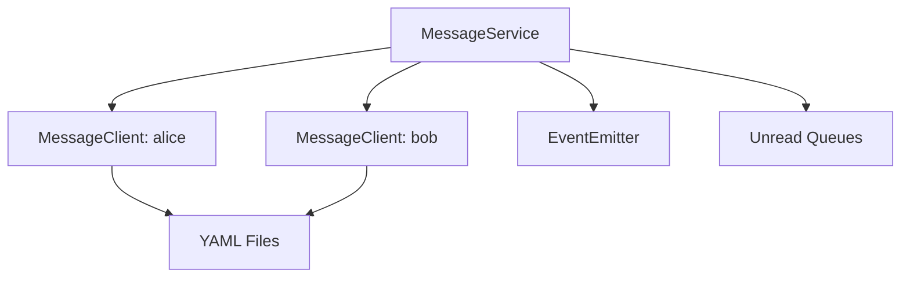
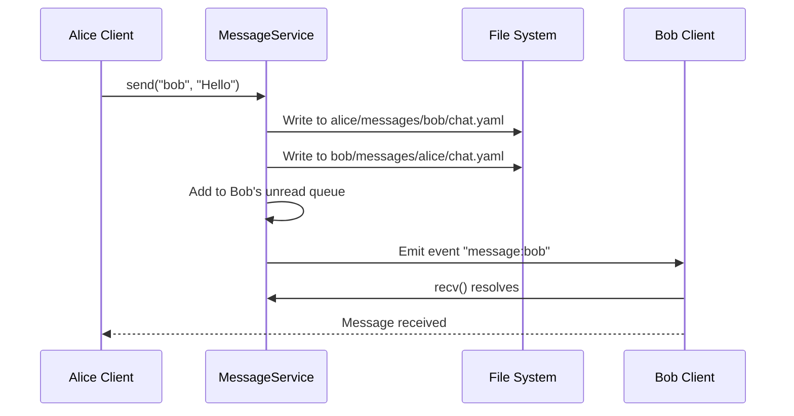
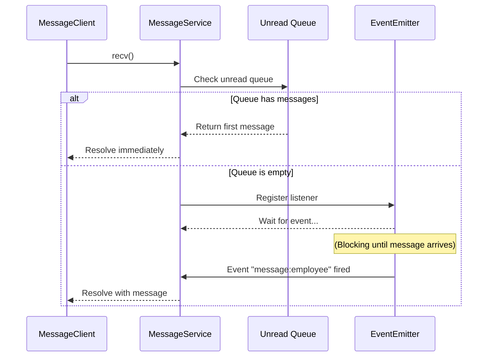
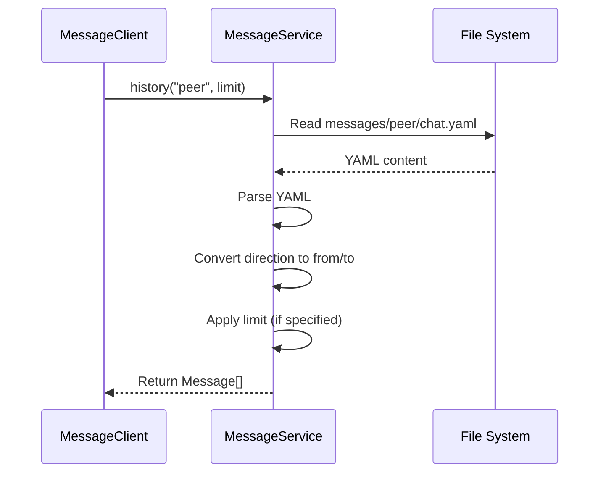

# MessageService Design

## Overview

MessageService is the core communication module for the multi-agent collaboration system, responsible for message sending/receiving and synchronization between employees.

**Module Purpose**: Enable decentralized message storage with centralized synchronization, providing event-driven message delivery for employee communication.

**Key Responsibilities**:
- Message sending and receiving between employees
- Unread message queue management
- Message persistence in YAML format
- Event notification mechanism for new messages

## Architecture Reference

Implements the messaging system requirements specified in [Requirements - Messaging System](./requirements-messaging.md).

**Design Principles**:
- **Decentralized Storage**: Each employee stores their own messages locally
- **Centralized Service**: Unified message service handles synchronization
- **Read-Only Client**: Employees can only read messages, cannot write directly
- **Blocking Receive**: `recv()` blocks until new message arrives
- **Atomic Send**: `send()` writes to both parties' message files atomically

## Interface

### Public API

#### MessageService Class

```typescript
class MessageService {
  constructor(workspaceRoot: string)
  
  // Get client for specific employee
  getClient(employeeName: string): MessageClient
  
  // Send message (internal use)
  send(from: string, ring, content: string): Promise<void>
  
  // Get unread queue (internal use)
  getUnreadQueue(employeeName: string): Message[]
}
```

#### MessageClient Class

```typescript
class MessageClient {
  constructor(
    private employeeName: string,
    private service: MessageService
  )
  
  // Receive message (blocking)
  recv(): Promise<Message>
  
  // Send message to another employee
  send(to: string, content: string): Promise<void>
  
  // Query message history with peer
  history(peer: string, limit?: number): Promise<Message[]>
}
```

#### Message Interface

```typescript
interface Message {
  from: string      // Sender name
  content: string   // Message content
  timestamp: string // ISO 8601 timestamp
}
```

### Creating Instance

```typescript
import { MessageService } from './core/MessageService'
import path from 'path'

// Initialize service
const workspaceRoot = path.join(projectRoot, '.cclover/workspace')
const messageService = new MessageService(workspaceRoot)

// Create clients for employees
const aliceClient = messageService.getClient('alice')
const bobClient = messageService.getClient('bob')

// Send and receive messages
await aliceClient.send('bob', 'Hello Bob!')
const message = await bobClient.recv()
console.log(message.content) // "Hello Bob!"
```

## Internal Design

### Component Architecture



### File Structure

```
{workspaceRoot}/employees/
├── alice/
│   └── messages/
│       └── bob/
│           └── chat.yaml      # Alice's view of conversation with Bob
└── bob/
    └── messages/
        └── alice/
            └── chat.yaml      # Bob's view of conversation with Alice
```

### YAML Message Format

```yaml
# alice/messages/bob/chat.yaml
- timestamp: 2026-03-01T10:00:00Z
  direction: send
  content: Hello Bob!

- timestamp: 2026-03-01T10:00:05Z
  direction: receive
  content: Hi Alice!
```

**Fields**:
- `timestamp`: ISO 8601 format timestamp
- `direction`: `send` or `receive` (from owner's perspective)
- `content`: Message text content

### Internal Components

#### 1. Unread Queue Management

```typescript
private unreadQueues: Map<string, Message[]> = new Map()

private addToUnreadQueue(employeeName: string, message: Message): void {
  if (!this.unreadQueues.has(employeeName)) {
    this.unreadQueues.set(employeeName, [])
  }
  this.unreadQueues.get(employeeName)!.push(message)
}

getUnreadQueue(employeeName: string): Message[] {
  return this.unreadQueues.get(employeeName) || []
}
```

#### 2. Event Notification

```typescript
private eventEmitter = new EventEmitter()

private notifyNewMessage(to: string, message: Message): void {
  this.eventEmitter.emit(`message:${to}`, message)
}
```

#### 3. File Operations

```typescript
private async appendMessage(
  owner: string,
  peer: string,
  message: YamlMessage
): Promise<void> {
  const filePath = this.getMessageFilePath(owner, peer)
  
  // Ensure directory exists
  await fs.mkdir(path.dirname(filePath), { recursive: true })
  
  // Read existing messages
  let messages: YamlMessage[] = []
  try {
    const content = await fs.readFile(filePath, 'utf-8')
    messages = yaml.parse(content) || []
  } catch (error: any) {
    if (error.code !== 'ENOENT') throw error
  }
  
  // Append new message
  messages.push(message)
  
  // Write back to file
  await fs.writeFile(filePath, yaml.stringify(messages), 'utf-8')
}
```

### Error Handling

**File Operation Errors**:
- `ENOENT`: File doesn't exist → Create new file
- Other errors: Log and throw

**Concurrency Control** (Phase 1 Simplification):
- No file locking in first version
- Rely on JavaScript single-threaded nature
- Future: Add `proper-lockfile` for production use

## Data Flow

### Message Send Flow



### Message Receive Flow



### History Query Flow



## Performance Considerations

### Optimization Strategies

1. **Append-Only Writes**: Only append new messages, don't rewrite entire file
2. **Lazy Loading**: Load history on demand, don't preload
3. **In-Memory Queue**: Maintain unread messages in memory to reduce file reads

### Scalability Limitations (Phase 1)

- Single message file per peer relationship may grow large over time
- All messages stored in one file (no sharding)

### Future Optimizations

- Shard messages by date (e.g., `chat-2026-03.yaml`)
- Archive old messages periodically
- Replace file system with database for better query performance

## Testing Strategy

### Unit Tests

```typescript
describe('MessageService', () => {
  test('send and receive message', async () => {
    const service = new MessageService(workspaceRoot)
    const alice = service.getClient('alice')
    const bob = service.getClient('bob')
    
    await alice.send('bob', 'Hello')
    const message = await bob.recv()
    
    expect(message.from).toBe('alice')
    expect(message.content).toBe('Hello')
  })
  
  test('unread queue ordering', async () => {
    const service = new MessageService(workspaceRoot)
    const alice = service.getClient('alice')
    const bob = service.getClient('bob')
    
    await alice.send('bob', 'Message 1')
    await alice.send('bob', 'Message 2')
    
    const msg1 = await bob.recv()
    const msg2 = await bob.recv()
    
    expect(msg1.content).toBe('Message 1')
    expect(msg2.content).toBe('Message 2')
  })
})
```

### Integration Tests

- Test file persistence across service restarts
- Test concurrent send/receive with multiple employees
- Test history query with various limits

## Implementation Checklist

- [x] MessageService class
  - [x] Constructor and initialization
  - [x] send() method
  - [x] getClient() method
  - [x] Unread queue management
  - [x] EventEmitter integration
- [x] MessageClient class
  - [x] recv() method
  - [x] send() method
  - [x] history() method
- [x] File operations
  - [x] appendMessage() method
  - [x] Directory creation
  - [x] YAML parsing and serialization
- [x] Tests
  - [x] Unit tests
  - [x] Integration tests
