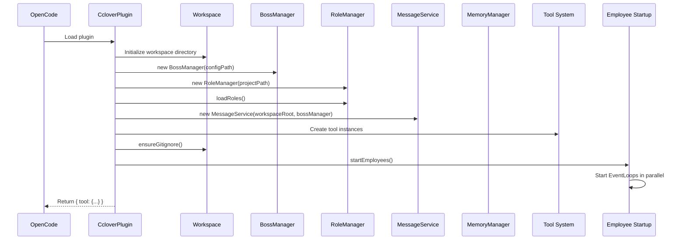
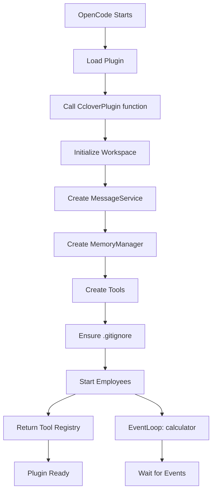
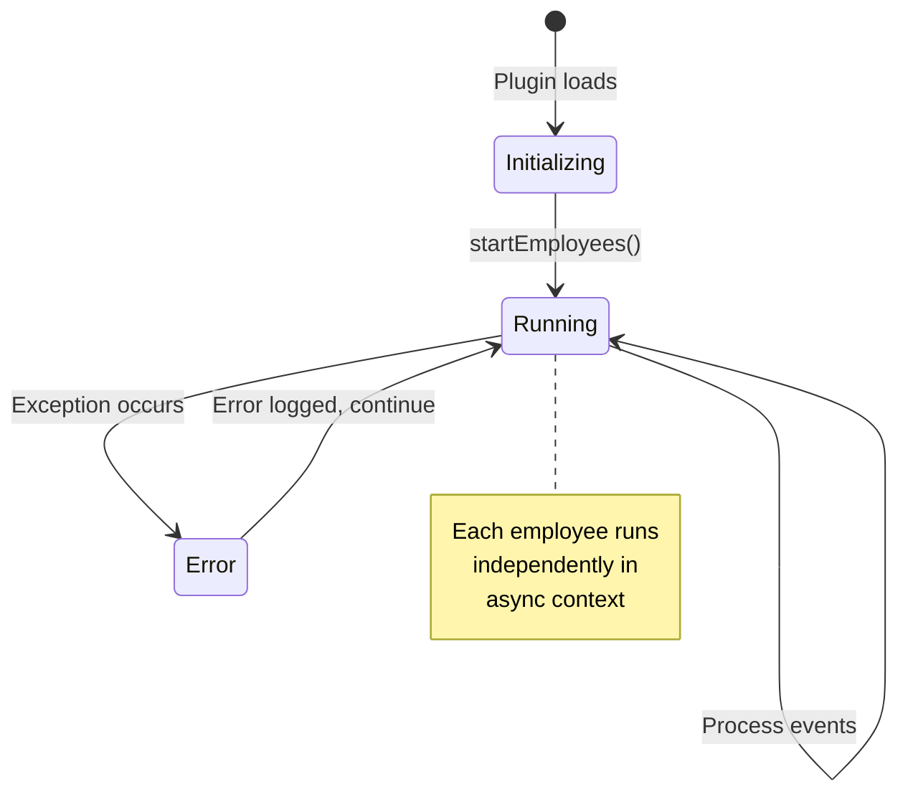

# Plugin Entry Design

## Overview

The plugin entry is the system's startup point, responsible for initializing all modules and starting employees.

**Module Purpose**: Serve as the OpenCode plugin entry point, orchestrating initialization of core services (including boss management), tool registration, and employee lifecycle management.

**Key Responsibilities**:
- Initialize workspace and core services (including BossManager, RoleManager)
- Register tools with OpenCode
- Start employee event loops
- Ensure .gitignore configuration
- Handle plugin lifecycle

## Architecture Reference

Implements the plugin integration requirements specified in [Requirements - Implementation Approach](./requirements.md#implementation-approach).

**Design Principles**:
- **Single Entry Point**: All initialization flows through plugin entry
- **Dependency Injection**: Services created once and passed to components
- **Graceful Startup**: Handle initialization errors without crashing
- **Clean Separation**: Plugin entry only orchestrates, doesn't implement business logic

## Interface

### Plugin Export

```typescript
// src/index.ts
import { Plugin } from "@opencode-ai/plugin"

export const CcloverPlugin: Plugin = async (ctx) => {
  // Initialization logic
  
  return {
    tool: {
      // Tool registrations
    }
  }
}

export default CcloverPlugin
```

### Plugin Context

```typescript
interface PluginInput {
  directory: string        // Project root directory
  client: OpencodeClient   // OpenCode SDK client
  config: {                // Global configuration
    configPath: string     // Path to global config file
  }
  // ... other context properties
}
```

## Internal Design

### Initialization Flow



### Plugin Entry Implementation

```typescript
// src/index.ts
import { Plugin } from "@opencode-ai/plugin"
import path from "path"
import * as fs from "fs/promises"
import { MessageService } from "./core/MessageService"
import { BossManager } from "./core/BossManager"
import { RoleManager } from "./roles/RoleManager"
import { MemoryManager } from "./core/MemoryManager"

export const CcloverPlugin: Plugin = async (ctx) => {
  console.log("[Cclover] Initializing plugin...")
  
  // 1. Initialize workspace
  const workspaceRoot = path.join(ctx.directory, '.cclover/workspace')
  await fs.mkdir(workspaceRoot, { recursive: true })
  
  // 1.5. Initialize boss manager
  const configPath = path.join(os.homedir(), '.config/opencode-cclover/config.yaml')
  const bossManager = new BossManager(configPath)
  
  // 1.6. Initialize role manager
  const roleManager = new RoleManager(ctx.directory)
  await roleManager.loadRoles()
  
  // 2. Initialize message service (with boss manager)
  const messageService = new MessageService(workspaceRoot, bossManager)
  // 3. Initialize memory manager
  const memoryManager = new MemoryManager(workspaceRoot)
  
  // 4. Create tools
  const sendMessageTool = createSendMessageTool(messageService)
  const editTasksTool = createEditTasksTool(memoryManager)
  const createAgentTool = createCreateAgentTool(ctx.client)
  const hireEmployeeTool = createHireEmployeeTool()
  
  // 5. Ensure .gitignore
  await ensureGitignore(ctx.directory)
  
  // 6. Start employees
  startEmployees(ctx, messageService, memoryManager, roleManager)
  
  console.log("[Cclover] Plugin initialized")
  
  // 7. Return tool registrations
  return {
    tool: {
      send_message: sendMessageTool,
      edit_tasks: editTasksTool,
      create_agent: createAgentTool,
      hire_employee: hireEmployeeTool
    }
  }
}

export default CcloverPlugin
```

### Workspace Initialization

```typescript
async function initializeWorkspace(projectRoot: string): Promise<string> {
  const workspaceRoot = path.join(projectRoot, '.cclover/workspace')
  
  // Create workspace directory structure
  await fs.mkdir(workspaceRoot, { recursive: true })
  await fs.mkdir(path.join(workspaceRoot, 'employees'), { recursive: true })
  
  console.log(`[Cclover] Workspace initialized at ${workspaceRoot}`)
  
  return workspaceRoot
}
```
### Boss Manager Initialization
```typescript
async function initializeBossManager(): Promise<BossManager> {
  const configPath = path.join(os.homedir(), '.config/opencode-cclover/config.yaml')
  const bossManager = new BossManager(configPath)
  
  // Load configuration
  await bossManager.reload()
  
  console.log(`[Cclover] Loaded ${bossManager.getBosses().length} boss(es)`)
  
  return bossManager
}
```

### Gitignore Management

```typescript
async function ensureGitignore(projectRoot: string): Promise<void> {
  const gitignorePath = path.join(projectRoot, '.gitignore')
  
  // Read existing .gitignore
  let content = ''
  try {
    content = await fs.readFile(gitignorePath, 'utf-8')
  } catch (error: any) {
    if (error.code !== 'ENOENT') throw error
  }
  
  // Check if .cclover already included
  if (!content.includes('.cclover')) {
    content += '\n# Cclover workspace\n.cclover/\n'
    await fs.writeFile(gitignorePath, content, 'utf-8')
    console.log("[Cclover] Added .cclover to .gitignore")
  }
}
```

### Employee Startup

```typescript
async function startEmployees(
  ctx: PluginInput,
  messageService: MessageService,
  memoryManager: MemoryManager,
  roleManager: RoleManager
): Promise<void> {
  const employees = [
    { name: 'calculator', roleName: 'calculator' }
    // Future: Add more employees
  ]
  
  // Start all employees in parallel
  Promise.all(
    employees.map(async ({ name, roleName }) => {
      try {
        const role = roleManager.getRole(roleName)
        if (!role) {
          console.error(`[Cclover] Role "${roleName}" not found`)
          return
        }
        
        const messageClient = messageService.getClient(name)
        const eventLoop = new EventLoop(
          name,
          role,
          messageClient,
          memoryManager,
          ctx.client  // OpencodeClient
        )
        
        // EventLoop will register session when created
        // Start event loop (runs forever)
        await eventLoop.run()
        
      } catch (error) {
        console.error(`[Cclover] Failed to start employee ${name}:`, error)
      }
    })
  ).catch(error => {
    console.error("[Cclover] Error in employee startup:", error)
  })
  
  console.log(`[Cclover] Started ${employees.length} employee(s)`)
}
```

### Error Handling

```typescript
export const CcloverPlugin: Plugin = async (ctx) => {
  try {
    console.log("[Cclover] Initializing plugin...")
    
    // ... initialization steps ...
    
    console.log("[Cclover] Plugin initialized")
    
    return { tool: { ... } }
    
  } catch (error) {
    console.error("[Cclover] Plugin initialization failed:", error)
    
    // Return empty tool set to prevent OpenCode crash
    return { tool: {} }
  }
}
```

## Data Flow

### Plugin Loading Flow



### Employee Lifecycle



## Deployment

### Method 1: Local Development (Symlink)

```bash
# In your project directory
mkdir -p .opencode/plugin
ln -s /absolute/path/to/opencode-cclover/src/index.ts .opencode/plugin/cclover.ts

# OpenCode will auto-discover and load
opencode serve
```

### Method 2: Configuration File

```json
// opencode.json
{
  "plugin": [
    "file:///absolute/path/to/opencode-cclover/src/index.ts"
  ]
}
```

### Method 3: NPM Package (Future)

```bash
# Publish to npm
npm publish

# In project
npm install opencode-cclover
```

```json
// opencode.json
{
  "plugin": ["opencode-cclover"]
}
```

## Testing

### Manual Testing Flow

1. **Start OpenCode with Plugin**:
   ```bash
   cd workspace_test
   opencode serve --port 4099
   ```

2. **Verify Plugin Loaded**:
   - Check console for "[Cclover] Plugin initialized"
   - Check for "[calculator] Starting event loop..."

3. **Test Scenario 1: Simple Calculation**:
   - User calls `send_message` tool: `{ to: "calculator", content: "Calculate 1+1" }`
   - Calculator receives message event
   - Calculator replies: `{ to: "user", content: "The result is 2" }`
   - User receives reply

4. **Test Scenario 2: Complex Calculation**:
   - User sends: `{ to: "calculator", content: "Calculate (123+456)*789" }`
   - Calculator creates agent
   - Calculator waits for agent completion event
   - Calculator replies with result

### Integration Test Structure

```typescript
describe('Plugin Integration', () => {
  test('plugin initializes successfully', async () => {
    const ctx = createMockPluginContext()
    const plugin = await CcloverPlugin(ctx)
    
    expect(plugin.tool).toHaveProperty('send_message')
    expect(plugin.tool).toHaveProperty('edit_tasks')
    expect(plugin.tool).toHaveProperty('create_agent')
  })
  
  test('workspace directory created', async () => {
    const ctx = createMockPluginContext()
    await CcloverPlugin(ctx)
    
    const workspacePath = path.join(ctx.directory, '.cclover/workspace')
    const exists = await fs.stat(workspacePath).then(() => true).catch(() => false)
    
    expect(exists).toBe(true)
  })
  
  test('.gitignore updated', async () => {
    const ctx = createMockPluginContext()
    await CcloverPlugin(ctx)
    
    const gitignorePath = path.join(ctx.directory, '.gitignore')
    const content = await fs.readFile(gitignorePath, 'utf-8')
    
    expect(content).toContain('.cclover')
  })
})
```

## Monitoring and Debugging

### Logging Strategy

```typescript
// Key log points
console.log("[Cclover] Initializing plugin...")
console.log("[Cclover] Workspace initialized at", workspaceRoot)
console.log("[Cclover] Added .cclover to .gitignore")
console.log(`[Cclover] Started ${employees.length} employee(s)`)
console.log("[Cclover] Plugin initialized")

// Employee logs
console.log(`[${employeeName}] Starting event loop...`)
console.log(`[${employeeName}] Received event: ${event.type}`)
console.log(`[${employeeName}] Created session: ${sessionId}`)

// Error logs
console.error(`[Cclover] Plugin initialization failed:`, error)
console.error(`[Cclover] Failed to start employee ${name}:`, error)
console.error(`[${employeeName}] Error in event loop:`, error)
```

### Debug Mode (Future)

```typescript
const DEBUG = process.env.CCLOVER_DEBUG === 'true'

function debug(message: string, ...args: any[]) {
  if (DEBUG) {
    console.log(`[DEBUG] ${message}`, ...args)
  }
}

// Usage
debug('MessageService initialized', { workspaceRoot })
debug('Employee event', { employeeName, eventType: event.type })
```

## Project Structure

```
opencode-cclover/
├── src/
│   ├── index.ts                   # Plugin entry (this design)
│   ├── core/
│   │   ├── MessageService.ts
│   │   ├── MemoryManager.ts
│   │   ├── EventLoop.ts
│   │   └── index.ts
│   ├── tools/
│   │   ├── SendMessageTool.ts
│   │   ├── EditTasksTool.ts
│   │   ├── CreateAgentTool.ts
│   │   ├── HireEmployeeTool.ts
│   │   └── index.ts
│   ├── roles/
│   │   ├── Calculator.ts
│   │   └── index.ts
│   └── utils/
│       ├── SessionRegistry.ts
│       ├── AgentRegistry.ts
│       └── index.ts
├── tests/
│   ├── unit/
│   ├── integration/
│   └── fixtures/
├── docs/
│   ├── design-message-service.md
│   ├── design-memory-manager.md
│   ├── design-event-loop.md
│   ├── design-tools.md
│   ├── design-roles.md
│   └── design-plugin-entry.md    # This document
├── package.json
├── tsconfig.json
└── README.md
```

## Implementation Checklist

- [x] Plugin entry
  - [x] CcloverPlugin function
  - [x] Module initialization
  - [x] Tool registration
- [x] Initialization flow
  - [x] Workspace creation
  - [x] ensureGitignore() function
  - [x] Boss manager initialization
  - [ ] Role manager initialization
  - [x] startEmployees() function
- [x] Error handling
  - [x] Try-catch in plugin entry
  - [x] Employee startup error handling
- [x] Tests
  - [x] Plugin initialization test
  - [x] Workspace creation test
  - [x] .gitignore update test
- [x] Documentation
  - [x] README update
  - [x] Usage instructions

## Future Enhancements

### Configuration File Support

```typescript
// Load configuration from .cclover/config.yaml
interface CcloverConfig {
  employees: Array<{
    name: string
    role: string
    autoStart: boolean
  }>
  workspace: {
    path?: string
  }
  logging: {
    level: 'debug' | 'info' | 'warn' | 'error'
  }
}

async function loadConfig(projectRoot: string): Promise<CcloverConfig> {
  const configPath = path.join(projectRoot, '.cclover/config.yaml')
  try {
    const content = await fs.readFile(configPath, 'utf-8')
    return yaml.parse(content)
  } catch {
    return getDefaultConfig()
  }
}
```

### Hot Reload Support

```typescript
// Watch for configuration changes
import { watch } from 'fs/promises'

async function watchConfig(configPath: string, onReload: () => void) {
  const watcher = watch(configPath)
  
  for await (const event of watcher) {
    if (event.eventType === 'change') {
      console.log('[Cclover] Configuration changed, reloading...')
      await onReload()
    }
  }
}
```

### Graceful Shutdown

```typescript
export const CcloverPlugin: Plugin = async (ctx) => {
  // ... initialization ...
  
  // Register cleanup handler
  process.on('SIGTERM', async () => {
    console.log('[Cclover] Shutting down...')
    
    // Close all employee sessions
    for (const employee of activeEmployees) {
      await employee.shutdown()
    }
    
    console.log('[Cclover] Shutdown complete')
    process.exit(0)
  })
  
  return { tool: { ... } }
}
```

### Health Check Endpoint

```typescript
// Expose health check for monitoring
export const CcloverPlugin: Plugin = async (ctx) => {
  // ... initialization ...
  
  return {
    tool: { ... },
    health: async () => {
      return {
        status: 'healthy',
        employees: activeEmployees.map(e => ({
          name: e.name,
          status: e.isRunning ? 'running' : 'stopped',
          lastEvent: e.lastEventTime
        }))
      }
    }
  }
}
```
