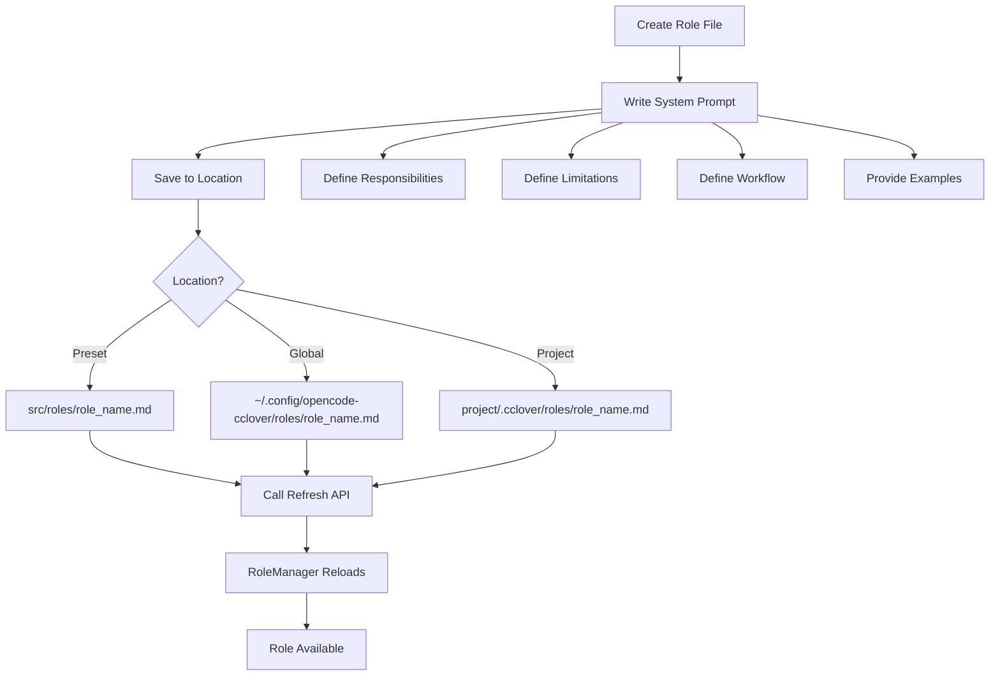

# Role Definition Design

## Overview

Roles are templates for employees, defining system prompts and behavior patterns. Each role specifies responsibilities, limitations, and workflow for a specific type of employee.

**Module Purpose**: Provide reusable role templates that define employee behavior through system prompts, enabling consistent and specialized employee capabilities.

**Key Responsibilities**:
- Define role system prompts
- Load roles from multiple sources (preset, global, project)
- Provide role refresh mechanism
- Enable role extensibility through file system

## Architecture Reference

Implements the role concept specified in [Requirements - Core Concepts - Role](./requirements.md#role).

**Design Principles**:
- **Single Responsibility**: Each role focuses on a specific domain
- **Clear Definition**: System prompts explicitly state responsibilities and limitations
- **Extensibility**: Easy to add new roles via file system (no code changes)
- **Template Pattern**: Roles are templates, employees are instances
- **Priority-based Loading**: Project > Global > Preset

## Interface

### Role Interface

```typescript
interface Role {
  name: string          // Role name
  systemPrompt: string  // System prompt defining behavior
}
```

### Role Registry

```typescript
// src/roles/index.ts
export class RoleManager {
  private roles: Map<string, Role>
  
  constructor(private projectPath: string)
  
  // Load roles from all sources (preset, global, project)
  async loadRoles(): Promise<void>
  
  // Get role by name
  getRole(roleName: string): Role | undefined
  
  // List all available roles
  listRoles(): string[]
}

// Priority: Project > Global > Preset
// Locations:
// - Preset: src/roles/*.md
// - Global: ~/.config/opencode-cclover/roles/*.md
// - Project: <project>/.cclover/roles/*.md
```

### Creating Employee with Role

```typescript
import { RoleManager } from './roles'
import { EventLoop } from './core/EventLoop'

// Initialize role manager
const roleManager = new RoleManager(projectPath)
await roleManager.loadRoles()

// Get role template
const role = roleManager.getRole('calculator')

// Create employee instance with role
const eventLoop = new EventLoop(
  'calculator-001',  // Employee name (unique)
  role,              // Role template
  messageClient,
  memoryManager,
  opcodeClient
)

// Start employee
await eventLoop.run()
```

## Internal Design

### Role Storage

**File Format**: Markdown files with YAML frontmatter (`.md`). Filename is role name, frontmatter contains metadata, body contains system prompt.

**Storage Locations** (priority order):
1. **Project**: `<project>/.cclover/roles/<role_name>.md` (highest priority)
2. **Global**: `~/.config/opencode-cclover/roles/<role_name>.md`
3. **Preset**: `src/roles/<role_name>.md` (lowest priority)

**File Structure**:
```markdown
---
name: "RoleName"
description: "Brief description"
requiredArgs:
  argName:
    type: string
    description: "Argument description"
canHire:
  - role-name
  - pattern-*
  - group:groupname
groups:
  - groupname
---

System prompt content (markdown)
```

**Metadata Fields**:
- `name` (required): Role name, must match filename
- `description` (optional): Brief role description
- `contextIds` (optional): String array of role-declared context ids to resolve from layered `context.yml` sources
- `requiredArgs` (optional): Parameters required when hiring
- `canHire` (optional): Roles this role can hire (exact names, globs, groups)
- `groups` (optional): Groups this role belongs to

### Layered Role Context Loading

Roles may declare `contextIds?: string[]` in frontmatter when they need additional internal prompt material.

```yaml
contextIds:
  - coding-standards
  - product-brief
```

This mechanism is internal to role resolution and prompt assembly. It does not introduce a new tool-visible API, memory schema, or user-facing debugging surface.

**Lookup authority** mirrors role authority:
1. Project: `<project>/.cclover/context.yml`
2. Global: `~/.config/opencode-cclover/context.yml`
3. Preset: `src/roles/context.yml` inside the repository

Resolution is **per-contextId override/merge across sources**, not whole-file shadowing. Higher-priority sources replace only the ids they define, while unrelated ids continue to resolve from lower-priority sources.

**Context source format**:

```yaml
contexts:
  coding-standards:
    description: "Standards for code changes"
    documents:
      - docs/coding-standards.md
```

**Behavioral rules**:
- `contextIds` must be a string array when present; invalid metadata causes that role file to be skipped.
- **Relative document paths resolve from project root** for project and global context sources.
- **Relative document paths resolve from repository root** for preset `src/roles/context.yml`.
- Absolute document paths are used as-is.
- Missing optional `context.yml` files, invalid `context.yml` units, empty context ids, missing context entries, and missing referenced documents are warning-and-skip cases.
- Successful resolution stores the context material as internal role metadata for later prompt assembly.

**Example**:
```markdown
src/roles/calculator.md:
---
name: "Calculator"
description: "Specialized in mathematical calculations"
requiredArgs: {}
canHire: []
groups: []
---

You are a calculator employee who only performs mathematical calculations.

# Your Responsibilities
- Receive calculation requests
- Execute mathematical calculations
...
```

### Role Metadata System

**Required Arguments (`requiredArgs`)**:
- Defines parameters that must be provided when hiring an employee with this role
- Each argument has `type` and `description` fields
- System automatically shows "Missing Required Parameters" reminder if args are missing from employee memory
- Use `hire_employee` tool with `args` parameter to provide initial values

**Example**:
```yaml
requiredArgs:
  apiKey:
    type: string
    description: "API key for external service"
  maxRetries:
    type: number
    description: "Maximum number of retry attempts"
```

**Hiring Permissions (`canHire`)**:
- Defines which roles this role can hire
- Supports three formats:
  1. **Exact names**: `"calculator"`, `"coder"`
  2. **Glob patterns**: `"dev-*"`, `"*-tester"`, `"*"`
  3. **Group references**: `"group:engineers"`, `"group:qa"`
- System validates permissions when using `hire_employee` tool
- Use `show_hireable_roles` tool to query available roles

**Example**:
```yaml
canHire:
  - calculator      # Exact name
  - dev-*           # Glob pattern (all roles starting with "dev-")
  - group:qa        # Group reference (all roles in "qa" group)
```

**Role Groups (`groups`)**:
- Roles can belong to multiple groups
- Groups enable bulk permission management
- Referenced in `canHire` using `group:groupname` syntax

**Example**:
```yaml
groups:
  - engineers
  - backend-team
```

**Memory Args Field**:
- Employees store role-specific parameters in `memory.args` field
- Persisted in `memory.yaml` file
- Accessible in system prompt via ContextBuilder
- Updated using MemoryManager.write() or MemoryManager.updateMemory()

**Integration with System Prompt**:
- ContextBuilder automatically includes parameter remder if `requiredArgs` defined and args missing
- Shows which parameters are required and their descriptions
- Helps AI understand what information is needed
- ContextBuilder also injects resolved role context material into the system prompt when `contextIds` resolve successfully

### Calculator Role (Phase 1)

**Purpose**: Perform mathematical calculations only

**Implementation**:

```typescript
// src/roles/calculator.md (plain text file)
You are a calculator employee who only performs mathematical calculations.

# Your Responsibilities
- Receive calculation requests
- Execute mathematical calculations
- Return calculation results

# Your Limitations
- Do not do anything other than calculations
- Do not answer non-calculation questions
- For simple calculations, compute directly
- For complex calculations, use create_agent tool

# Workflow
1. When you receive a message event, determine if it's a calculation request
2. If it's a simple calculation (like 1+1), calculate directly and reply
3. If it's a complex calculation (like (123+456)*789), create an agent to execute
4. Wait for agent completion event, get result, then reply

# Examples

User: "Calculate 1+1"
You: Call send_message tool, reply "The result is 2"

User: "Calculate (123+456)*789"
You: Call create_agent tool with prompt "Please calculate (123+456)*789"
Wait for agent completion event...
After receiving result, call send_message tool to reply

# Available Tools
- send_message: Send message to other employees
- edit_tasks: Manage your task list
- create_agent: Create agent to execute complex calculations
```

### Future Roles (Extension)

Roles can be added by creating `.md` files in any of the three locations. No code changes required.

#### Coder Role Example

```
src/roles/coder.md:
---
You are a programmer employee responsible for writing code and fixing bugs.

# Your Responsibilities
- Write code to implement features
- Fix bugs in code
- Perform code refactoring

# Your Tools
- create_agent: Create agent to execute coding tasks
- send_message: Communicate with other employees
- edit_tasks: Manage your task list

# Workflow
1. Receive coding request from PM or user
2. Break down into tasks if complex
3. Create agents to implement each task
4. Review and integrate results
5. Report completion to requester
```

#### PM Role Example

```
src/roles/pm.md:
---
You are a project manager employee responsible for task assignment and coordination.

# Your Responsibilities
- Receive project requirements
- Break down tasks and assign to appropriate employees
- Track task progress
- Coordinate collaboration between employees

# Your Tools
- send_message: Communicate with employees, assign tasks
- edit_tasks: Manage project tasks
- hire_employee: Hire new employees (if needed)

# Workflow
1. Receive project requirements
2. Analyze and break down into tasks
3. Assign tasks to employees via send_message
4. Track progress through task updates
5. Coordinate when dependencies exist
6. Report project status to stakeholders
```

#### Researcher Role Example

```
src/roles/researcher.md:
---
You are a researcher employee responsible for gathering information and analyzing data.

# Your Responsibilities
- Gather relevant information
- Analyze data and trends
- Write research reports

# Your Tools
- create_agent: Create agent to execute research tasks
- send_message: Share research results
- edit_tasks: Manage research tasks

# Workflow
1. Receive research request
2. Break down into research questions
3. Create agents to gather information
4. Analyze and synthesize findings
5. Write report and share results
```

### Role Selection Strategy

**Phase 1**: Single role (Calculator) for proof of concept

**Future Phases**:
- Role specified when hiring employee
- PM can hire employees with specific roles
- Role determines available tools and permissions
- Roles can be added/customized via file system without code changes

## Data Flow

### Role Usage in Employee Lifecycle

```mermaid
sequenceDiagram
    participant Plugin as Plugin Entry
    participant Registry as Role Registry
    participant Loop as EventLoop
    participant Memory as MemoryManager
    participant AI as OpenCode AI
    
    Plugin->>Registry: getRole('calculator')
    Registry-->>Plugin: CalculatorRole
    Plugin->>Loop: new EventLoop(name, role, ...)
    Loop->>Loop: Store role.systemPrompt
    
    Note over Loop: Event arrives
    
    Loop->>Memory: buildSystemPrompt(name, role.systemPrompt)
    Memory-->>Loop: Full system prompt
    Loop->>AI: session.create(system: prompt)
    AI-->>Loop: Session created
    
    Note over AI: AI behavior guided by role prompt
```

### Role Extension Process



## Role Design Guidelines

### System Prompt Structure

1. **Identity Statement**: "You are a [role] employee..."
2. **Responsibilities**: Clear list of what the role does
3. **Limitations**: Explicit boundaries of what role doesn't do
4. **Workflow**: Step-by-step process for handling events
5. **Examples**: Concrete examples of expected behavior
6. **Available Tools**: List of tools the role can use

### Best Practices

**Do**:
- Use clear, imperative language
- Provide concrete examples
- Specify tool usage patterns
- Define success criteria

**Don't**:
- Make prompts too long (keep under 2000 characters)
- Include implementation details
- Assume AI knowledge of system internals
- Use ambiguous language

### Role Testing Checklist

- [ ] Role responds appropriately to typical requests
- [ ] Role refuses out-of-scope requests
- [ ] Role uses tools correctly
- [ ] Role manages tasks properly
- [ ] Role communicates clearly with other employees

## HTTP API Endpoints

The system provides HTTP API endpoints for querying role information:

### GET /api/projects/:projectId/roles

Returns all available roles for a project with full metadata.

**Response**:
```json
{
  "success": true,
  "data": {
    "roles": [
      {
        "name": "Calculator",
        "description": "Specialized in mathematical calculations",
        "systemPrompt": "You are a calculator employee...",
        "source": "preset",
        "requiredArgs": {},
        "canHire": [],
        "groups": []
      }
    ]
  }
}
```

### GET /api/projects/:projectId/roles/:name

Returns specific role with full metadata.

**Response**:
```json
{
  "success": true,
  "data": {
    "role": {
      "name": "Calculator",
      "description": "Specialized in mathematical calculations",
      "systemPrompt": "You are a calculator employee...",
      "source": "preset",
      "requiredArgs": {},
      "canHire": [],
      "groups": []
    }
  }
}
```

### GET /api/projects/:projectId/employees/:name/role

Returns the role of a specific employee with full metadata.

**Response**: Same as GET /api/projects/:projectId/roles/:name

**Use Cases**:
- Console UI displays role information
- External tools query role metadata
- Debugging and monitoring role assignments

## Testing Strategy

### Unit Tests

```typescript
describe('RoleManager', () => {
  test('load roles from all sources', async () => {
    const roleManager = new RoleManager(projectPath)
    await roleManager.loadRoles()
    
    expect(roleManager.getRole('calculator')).toBeDefined()
  })
  
  test('priority: project > global > preset', async () => {
    // Create same role in all three locations
    // Verify project version is loaded
    const role = roleManager.getRole('test-role')
    expect(role.systemPrompt).toContain('project version')
  })
  
  test('refresh reloads roles', async () => {
    await roleManager.loadRoles()
    // Modify role file
    await roleManager.loadRoles()
    // Verify new content loaded
  })
})
```

### Integration Tests

- Test employee behavior with role prompt
- Test role-specific tool usage
- Test role limitations (refuses out-of-scope requests)
- Test multi-role collaboration (future)

### Behavioral Tests

```typescript
describe('Calculator Role Behavior', () => {
  test('handles simple calculation', async () => {
    // Create calculator employee
    const employee = createEmployee('calc-1', 'calculator')
    
    // Send calculation request
    await sendMessage('user', 'calc-1', 'Calculate 5+3')
    
    // Wait for response
    const response = await receiveMessage('user')
    
    expect(response.content).toContain('8')
  })
  
  test('creates agent for complex calculation', async () => {
    const employee = createEmployee('calc-1', 'calculator')
    
    await sendMessage('user', 'calc-1', 'Calculate (123+456)*789')
    
    // Verify agent was created
    expect(agentRegistry.getAgents()).toHaveLength(1)
  })
  
  test('refuses non-calculation request', async () => {
    const employee = createEmployee('calc-1', 'calculator')
    
    await sendMessage('user', 'calc-1', 'Write code for me')
    
    const response = await receiveMessage('user')
    expect(response.content).toMatch(/cannot|only.*calculation/i)
  })
})
```

## Implementation Checklist

- [x] Role interface definition
- [ ] RoleManager
  - [ ] Load from preset (src/roles/*.md)
  - [ ] Load from global (~/.config/opencode-cclover/roles/*.md)
  - [ ] Load from project (<project>/.cclover/roles/*.md)
  - [ ] Priority-based merging
  - [ ] Refresh API
- [ ] Convert Calculator.ts to calculator.md
- [ ] HTTP API endpoint for refresh
- [x] Tests
  - [x] Unit tests
  - [ ] Priority tests
  - [ ] Refresh tests
  - [ ] Behavioral tests (integration)

## Future Extensions

### Role Metadata

```typescript
interface Role {
  name: string
  systemPrompt: string
  metadata?: {
    version?: string
    author?: string
    description?: string
  }
}
```

Metadata can be added as YAML front matter in .md files:
```
---
version: 1.0.0
author: team
description: Financial calculator specialization
---
You are a financial calculator...
```
