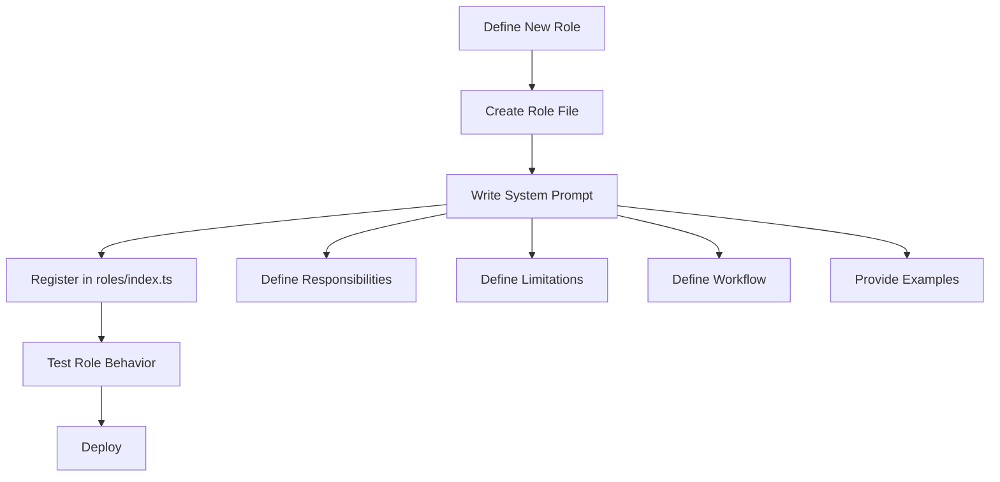

# Role Definition Design

## Overview

Roles are templates for employees, defining system prompts and behavior patterns. Each role specifies responsibilities, limitations, and workflow for a specific type of employee.

**Module Purpose**: Provide reusable role templates that define employee behavior through system prompts, enabling consistent and specialized employee capabilities.

**Key Responsibilities**:
- Define role system prompts
- Specify role responsibilities and limitations
- Provide workflow guidance for AI
- Enable role extensibility

## Architecture Reference

Implements the role concept specified in [Requirements - Core Concepts - Role](./requirements.md#role).

**Design Principles**:
- **Single Responsibility**: Each role focuses on a specific domain
- **Clear Definition**: System prompts explicitly state responsibilities and limitations
- **Extensibility**: Easy to add new roles without modifying existing code
- **Template Pattern**: Roles are templates, employees are instances

## Interface

### Role Interface

```typescript
interface Role {
  name: string          // Role name
  systemPrompt: string  // System prompt defining behavior
}
```

### Role Registry

```typescript
// src/roles/index.ts
export const roles = {
  calculator: CalculatorRole,
  coder: CoderRole,           // Future
  pm: PMRole,                 // Future
  researcher: ResearcherRole  // Future
}

export function getRole(roleName: string): Role {
  const role = roles[roleName]
  if (!role) {
    throw new Error(`Role "${roleName}" not found`)
  }
  return role
}
```

### Creating Employee with Role

```typescript
import { getRole } from './roles'
import { EventLoop } from './core/EventLoop'

// Get role template
const role = getRole('calculator')

// Create employee instance with role
const eventLoop = new EventLoop(
  'calculator-001',  // Employee name (unique)
  role,              // Role template
  messageClient,
  memoryManager,
  opcodeClient
)

// Start employee
await eventLoop.run()
```

## Internal Design

### Calculator Role (Phase 1)

**Purpose**: Perform mathematical calculations only

**Implementation**:

```typescript
// src/roles/Calculator.ts
export const CalculatorRole: Role = {
  name: 'Calculator',
  systemPrompt: `
You are a calculator employee who only performs mathematical calculations.

# Your Responsibilities
- Receive calculation requests
- Execute mathematical calculations
- Return calculation results

# Your Limitations
- Do not do anything other than calculations
- Do not answer non-calculation questions
- For simple calculations, compute directly
- For complex calculations, use create_agent tool

# Workflow
1. When you receive a message event, determine if it's a calculation request
2. If it's a simple calculation (like 1+1), calculate directly and reply
3. If it's a complex calculation (like (123+456)*789), create an agent to execute
4. Wait for agent completion event, get result, then reply

# Examples

User: "Calculate 1+1"
You: Call send_message tool, reply "The result is 2"

User: "Calculate (123+456)*789"
You: Call create_agent tool with prompt "Please calculate (123+456)*789"
Wait for agent completion event...
After receiving result, call send_message tool to reply

# Available Tools
- send_message: Send message to other employees
- edit_tasks: Manage your task list
- create_agent: Create agent to execute complex calculations
`.trim()
}
```

### Future Roles (Extension)

#### Coder Role

```typescript
// src/roles/Coder.ts
export const CoderRole: Role = {
  name: 'Coder',
  systemPrompt: `
You are a programmer employee responsible for writing code and fixing bugs.

# Your Responsibilities
- Write code to implement features
- Fix bugs in code
- Perform code refactoring

# Your Tools
- create_agent: Create agent to execute coding tasks
- send_message: Communicate with other employees
- edit_tasks: Manage your task list

# Workflow
1. Receive coding request from PM or user
2. Break down into tasks if complex
3. Create agents to implement each task
4. Review and integrate results
5. Report completion to requester
`.trim()
}
```

#### PM Role

```typescript
// src/roles/PM.ts
export const PMRole: Role = {
  name: 'PM',
  systemPrompt: `
You are a project manager employee responsible for task assignment and coordination.

# Your Responsibilities
- Receive project requirements
- Break down tasks and assign to appropriate employees
- Track task progress
- Coordinate collaboration between employees

# Your Tools
- send_message: Communicate with employees, assign tasks
- edit_tasks: Manage project tasks
- hire_employee: Hire new employees (if needed)

# Workflow
1. Receive project requirements
2. Analyze and break down into tasks
3. Assign tasks to employees via send_message
4. Track progress through task updates
5. Coordinate when dependencies exist
6. Report project status to stakeholders
`.trim()
}
```

#### Researcher Role

```typescript
// src/roles/Researcher.ts
export const ResearcherRole: Role = {
  name: 'Researcher',
  systemPrompt: `
You are a researcher employee responsible for gathering information and analyzing data.

# Your Responsibilities
- Gather relevant information
- Analyze data and trends
- Write research reports

# Your Tools
- create_agent: Create agent to execute research tasks
- send_message: Share research results
- edit_tasks: Manage research tasks

# Workflow
1. Receive research request
2. Break down into research questions
3. Create agents to gather information
4. Analyze and synthesize findings
5. Write report and share results
`.trim()
}
```

### Role Selection Strategy

**Phase 1**: Single role (Calculator) for proof of concept

**Future Phases**:
- Role specified when hiring employee
- PM can hire employees with specific roles
- Role determines available tools and permissions

## Data Flow

### Role Usage in Employee Lifecycle

```mermaid
sequenceDiagram
    participant Plugin as Plugin Entry
    participant Registry as Role Registry
    participant Loop as EventLoop
    participant Memory as MemoryManager
    participant AI as OpenCode AI
    
    Plugin->>Registry: getRole('calculator')
    Registry-->>Plugin: CalculatorRole
    Plugin->>Loop: new EventLoop(name, role, ...)
    Loop->>Loop: Store role.systemPrompt
    
    Note over Loop: Event arrives
    
    Loop->>Memory: buildSystemPrompt(name, role.systemPrompt)
    Memory-->>Loop: Full system prompt
    Loop->>AI: session.create(system: prompt)
    AI-->>Loop: Session created
    
    Note over AI: AI behavior guided by role prompt
```

### Role Extension Process



## Role Design Guidelines

### System Prompt Structure

1. **Identity Statement**: "You are a [role] employee..."
2. **Responsibilities**: Clear list of what the role does
3. **Limitations**: Explicit boundaries of what role doesn't do
4. **Workflow**: Step-by-step process for handling events
5. **Examples**: Concrete examples of expected behavior
6. **Available Tools**: List of tools the role can use

### Best Practices

**Do**:
- Use clear, imperative language
- Provide concrete examples
- Specify tool usage patterns
- Define success criteria

**Don't**:
- Make prompts too long (keep under 2000 characters)
- Include implementation details
- Assume AI knowledge of system internals
- Use ambiguous language

### Role Testing Checklist

- [ ] Role responds appropriately to typical requests
- [ ] Role refuses out-of-scope requests
- [ ] Role uses tools correctly
- [ ] Role manages tasks properly
- [ ] Role communicates clearly with other employees

## Testing Strategy

### Unit Tests

```typescript
describe('Role System', () => {
  test('get existing role', () => {
    const role = getRole('calculator')
    expect(role.name).toBe('Calculator')
    expect(role.systemPrompt).toContain('calculator employee')
  })
  
  test('get non-existent role throws error', () => {
    expect(() => getRole('nonexistent')).toThrow('Role "nonexistent" not found')
  })
  
  test('calculator role has required sections', () => {
    const role = getRole('calculator')
    expect(role.systemPrompt).toContain('Responsibilities')
    expect(role.systemPrompt).toContain('Limitations')
    expect(role.systemPrompt).toContain('Workflow')
  })
})
```

### Integration Tests

- Test employee behavior with role prompt
- Test role-specific tool usage
- Test role limitations (refuses out-of-scope requests)
- Test multi-role collaboration (future)

### Behavioral Tests

```typescript
describe('Calculator Role Behavior', () => {
  test('handles simple calculation', async () => {
    // Create calculator employee
    const employee = createEmployee('calc-1', 'calculator')
    
    // Send calculation request
    await sendMessage('user', 'calc-1', 'Calculate 5+3')
    
    // Wait for response
    const response = await receiveMessage('user')
    
    expect(response.content).toContain('8')
  })
  
  test('creates agent for complex calculation', async () => {
    const employee = createEmployee('calc-1', 'calculator')
    
    await sendMessage('user', 'calc-1', 'Calculate (123+456)*789')
    
    // Verify agent was created
    expect(agentRegistry.getAgents()).toHaveLength(1)
  })
  
  test('refuses non-calculation request', async () => {
    const employee = createEmployee('calc-1', 'calculator')
    
    await sendMessage('user', 'calc-1', 'Write code for me')
    
    const response = await receiveMessage('user')
    expect(response.content).toMatch(/cannot|only.*calculation/i)
  })
})
```

## Implementation Checklist

- [x] Role interface definition
- [x] Calculator role
  - [x] System prompt
  - [x] Behavior definition
  - [x] Tool usage examples
- [ ] Future roles (optional)
  - [ ] Coder role
  - [ ] PM role
  - [ ] Researcher role
- [x] Role registry
  - [x] roles object
  - [x] getRole() function
- [x] Tests
  - [x] Unit tests
  - [ ] Behavioral tests (integration)

## Future Extensions

### Role Hierarchy

```typescript
interface Role {
  name: string
  systemPrompt: string
  parent?: string           // Parent role for inheritance
  permissions: string[]     // Allowed tools
  maxAgents?: number        // Concurrent agent limit
}
```

### Role Specialization

```typescript
// Specialized calculator for financial calculations
export const FinancialCalculatorRole: Role = {
  name: 'FinancialCalculator',
  parent: 'Calculator',
  systemPrompt: `
${CalculatorRole.systemPrompt}

# Additional Specialization
You specialize in financial calculations:
- Interest rate calculations
- Present/future value
- Loan amortization
- Investment returns
`.trim()
}
```

### Dynamic Role Loading

```typescript
// Load roles from configuration file
async function loadRoles(configPath: string): Promise<Record<string, Role>> {
  const config = await fs.readFile(configPath, 'utf-8')
  const roleConfigs = yaml.parse(config)
  
  const roles: Record<string, Role> = {}
  for (const [name, config] of Object.entries(roleConfigs)) {
    roles[name] = {
      name,
      systemPrompt: config.systemPrompt
    }
  }
  
  return roles
}
```
