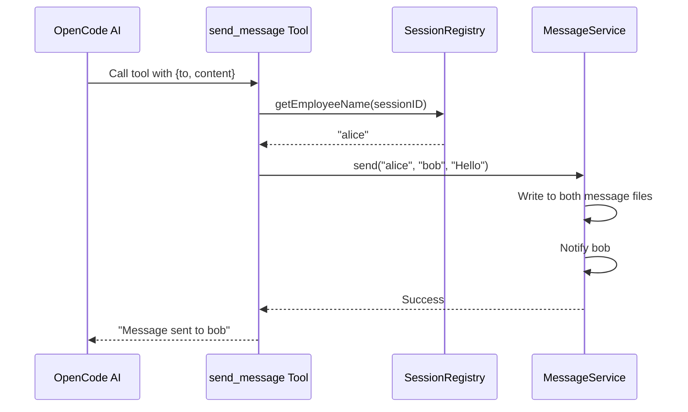
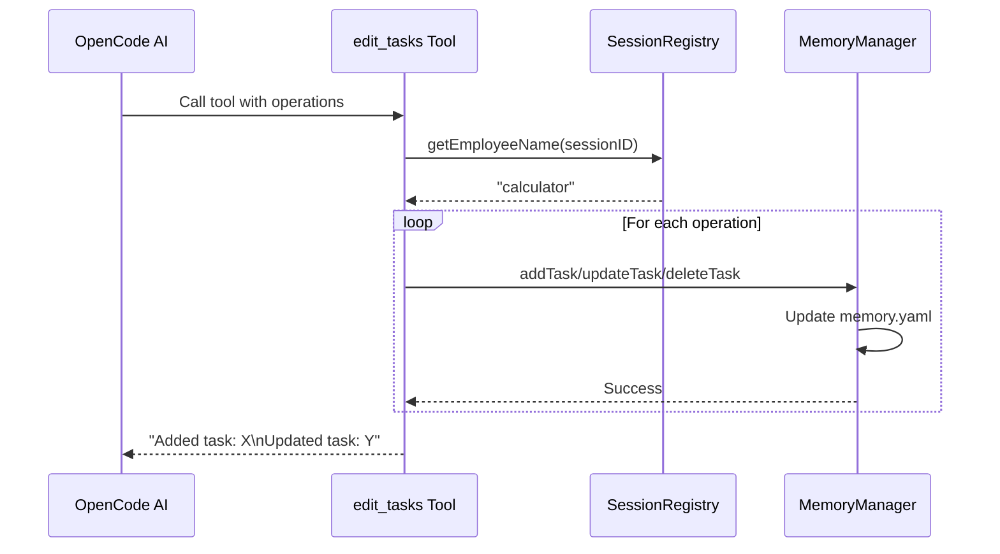
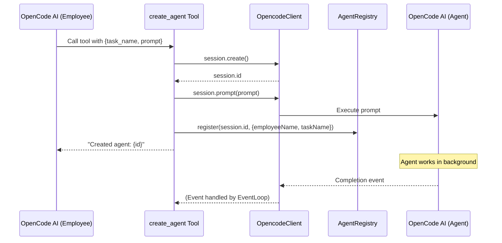

# Tool System Design

## Overview

The Tool System provides employees with operational capabilities, including sending messages, managing tasks, creating agents, and hiring employees.

**Module Purpose**: Enable AI employees to perform actions through a standardized tool interface, with global registration and permission control.

**Key Responsibilities**:
- Tool definition and registration
- Permission control per session
- Context-aware execution (access to caller information)
- Integration with core services (MessageService, MemoryManager, OpencodeClient)

## Architecture Reference

Implements the tool system requirements specified in [Requirements - Tool System](./requirements-tools.md).

**Design Principles**:
- **Global Registration**: Tools registered globally through plugin
- **Permission Control**: Tool availability controlled via `session.prompt` tools parameter
- **Context Awareness**: Tools can access caller information (sessionID, agent)
- **Atomic Operations**: Each tool performs a single, well-defined operation

## Interface

### Available Tools

#### 1. send_message

**Purpose**: Send message to another employee

**Parameters**:
```typescript
{
  to: string      // Recipient employee name
  content: string // Message content
}
```

**Returns**: Success confirmation message

#### 2. edit_tasks

**Purpose**: Batch edit task list (add, update, delete tasks)

**Parameters**:
```typescript
{
  operations: Array<{
    action: 'add' | 'update' | 'delete'
    
    // For 'add' action
    name?: string
    description?: string
    dependencies?: string[]
    
    // For 'update' action
    name?: string
    status?: 'pending' | 'in_progress' | 'completed' | 'cancelled' | 'blocked'
    result?: string
    statusReason?: string
    
    // For 'delete' action
    name?: string
  }>
}
```

**Returns**: Summary of operations performed

#### 3. create_agent

**Purpose**: Create OpenCode agent to execute task

**Parameters**:
```typescript
{
  task_name: string  // Associated task name
  prompt: string     // Prompt for the agent
}
```

**Returns**: Agent ID and confirmation message

#### 4. hire_employee

**Purpose**: Hire new employee with specified role

**Parameters**:
```typescript
{
  name: string  // Employee name (must be unique)
  role: string  // Role type (must exist in RoleManager)
}
```

**Returns**: Success confirmation with employee name and role

### Tool Registration

```typescript
// In plugin entry (src/index.ts)
import { Plugin } from "@opencode-ai/plugin"
import { 
  sendMessageTool, 
  editTasksTool, 
  createAgentTool, 
  hireEmployeeTool 
} from "./tools"

export const CcloverPlugin: Plugin = async (ctx) => {
  // ... initialization ...
  
  return {
    tool: {
      send_message: sendMessageTool,
      edit_tasks: editTasksTool,
      create_agent: createAgentTool,
      hire_employee: hireEmployeeTool
    }
  }
}
```

### Permission Control

```typescript
// In EventLoop when calling AI
await this.opcodeClient.session.prompt({
  path: { id: session.id },
  body: {
    parts: [...],
    tools: {
      'send_message': true,
      'edit_tasks': true,
      'create_agent': true,
      'hire_employee': true  // Enabled for all employees
    }
  }
})
```

## Internal Design

### Tool Implementation Pattern

Each tool follows this structure:

```typescript
import { tool } from "@opencode-ai/plugin"

export const toolName = tool({
  description: "Tool description for AI",
  args: {
    param1: tool.schema.string().describe("Parameter description"),
    param2: tool.schema.number().optional().describe("Optional parameter")
  },
  async execute(args, context) {
    // 1. Get caller information
    const employeeName = sessionRegistry.getEmployeeName(context.sessionID)
    
    // 2. Perform operation
    const result = await performOperation(args)
    
    // 3. Return result message
    return `Operation completed: ${result}`
  }
})
```

### Tool Implementations

#### 1. send_message Tool

```typescript
// src/tools/SendMessageTool.ts
import { tool } from "@opencode-ai/plugin"
import type { MessageService } from "../core/MessageService"
import { sessionRegistry } from "../utils/SessionRegistry"

export function createSendMessageTool(messageService: MessageService) {
  return tool({
    description: "Send message to another employee",
    args: {
      to: tool.schema.string().describe("Recipient employee name"),
      content: tool.schema.string().describe("Message content")
    },
    async execute(args, context) {
      // Get sender from session registry
      const from = sessionRegistry.getEmployeeName(context.sessionID)
      
      if (!from) {
        throw new Error('Cannot determine sender from session')
      }
      
      // Send message via MessageService
      await messageService.send(from, args.to, args.content)
      
      return `Message sent to ${args.to}`
    }
  })
}
```

#### 2. edit_tasks Tool

```typescript
// src/tools/EditTasksTool.ts
import { tool } from "@opencode-ai/plugin"
import type { MemoryManager } from "../core/MemoryManager"
import { sessionRegistry } from "../utils/SessionRegistry"

export function createEditTasksTool(memoryManager: MemoryManager) {
  return tool({
    description: "Batch edit task list (add, update, delete, decompose tasks)",
    args: {
      operations: tool.schema.array(
        tool.schema.object({
          action: tool.schema.enum(['add', 'update', 'delete', 'decompose']).describe("Operation type"),
          name: tool.schema.string().optional().describe("Task name"),
          description: tool.schema.string().optional().describe("Task description"),
          dependencies: tool.schema.array(tool.schema.string()).optional().describe("Dependency task names"),
          status: tool.schema.enum(['pending', 'in_progress', 'completed', 'cancelled', 'blocked']).optional().describe("Task status"),
          result: tool.schema.string().optional().describe("Task result (only for completed tasks)"),
          statusReason: tool.schema.string().optional().describe("Reason for status change (e.g., why blocked or cancelled)"),
          subtasks: tool.schema.array(
            tool.schema.object({
              name: tool.schema.string().describe("Subtask name"),
              description: tool.schema.string().describe("Subtask description"),
              dependencies: tool.schema.array(tool.schema.string()).optional().describe("Additional dependencies")
            })
          ).optional().describe("Subtasks for decompose operation")
        })
      ).describe("List of operations")
    },
    async execute(args, context) {
      const employeeName = sessionRegistry.getEmployeeName(context.sessionID)
      
      if (!employeeName) {
        throw new Error('Cannot determine employee from session')
      }
      
      const results: string[] = []
      
      for (const op of args.operations) {
        if (op.action === 'add') {
          await memoryManager.addTask(employeeName, {
            name: op.name!,
            status: 'pending',
            description: op.description!,
            dependencies: op.dependencies || []
          })
          results.push(`Added task: ${op.name}`)
        }
        else if (op.action === 'update') {
          await memoryManager.updateTask(employeeName, op.name!, {
            status: op.status,
            result: op.result,
            statusReason: op.statusReason
          })
          results.push(`Updated task: ${op.name}`)
        }
        else if (op.action === 'delete') {
          const { affectedTasks } = await memoryManager.deleteTaskWithCleanup(employeeName, op.name!)
          if (affectedTasks.length > 0) {
            results.push(`Deleted task: ${op.name} (cleaned dependencies for ${affectedTasks.length} tasks)`)
          } else {
            results.push(`Deleted task: ${op.name}`)
          }
        }
        else if (op.action === 'decompose') {
          await memoryManager.decomposeTask(employeeName, op.name!, op.subtasks!)
          results.push(`Decomposed task: ${op.name} into ${op.subtasks!.length} subtasks`)
        }
      }
      
      return results.join('\n')
    }
  })
}
```

#### 3. create_agent Tool

```typescript
// src/tools/CreateAgentTool.ts
import { tool } from "@opencode-ai/plugin"
import type { OpencodeClient } from "@opencode-ai/sdk"
import { sessionRegistry } from "../utils/SessionRegistry"
import { agentRegistry } from "../utils/AgentRegistry"

export function createCreateAgentTool(opcodeClient: OpencodeClient) {
  return tool({
    description: "Create OpenCode agent to execute task",
    args: {
      task_name: tool.schema.string().describe("Associated task name"),
      prompt: tool.schema.string().describe("Prompt for the agent")
    },
    async execute(args, context) {
      const employeeName = sessionRegistry.getEmployeeName(context.sessionID)
      
      if (!employeeName) {
        throw new Error('Cannot determine employee from session')
      }
      
      // 1. Create agent session
      const session = await opcodeClient.session.create({
        body: {
          title: `${employeeName} - ${args.task_name}`
        }
      })
      
      // 2. Send prompt to agent
      await opcodeClient.session.prompt({
        path: { id: session.data.id },
        body: {
          parts: [
            { type: 'text', text: args.prompt }
          ]
        }
      })
      
      // 3. Register agent info (for event matching)
      agentRegistry.register(session.data.id, {
        employeeName,
        taskName: args.task_name
      })
      
      return `Created agent: ${session.data.id}, executing task: ${args.task_name}`
    }
  })
}
```

#### 4. hire_employee Tool

```typescript
// src/tools/HireEmployeeTool.ts
import { tool } from "@opencode-ai/plugin"
import type { StateManager } from "../state/StateManager"
import type { ProjectInstance } from "../server/GlobalServer"
import { sessionRegistry } from "../utils/SessionRegistry"

export function createHireEmployeeTool(
  stateManager: StateManager,
  project: ProjectInstance
) {
  return tool({
    description: "Hire new employee with specified role",
    args: {
      name: tool.schema.string().describe("Employee name (must be unique)"),
      role: tool.schema.string().describe("Role type (must exist)")
    },
    async execute(args, context) {
      const hiredBy = sessionRegistry.getEmployeeName(context.sessionID)
      
      // 1. Validate role exists
      const roleDefinition = project.roleManager.getRole(args.role)
      if (!roleDefinition) {
        throw new Error(`Role '${args.role}' not found`)
      }
      
      // 2. Register employee (auto-persists via StateManager)
      await stateManager.registerEmployee({
        name: args.name,
        role: args.role,
        status: "inactive",
        createdAt: new Date().toISOString(),
        lastActiveAt: new Date().toISOString(),
        hiredBy
      })
      
      // 3. Start EventLoop for new employee
      await project.startEmployee(args.name, args.role)
      
      return `Successfully hired '${args.name}' as ${args.role}`
    }
  })
}
```

### Supporting Utilities

#### SessionRegistry

Maps session IDs to employee names:

```typescript
// src/utils/SessionRegistry.ts
class SessionRegistry {
  private sessionToEmployee = new Map<string, string>()
  
  register(sessionId: string, employeeName: string): void {
    this.sessionToEmployee.set(sessionId, employeeName)
  }
  
  getEmployeeName(sessionId: string): string | undefined {
    return this.sessionToEmployee.get(sessionId)
  }
  
  unregister(sessionId: string): void {
    this.sessionToEmployee.delete(sessionId)
  }
}

export const sessionRegistry = new SessionRegistry()
```

#### AgentRegistry

Tracks background agents created by employees:

```typescript
// src/utils/AgentRegistry.ts
interface AgentInfo {
  employeeName: string
  taskName: string
}

class AgentRegistry {
  private agents = new Map<string, AgentInfo>()
  
  register(agentId: string, info: AgentInfo): void {
    this.agents.set(agentId, info)
  }
  
  getInfo(agentId: string): AgentInfo | undefined {
    return this.agents.get(agentId)
  }
  
  isOurAgent(agentId: string): boolean {
    return this.agents.has(agentId)
  }
  
  unregister(agentId: string): void {
    this.agents.delete(agentId)
  }
}

export const agentRegistry = new AgentRegistry()
```

## Data Flow

### send_message Flow



### edit_tasks Flow



### create_agent Flow



## Usage Examples

### Example 1: Employee Sends Message

AI calls tool:
```json
{
  "tool": "send_message",
  "args": {
    "to": "user",
    "content": "The result is 2"
  }
}
```

### Example 2: Employee Manages Tasks

AI calls tool:
```json
{
  "tool": "edit_tasks",
  "args": {
    "operations": [
      {
        "action": "add",
        "name": "Calculate1+1",
        "description": "Calculate 1+1 for user",
        "dependencies": []
      },
      {
        "action": "update",
        "name": "Calculate1+1",
        "status": "completed",
        "result": "2"
      }
    ]
  }
}
```

### Example 3: Employee Creates Agent

AI calls tool:
```json
{
  "tool": "create_agent",
  "args": {
    "task_name": "CalculateComplexExpression",
    "prompt": "Please calculate (123 + 456) * 789"
  }
}
```

## Error Handling

**Tool Execution Errors**:
- Missing session mapping → Throw error with clear message
- Service operation failure → Propagate error to AI
- Invalid parameters → Schema validation catches before execution

**Permission Errors**:
- Tool not in allowed list → OpenCode SDK prevents call
- No explicit permission check needed in tool code

## Testing Strategy

### Unit Tests

```typescript
describe('Tool System', () => {
  test('send_message tool', async () => {
    const mockMessageService = createMockMessageService()
    const tool = createSendMessageTool(mockMessageService)
    
    sessionRegistry.register('session-123', 'alice')
    
    const result = await tool.execute(
      { to: 'bob', content: 'Hello' },
      { sessionID: 'session-123' }
    )
    
    expect(mockMessageService.send).toHaveBeenCalledWith('alice', 'bob', 'Hello')
    expect(result).toContain('Message sent to bob')
  })
  
  test('edit_tasks tool - add operation', async () => {
    const mockMemoryManager = createMockMemoryManager()
    const tool = createEditTasksTool(mockMemoryManager)
    
    sessionRegistry.register('session-123', 'calculator')
    
    const result = await tool.execute(
      {
        operations: [{
          action: 'add',
          name: 'Task1',
          description: 'Test task',
          dependencies: []
        }]
      },
      { sessionID: 'session-123' }
    )
    
    expect(mockMemoryManager.addTask).toHaveBeenCalled()
    expect(result).toContain('Added task: Task1')
  })
  
  test('create_agent tool', async () => {
    const mockOpcodeClient = createMockOpcodeClient()
    const tool = createCreateAgentTool(mockOpcodeClient)
    
    sessionRegistry.register('session-123', 'calculator')
    mockOpcodeClient.session.create.mockResolvedValue({
      data: { id: 'agent-456' }
    })
    
    const result = await tool.execute(
      {
        task_name: 'Calculate',
        prompt: 'Calculate 1+1'
      },
      { sessionID: 'session-123' }
    )
    
    expect(mockOpcodeClient.session.create).toHaveBeenCalled()
    expect(mockOpcodeClient.session.prompt).toHaveBeenCalled()
    expect(agentRegistry.isOurAgent('agent-456')).toBe(true)
  })
})
```

### Integration Tests

- Test tools with real MessageService and MemoryManager
- Test permission control (tool not in allowed list)
- Test error propagation from services to AI
- Test agent creation and event matching

## Implementation Checklist

- [x] Tool definitions
  - [x] sendMessageTool
  - [x] editTasksTool
  - [x] createAgentTool
  - [x] hireEmployeeTool (stub)
- [x] Supporting utilities
  - [x] SessionRegistry
  - [x] AgentRegistry
- [x] Plugin registration
  - [x] Tool registration in plugin entry
  - [x] Permission control in EventLoop
- [x] Tests
  - [x] Unit tests for each tool
  - [x] Integration tests
