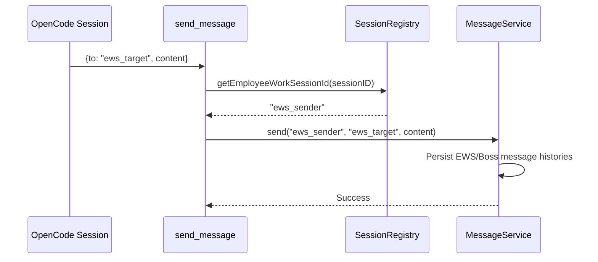
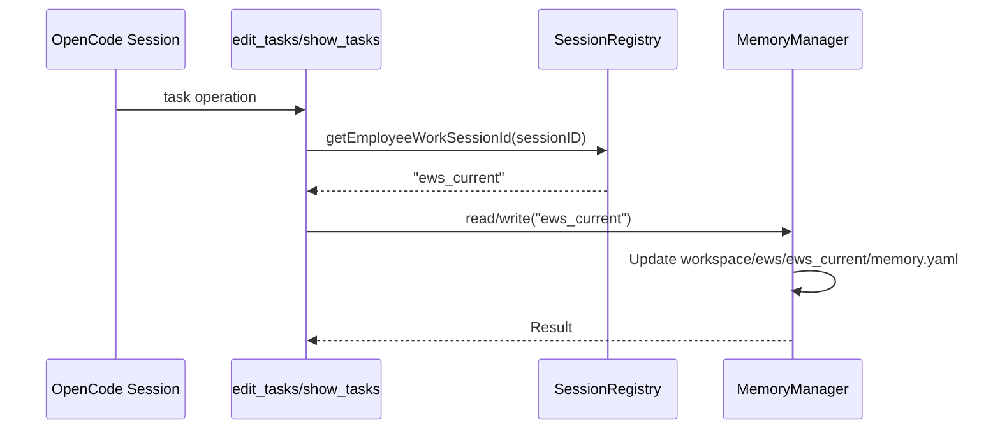

# Tool System Design

## EWS Refactor Status

Supported tools are EmployeeWorkSession-oriented. Runtime actions, memory, tasks, and messages are keyed by `EmployeeWorkSessionId` (`ews_*`). Stable Employee IDs (`emp_*`) are metadata identifiers only and are not runtime/message/task targets.

Supported registry/default-enabled tools:

- `send_message`
- `edit_tasks`
- `show_tasks`
- `hire_employee`
- `update_employee`
- `show_available_employees`
- `create_employee_work_session`
- `show_employee_work_sessions`
- `close_employee_work_session`
- `refresh_roles`
- `show_hireable_roles`
- `integrate`

Historical non-EWS tool paths have been removed from the supported repository surface. New runtime delegation uses Employee metadata plus `create_employee_work_session` instead of compatibility shims.

## Module Purpose

The tool system exposes controlled operational capabilities to OpenCode sessions. Tools resolve the caller from OpenCode session ID to `employeeWorkSessionId`, then operate on EWS-keyed services.

## Supported Identity Contract

- Caller identity: `SessionRegistry.getEmployeeWorkSessionId(sessionID)`.
- Message targets: `ews_*` employee work sessions or `boss_*` configured bosses.
- Task memory: `.cclover/workspace/ews/{employeeWorkSessionId}/memory.yaml`.
- `hire_employee` creates stable Employee metadata only.
- `create_employee_work_session` creates the runnable unit, initializes EWS memory, starts the EWS event loop, and sends the initial message.

## Supported Tool Responsibilities

### `send_message`

Sends a message from the caller EWS/Boss identity to a target EWS/Boss identity.

Important behavior:

- Rejects Employee IDs (`emp_*`) and role names as runtime targets.
- Accepts only EWS IDs and configured Boss IDs.
- Writes message history under EWS/Boss message stores.

### `edit_tasks`

Mutates the caller EWS task list.

Important behavior:

- Uses EWS memory through `MemoryManager`.
- Supports add/update/delete/decompose operations.
- Validates task dependency DAG through `MemoryManager`.
- `waiting_for_message` marks externally blocked work and suppresses reminders.

### `show_tasks`

Reads the caller EWS task list and executable task set from EWS memory.

### `hire_employee`

Creates stable Employee metadata.

Important behavior:

- Does not start a runtime loop.
- Does not initialize EWS memory.
- Does not validate role required runtime args.
- Runtime startup is delegated to `create_employee_work_session`.

### `update_employee`

Updates stable Employee metadata and validates context paths.

### `show_available_employees`

Lists stable Employee metadata visible to the caller, based on boss authority, role `canHire`, and EWS supervisor chains.

### `create_employee_work_session`

Creates and starts an EmployeeWorkSession.

Important behavior:

- Validates Employee metadata and role.
- Validates required args for the role.
- Creates `.cclover/employee-work-sessions.yaml` record.
- Initializes `.cclover/workspace/ews/{employeeWorkSessionId}/memory.yaml`.
- Starts an EventLoop keyed by `employeeWorkSessionId`.
- Sends the initial message to the new EWS.

### `show_employee_work_sessions`

Lists EWS runtime records visible to the caller.

### `close_employee_work_session`

Stops the EWS runtime loop and marks the EWS record closed.

### `refresh_roles`

Reloads role definitions from project, user, and preset role directories.

### `show_hireable_roles`

Lists roles the caller can hire based on boss authority or current role `canHire` permissions.

### `integrate`

Resets context for soulless employees with active EWS records. This is EWS-aware and should not reintroduce Employee runtime fields.

## Registration and Permissions

`src/tools/index.ts` is the supported registry authority.

```typescript
export const DEFAULT_TOOL_PERMISSIONS = {
  send_message: true,
  edit_tasks: true,
  hire_employee: true,
  update_employee: true,
  show_available_employees: true,
  create_employee_work_session: true,
  show_employee_work_sessions: true,
  close_employee_work_session: true,
  refresh_roles: true,
  show_tasks: true,
  show_hireable_roles: true,
  integrate: true,
}
```

EventLoop prompt tool permissions must not enable obsolete tools. Supported runtime prompt calls include only EWS-safe tools such as `send_message`, `edit_tasks`, and `show_tasks` unless the role/session explicitly receives additional supported tools.

## Data Flow

### Message Flow



### Task Flow



### EWS Creation Flow

```mermaid
sequenceDiagram
    participant AI as OpenCode Session
    participant Tool as create_employee_work_session
    participant EWS as EmployeeWorkSessionManager
    participant Memory as MemoryManager
    participant Loop as EventLoop

    AI->>Tool: employeeId, args, initialMessage
    Tool->>EWS: createEmployeeWorkSession(...)
    EWS-->>Tool: employeeWorkSessionId
    Tool->>Memory: write(employeeWorkSessionId, initial memory)
    Tool->>Loop: start EventLoop keyed by employeeWorkSessionId
    Tool-->>AI: Created employee work session
```

## API Boundary

HTTP routes for runtime message/task/halt operations use EWS paths:

- `GET /api/projects/:projectId/employee-work-sessions/:employeeWorkSessionId/messages`
- `POST /api/projects/:projectId/employee-work-sessions/:employeeWorkSessionId/messages`
- `GET /api/projects/:projectId/employee-work-sessions/:employeeWorkSessionId/peers`
- `GET /api/projects/:projectId/employee-work-sessions/:employeeWorkSessionId/tasks`
- `POST /api/projects/:projectId/employee-work-sessions/:employeeWorkSessionId/halt`

Employee paths remain only for stable Employee metadata reads/lists and must not expose runtime message/task/halt behavior.

## Testing Strategy

Supported validation focuses on EWS behavior:

- `tests/unit/EwsToolsMessaging.test.ts`
- `tests/unit/MessageRoutingContract.test.ts`
- `tests/unit/MemoryManager.test.ts`
- `tests/unit/SessionRegistry.test.ts`
- `tests/unit/ContextBuilder.test.ts`
- `tests/unit/EmployeeWorkSessionManager.test.ts`
- `tests/unit/RuntimeLifecycleEws.test.ts`

Tests for removed non-EWS behavior must not be used as supported behavior definitions.

## Implementation Checklist

- [x] EWS-aware supported tool registry
- [x] EWS task memory operations
- [x] EWS/Boss message routing
- [x] Employee metadata creation separated from runtime creation
- [x] EWS runtime creation/list/close tools
- [x] Non-EWS tools removed from supported registration/default permissions
- [x] Runtime message/task/halt HTTP API moved to EWS path contracts
- [x] Removed non-EWS source files from supported package
- [x] Removed tests for non-EWS tool/runtime contracts
