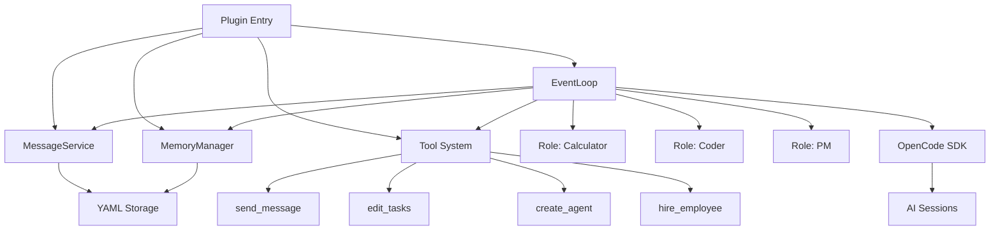
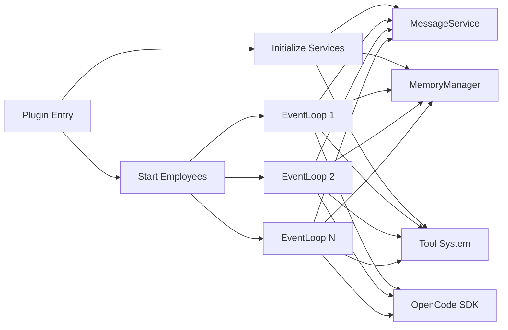
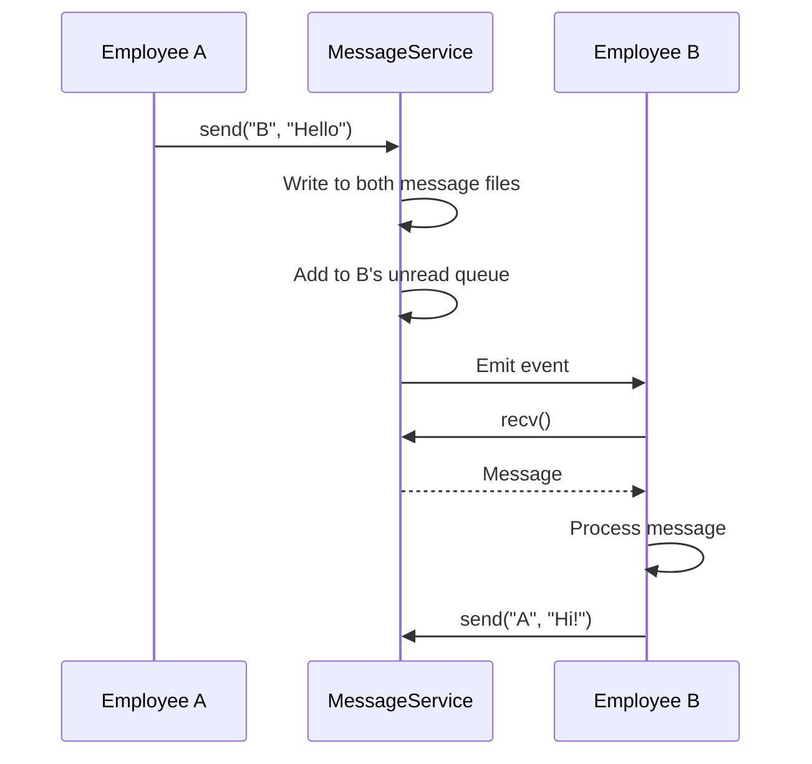
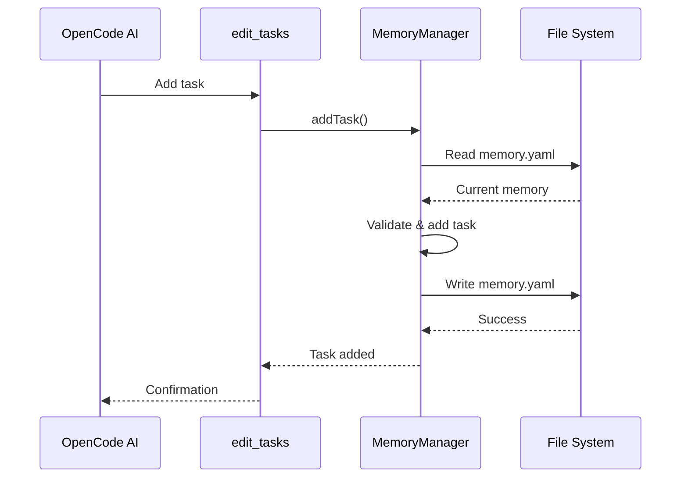
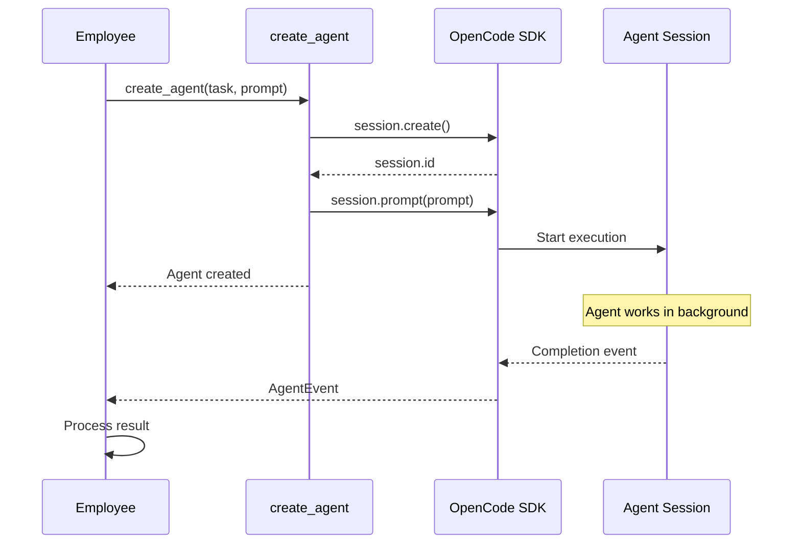

# opencode-cclover Design

## Overview

opencode-cclover is a multi-agent autonomous collaboration system implemented as an OpenCode plugin. The system simulates employee collaboration behavior where AI employees can send/receive messages, manage tasks, create agents to execute work, and achieve autonomous decision-making with parallel execution.

**Module Purpose**: Provide a complete framework for multi-agent collaboration within OpenCode, enabling AI employees to work together autonomously through event-driven architecture.

**Scope**: This design covers the entire plugin system including core services, tool system, role definitions, and plugin integration.

## Architecture Reference

Implements the requirements specified in [Requirements](./requirements.md) and [Architecture](./architecture.md).

**System Architecture**:



**Key Design Principles**:
- **Event-Driven**: Employee actions triggered by events (messages, task completion)
- **Decentralized Storage**: Each employee stores their own data locally
- **Centralized Coordination**: Services coordinate communication and state
- **Autonomous Decision-Making**: AI decides next actions based on context
- **Parallel Execution**: Multiple employees and agents work concurrently

## Interface

### Core Services

The system exposes the following core services:

#### MessageService

Handles message communication between employees.

**Location**: [src/core/MessageService.ts](../src/core/MessageService.ts)

**Detailed Design**: [MessageService Design](./design-message-service.md)

```typescript
import { MessageService } from './core/MessageService'

const messageService = new MessageService(workspaceRoot)
const client = messageService.getClient('employeeName')

// Send message
await client.send('recipient', 'Hello!')

// Receive message (blocking)
const message = await client.recv()
```

#### MemoryManager

Manages employee memory including knowledge, tasks (DAG), and custom data.

**Location**: [src/core/MemoryManager.ts](../src/core/MemoryManager.ts)

**Detailed Design**: [MemoryManager Design](./design-memory-manager.md)

```typescript
import { MemoryManager } from './core/MemoryManager'

const memoryManager = new MemoryManager(workspaceRoot)

// Read memory
const memory = await memoryManager.read('employeeName')

// Add task
await memoryManager.addTask('employeeName', {
  name: 'TaskName',
  status: 'pending',
  description: 'Task description',
  dependencies: []
})

// Get executable tasks
const tasks = await memoryManager.getExecutableTasks('employeeName')
```

#### EventLoop

Implements the employee runtime, processing events and invoking AI.

**Location**: [src/core/EventLoop.ts](../src/core/EventLoop.ts)

**Detailed Design**: [EventLoop Design](./design-event-loop.md)

```typescript
import { EventLoop } from './core/EventLoop'

const eventLoop = new EventLoop(
  employeeName,
  role,
  messageClient,
  memoryManager,
  opcodeClient
)

// Start event loop (runs forever)
await eventLoop.run()
```

### Tool System

Tools enable AI employees to perform actions.

**Location**: [src/tools/](../src/tools/)

**Detailed Design**: [Tool System Design](./design-tools.md)

**Available Tools**:
- `send_message`: Send message to another employee
- `edit_tasks`: Batch edit task list (add, update, delete)
- `create_agent`: Create OpenCode agent to execute task
- `hire_employee`: Hire new employee (future)

### Role System

Roles define employee behavior through system prompts.

**Location**: [src/roles/](../src/roles/)

**Detailed Design**: [Role Definition Design](./design-roles.md)

**Available Roles**:
- `Calculator`: Performs mathematical calculations only
- `Coder`: Writes code and fixes bugs (future)
- `PM`: Manages projects and assigns tasks (future)
- `Researcher`: Gathers information and analyzes data (future)

### Plugin Entry

The OpenCode plugin entry point that initializes the system.

**Location**: [src/index.ts](../src/index.ts)

**Detailed Design**: [Plugin Entry Design](./design-plugin-entry.md)

```typescript
import { CcloverPlugin } from 'opencode-cclover'

// Plugin is automatically loaded by OpenCode
// No manual initialization needed
```

## Internal Design

### Component Relationships



### Data Flow

#### Message Flow



#### Task Management Flow



#### Agent Creation Flow



### File Structure

```
{projectRoot}/.cclover/workspace/
└── employees/
    ├── calculator/
    │   ├── messages/
    │   │   └── user/
    │   │       └── chat.yaml
    │   └── memory.yaml
    └── coder/
        ├── messages/
        │   └── pm/
        │       └── chat.yaml
        └── memory.yaml
```

**Message File Format** (`messages/{peer}/chat.yaml`):
```yaml
- timestamp: 2026-03-01T10:00:00Z
  direction: send
  content: Hello!

- timestamp: 2026-03-01T10:00:05Z
  direction: receive
  content: Hi there!
```

**Memory File Format** (`memory.yaml`):
```yaml
knowledge:
  - Experience item 1
  - Experience item 2

tasks:
  - name: Task1
    status: completed
    description: Task description
    result: Task result
    dependencies: []
    created: 2026-03-01T10:00:00Z
    completed: 2026-03-01T10:00:05Z

custom:
  custom_field: custom_value
```

## Creating Instance

### Plugin Installation

**Method 1: Local Development (Symlink)**

```bash
# In your project directory
mkdir -p .opencode/plugin
ln -s /absolute/path/to/opencode-cclover/src/index.ts .opencode/plugin/cclover.ts

# Start OpenCode
opencode serve
```

**Method 2: Configuration File**

```json
// opencode.json
{
  "plugin": [
    "file:///absolute/path/to/opencode-cclover/src/index.ts"
  ]
}
```

**Method 3: NPM Package (Future)**

```bash
npm install opencode-cclover
```

```json
// opencode.json
{
  "plugin": ["opencode-cclover"]
}
```

### Using the System

Once the plugin is loaded, tools are automatically available:

```typescript
// In OpenCode AI session

// Send message to calculator employee
await tools.send_message({
  to: "calculator",
  content: "Calculate 1+1"
})

// Manage tasks
await tools.edit_tasks({
  operations: [
    {
      action: "add",
      name: "MyTask",
      description: "Task description",
      dependencies: []
    }
  ]
})

// Create agent
await tools.create_agent({
  task_name: "ComplexTask",
  prompt: "Execute this complex task..."
})
```

## Component Design Documents

For detailed design of each component, see:

1. **[MessageService Design](./design-message-service.md)**
   - Message sending and receiving
   - Unread queue management
   - Event notification mechanism
   - File persistence

2. **[MemoryManager Design](./design-memory-manager.md)**
   - Memory structure (knowledge, tasks, custom)
   - Task DAG management
   - Executable task calculation
   - Mermaid diagram generation
   - System prompt building

3. **[EventLoop Design](./design-event-loop.md)**
   - Event waiting and dispatching
   - Session lifecycle management
   - Context building
   - AI invocation
   - Summarization mechanism

4. **[Tool System Design](./design-tools.md)**
   - Tool definitions and implementations
   - Permission control
   - Context-aware execution
   - Supporting utilities (SessionRegistry, AgentRegistry)

5. **[Role Definition Design](./design-roles.md)**
   - Role interface
   - Calculator role (Phase 1)
   - Future roles (Coder, PM, Researcher)
   - Role registry

6. **[Plugin Entry Design](./design-plugin-entry.md)**
   - Plugin initialization flow
   - Service creation
   - Employee startup
   - Workspace management
   - .gitignore handling

## Testing

### Test Structure

```
tests/
├── unit/                      # Unit tests for individual modules
│   ├── MessageService.test.ts
│   ├── MemoryManager.test.ts
│   ├── EventLoop.test.ts
│   └── Tools.test.ts
├── integration/               # Integration tests for module interactions
│   ├── MessageService.integration.test.ts
│   ├── MemoryManager.integration.test.ts
│   └── PluginEntry.integration.test.ts
└── fixtures/                  # Test data and workspace snapshots
```

### Running Tests

```bash
# Run all tests
bun test

# Run specific test file
bun test tests/unit/MessageService.test.ts

# Run with coverage
bun test --coverage
```

### Manual Testing

See [workspace_test/README.md](../workspace_test/README.md) for manual testing guide with real OpenCode server.

## Performance Considerations

### Scalability Targets

- **Employees**: Support 10+ employees per project
- **Tasks**: Handle 1000+ tasks per employee
- **Messages**: Manage long-term message history (1000+ messages per peer)
- **Concurrent Agents**: Support multiple agents per employee

### Optimization Strategies

1. **Lazy Loading**: Load data only when needed
2. **In-Memory Caching**: Cache frequently accessed data
3. **Append-Only Writes**: Minimize file rewrites
4. **Event-Driven**: Avoid polling, use event notifications
5. **Parallel Execution**: Run employees independently

### Known Limitations (Phase 1)

- No file locking (relies on single-threaded JavaScript)
- No message/task archiving (files grow indefinitely)
- Fixed token threshold for summarization
- No database support (file system only)

## Implementation Status

### Phase 1: Infrastructure ✅ Completed
- [x] MessageService
- [x] MemoryManager
- [x] Tool System Framework
- [x] Supporting Utilities
- [x] Unit Tests

### Phase 2: Core Logic ✅ Completed
- [x] Tool Implementations
- [x] EventLoop
- [x] Calculator Role
- [x] Integration Tests

### Phase 3: Integration ✅ Completed
- [x] Plugin Entry
- [x] End-to-End Testing
- [x] Documentation

### Phase 4: Console (Planned)
- [ ] Web Management Console
- [ ] HTTP API Server
- [ ] WebSocket Real-time Updates
- [ ] Employee Monitoring UI

## Future Extensions

### Multi-Role Collaboration

- Implement Coder, PM, Researcher, Tester, Architect roles
- Test multi-role collaboration scenarios
- Implement role-based permissions

### Hierarchical Management

- Implement superior-subordinate relationships
- PM can assign tasks to Coder
- Coder can report progress to PM

### Storage Optimization

- Replace file system with database
- Implement message/task archiving
- Add indexing for faster queries

### Monitoring and Visualization

- Real-time employee status dashboard
- Task dependency graph visualization
- Message history viewer
- Performance metrics

## References

- [Requirements Document](./requirements.md)
- [Architecture Document](./architecture.md)
- [OpenCode Plugin SDK](https://github.com/opencode-ai/plugin)
- [Project README](../README.md)
