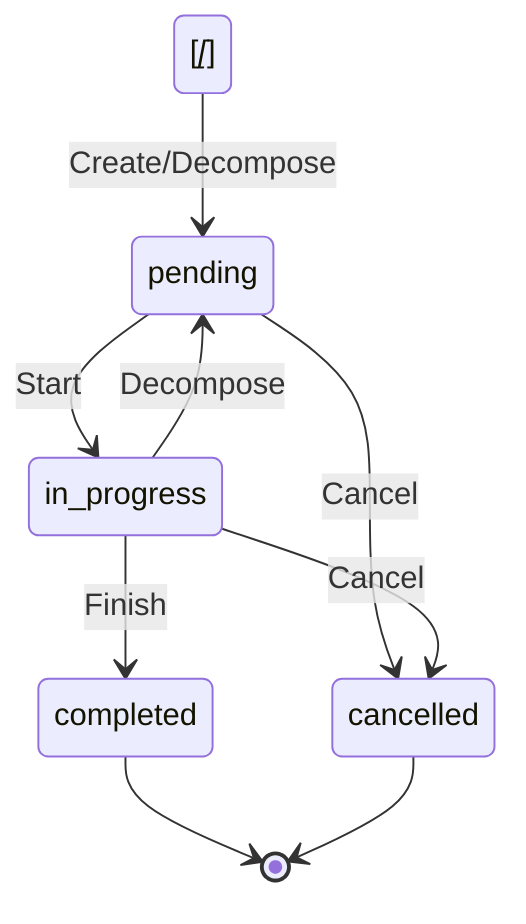
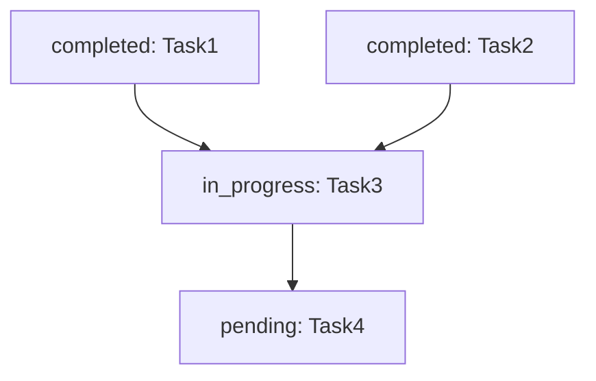

# Task Management Requirements

## Task Dependency System (DAG)

### Task Dependency Graph

- Uses DAG (Directed Acyclic Graph) to represent task dependencies
- Task names as unique identifiers (AI-generated, semantic)
- Supports parallel execution: automatically calculates tasks with satisfied dependencies

### Mermaid Visualization

- Framework automatically generates Mermaid diagram from `tasks`
- Fed to AI as context to help understand task progress
- Generation example:
  ```mermaid
  graph TD
    Calculate1+1[completed: Calculate1+1]
    Calculate3+4[completed: Calculate3+4]
    SumResults[in_progress: SumResults]
    Calculate1+1 --> SumResults
    Calculate3+4 --> SumResults
  ```

### Executable Task Calculation

- Scan all `pending` status tasks
- Check if all dependent tasks are `completed`
- Find all executable tasks
- These tasks can be started in parallel

## Task Operations

### Add Task

**Requirements**:
- Unique task name (AI-generated)
- Task description
- List of dependencies (task names)
- Initial status: `pending`
- Creation timestamp

**Validation**:
- Task name must be unique
- Dependencies must reference existing tasks
- Must not create circular dependencies

### Update Task

**Requirements**:
- Task name (identifier)
- New status (optional)
- Result (optional, required when status becomes `completed`)
- Completion timestamp (optional, set when status becomes `completed`)

**Validation**:
- Task must exist
- Status transitions must be valid:
  - `pending` → `in_progress` | `cancelled`
  - `in_progress` → `completed` | `cancelled`
  - `completed` → (no transitions)
  - `cancelled` → (no transitions)

### Delete Task

**Requirements**:
- Task name (identifier)

**Validation**:
- Task must exist

**Behavior**:
- Automatically removes deleted task from dependencies of all dependent tasks
- Dependent tasks continue to exist with updated dependencies

**Validation**:
- Task must exist

### Decompose Task

**Requirements**:
- Original task name (identifier)
- List of subtasks with names, descriptions, and optional additional dependencies

**Behavior**:
- Original task remains and depends on all subtasks
- Each subtask inherits original task's dependencies
- Subtasks can specify additional dependencies
- All tasks (original + subtasks) reset to `pending` status

**Validation**:
- Original task must exist
- Subtask names must be unique
- No circular dependencies created

### Batch Operations

**Requirements**:
- Support multiple operations in single call
- Operations: add, update, delete, decompose
- Atomic execution (all or nothing)

**Example**:
```json
{
  "operations": [
    {
      "action": "add",
      "name": "Calculate5*6",
      "description": "Calculate 5*6 for alice",
      "dependencies": []
    },
    {
      "action": "update",
      "name": "Calculate1+1",
      "status": "completed",
      "result": "2"
    },
    {
      "action": "delete",
      "name": "CancelledTask"
    },
    {
      "action": "decompose",
      "name": "ComplexTask",
      "subtasks": [
        {
          "name": "Subtask1",
          "description": "First part",
          "dependencies": []
        },
        {
          "name": "Subtask2",
          "description": "Second part",
          "dependencies": ["Subtask1"]
        }
      ]
    }
  ]
}
```

## Task Status Lifecycle



## Dependency Rules

### Valid Dependencies

- Task can depend on multiple tasks
- Dependencies must be acyclic (no circular dependencies)
- Dependencies must reference existing tasks

### Circular Dependency Detection

**Algorithm**:
1. Build dependency graph
2. Perform topological sort
3. If cycle detected, reject operation

**Example of Invalid Dependencies**:
```
TaskA depends on TaskB
TaskB depends on TaskC
TaskC depends on TaskA  ← Circular dependency!
```

### Dependency Resolution

**Executable Task Criteria**:
- Task status is `pending`
- All dependencies have status `completed`

**Example**:
`1: completed
Task2: completed
Task3: pending, depends on [Task1, Task2]  ← Executable!
Task4: pending, depends on [Task3]         ← Not executable yet
```

## Mermaid Generation Rules

### Node Format

- Format: `{taskName}[{status}: {taskName}]`
- Status colors (if supported):
  - `pending`: default
  - `in_progress`: yellow
  - `completed`: green
  - `cancelled`: red

### Edge Format

- Format: `{dependency} --> {task}`
- Direction: from dependency to dependent task

### Example Output



## Implementation Requirements

### Data Structure

```typescript
interface Task {
  name: string
  status: 'pending' | 'in_progress' | 'completed' | 'cancelled'
  description: string
  result?: string
  dependencies: string[]
  created: string  // ISO 8601
  completed?: string  // ISO 8601
}
```

### Validation Functions

- `validateTaskName(name: string): boolean`
- `validateDependencies(dependencies: string[], existingTasks: Task[]): boolean`
- `detectCircularDependency(tasks: Task[]): boolean`
- `validateStatusTransition(from: string, to: string): boolean`

### Query Functions

- `getExecutableTasks(tasks: Task[]): Task[]`
- `getTasksByStatus(tasks: Task[], status: string): Task[]`
- `getTaskDependents(tasks: Task[], taskName: string): Task[]`

### Utility Functions

- `generateMermaid(tasks: Task[]): string`
- `topologicalSort(tasks: Task[]): Task[]`

## Test Scenarios

### Scenario 1: Simple Task Flow

```
1. Add Task1 (no dependencies)
2. Start Task1 (pending → in_progress)
3. Complete Task1 (in_progress → completed)
```

**Verification**:
- Status transitions correctly
- Timestamps recorded
- Task becomes executable immediately (no dependencies)

### Scenario 2: Dependent Tasks

```
1. Add Task1 (no dependencies)
2. Add Task2 (depends on Task1)
3. Task1 is executable, Task2 is not
4. Complete Task1
5. Task2 becomes executable
```

**Verification**:
- Dependency tracking correct
- Executable task calculation correct
- Task2 not executable until Task1 completes

### Scenario 3: Parallel Tasks

```
1. Add Task1 (no dependencies)
2. Add Task2 (no dependencies)
3. Add Task3 (depends on Task1, Task2)
4. Task1 and Task2 are both executable
5. Complete Task1 and Task2
6. Task3 becomes executable
```

**Verification**:
- Multiple tasks executable simultaneously
- Task3 waits for both dependencies
- Correct parallel execution support

### Scenario 4: Circular Dependency Prevention

```
1. Add Task1 (no dependencies)
2. Add Task2 (depends on Task1)
3. Try to update Task1 to depend on Task2
```

**Verification**:
- Operation rejected
- Error message indicates circular dependency
- Task graph remains valid

### Scenario 5: Batch Operations

```
1. Batch: Add Task1, Add Task2, Add Task3 (depends on Task1, Task2)
2. All operations succeed atomically
```

**Verification**:
- All tasks added successfully
- Dependencies validated correctly
- No partial state if validation fails

## Design Rationale

**Why use task names instead of IDs?**
- AI-generated semantic names are more readable
- Easier to reference in dependencies
- Better for Mermaid visualization
- AI naturally avoids duplicates

**Why DAG structure?**
- Represents real-world task dependencies
- Enables parallel execution
- Prevents deadlocks (no cycles)
- Clear execution order

**Why Mermaid visualization?**
- Visual representation helps AI understand progress
- Easy to generate from task data
- Standard format, widely supported
- Compact representation in context

**Why batch operations?**
- Reduces tool call overhead
- Atomic updates ensure consistency
- More efficient for complex task updates
