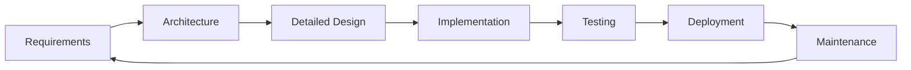

# Software Development Directory Standard

## Overview

This standard defines a comprehensive directory and documentation structure for software projects, designed to enable AI agents to effectively maintain large-scale projects with clear responsibilities and complete traceability.

### Background

This standard addresses two critical challenges in AI-assisted software development:

1. **AI struggles with large project maintenance**: AI agents often waste time and tokens on repeated searches, face context limitations, and may apply superficial fixes that mask underlying issues.

2. **AI lacks autonomous maintenance capabilities**: Decisions about module splitting and refactoring require human guidance. A standardized, traceable structure enables AI to proactively identify issues and report them to humans for approval.

### Key Benefits

- **Eliminates search waste**: Complete file mapping through `structure.md`
- **Reduces context overhead**: Interface-based module boundaries
- **Enables autonomous analysis**: AI can assess project health and suggest improvements
- **Ensures traceability**: Every change tracked from requirements to implementation

## Core Principles

1. **Strict Waterfall Model**: Requirements → Architecture → Design → Implementation → Testing → Deployment → Maintenance
2. **Documentation First**: All documents must be updated before code changes during maintenance
3. **Complete File Coverage**: Every file must be documented in `structure.md` (recursively)
4. **Interface as Contract**: Module interfaces are the only bridge for external interaction
5. **Change Propagation**: Upper-layer changes must propagate to lower layers via `.changed.md` files

## Development Process

### Phase Overview



### Maintenance Update Order

**CRITICAL**: During maintenance, documents must be updated in strict order:

1. Update `requirements.md` (if requirements changed)
2. Update `architecture.md` (if architecture affected)
3. Update `design.md` (if design affected)
4. Update code

**Never** modify code before updating relevant upstream documents.

## Document Standards

### Language and Format

- **Language**: English only (file names and content)
- **Format**: Markdown with Mermaid diagrams
- **Diagrams**: Use Mermaid for all diagrams (embedded in markdown)

### Requirements Phase

**File**: `docs/requirements.md`

**Required Sections** (in order):
1. Overview
2. Functional Requirements

**Optional Sections** (in order, if present):
3. Non-functional Requirements
4. Constraints
5. Assumptions
6. Dependencies

**Splitting Rule**: If `requirements.md` exceeds 8KB, split into:
- `requirements.md` (main entry with overview and links)
- `requirements-{topic}.md` (detailed requirements by topic)

### Architecture Phase

**File**: `docs/architecture.md`

**Required Sections** (in order):
1. System Architecture
2. Module Design
3. Technology Stack

**Optional Sections** (in order, if present):
4. Interface Design
5. Data Design

**Splitting Rule**: If `architecture.md` exceeds 8KB, split into:
- `architecture.md` (main entry with overview and links)
- `architecture-{module}.md` (detailed architecture by module)

### Detailed Design Phase

**File Location**: Flexible based on project complexity

**Option 1: Project-level** (for simple projects or few modules):
- `docs/design.md` (alongside requirements and architecture)
- `docs/design-{module}.md` (if split by module)

**Option 2: Module-level** (recommended when design docs are numerous):
- `{module}/docs/design.md` (within each module)
- `{module}/docs/design-{component}.md` (if split by component)

**Splitting Rule**: If `design.md` exceeds 8KB, split into:
- `design.md` (main entry with overview and links)
- `design-{module}.md` or `design-{component}.md` (detailed designs)

**Content**: 
- Module internal design
- Links to interface code (relative paths)
- Instance creation instructions

**Organization Guideline**:
- Start with project-level (`docs/design.md`) for simplicity
- Move to module-level when design docs become numerous (>3 modules)
- Keep consistency: don't mix both approaches in the same project

### Implementation Phase

**Interface Code**:
- Location: Anywhere within module (unified folder if multiple interfaces)
- Comments: Free format, must explain usage
- Referenced by: `design.md` with relative path links

**Interface as Contract**:
- External code must ONLY interact through documented interfaces
- No direct access to module internals

### Testing Phase

**File**: `docs/testing.md` (optional)

**When Required**: Only when test cases alone are insufficient (e.g., requires real service startup)

**Location**: Project root directory

### Deployment Phase

**File**: `deployment.md`

**Location**: Root directory of deployment unit (project root or subdirectory root)

**Sections**: All optional, based on complexity

Common sections:
- Prerequisites
- Installation Steps
- Configuration
- Deployment Process
- Verification
- Troubleshooting
- Rollback

## Directory Structure

### Basic Structure

```
project-root/
├── docs/
│   ├── structure.md          (REQUIRED: File layout documentation)
│   ├── requirements.md        (REQUIRED: Requirements)
│   ├── requirements-*.md     (Optional: Split requirements if > 8KB)
│   ├── architecture.md        (REQUIRED: Architecture)
│   ├── architecture-*.md     (Optional: Split architecture if > 8KB)
│   ├── design.md             (Optional: Project-level design for simple projects)
│   ├── design-*.md           (Optional: Split designs if > 8KB)
│   ├── testing.md            (Optional: Testing documentation)
│   └── deployment.md         (REQUIRED: Deployment)
├── module-a/
│   ├── docs/
│   │   ├── structure.md      (REQUIRED: Module file layout)
│   │   ├── design.md         (Optional: Module-level design for complex projects)
│   │   └── design-*.md       (Optional: Split designs if > 8KB)
│   ├── interface.ts          (Interface code)
│   └── ...                   (Implementation)
├── module-b/
│   └── ...
└── tests/
```

### Flexible Organization

- **No mandatory `src/` directory**: Modules can be direct subdirectories of project root
- **Recursive structure**: Subdirectories can be modules or sub-requirements
- **Document location**: Determined by `structure.md` in each `docs/` directory

### File Layout Documentation

**File**: `structure.md` (in every `docs/` directory)

**Purpose**: Document all files in current scope

**Format**: Tree structure in txt code block

**Rules**:
1. Folders end with `/`
2. Unexpanded folders must contain their own `structure.md`
3. Custom folders must explain their purpose (except `docs/`, `src/`)
4. Industry-standard files (`.gitignore`, `package.json`) only need name listed
5. Must cover ALL files recursively
6. No file type distinction (extension is sufficient)
7. No dependency documentation (covered in design docs)

**Example**:

````markdown
# File Structure

```txt
project-root/
├── .gitignore
├── package.json
├── docs/
│   ├── structure.md
│   ├── requirements.md
│   ├── architecture.md
│   └── deployment.md
├── auth-module/              - Authentication and authorization
│   ├── docs/
│   │   ├── structure.md
│   │   └── design.md
│   ├── interface.ts
│   └── impl.ts
└── storage-module/           - Data persistence layer
    └── ...                   (has its own structure.md)
```

**Custom Folders**:
- `auth-module/`: Handles user authentication and authorization
- `storage-module/`: Manages data persistence and caching
````

## Change Tracking Mechanism

### Purpose

Track upstream document changes and signal downstream updates needed.

### Change Files

**Naming**: `{filename}.changed.md`

**Location**: Same directory as the changed document

**Meaning**: Presence of `.changed.md` indicates downstream has pending updates

**Lifecycle**: Delete after downstream updates complete

### Format

```markdown
# Changes to {filename}

## Change Date
YYYY-MM-DD

## Changed By (Optional)
Agent ID or developer name

## What Changed
- Item 1: Description of change
- Item 2: Description of change

## Original Content (If Necessary)
### Section that was changed
\```
Original content here
\```

## Impact
Brief description of what downstream documents/code need updating
```

### Propagation Flow

```
requirements.md changed
    ↓
requirements.changed.md created
    ↓
architecture.md updated
    ↓
requirements.changed.md deleted
architecture.changed.md created
    ↓
design.md updated
    ↓
architecture.changed.md deleted
design.changed.md created
    ↓
Code updated
    ↓
design.changed.md deleted
```

### Exceptions

**`structure.md` does NOT use this mechanism** - file layout changes are self-evident.

## Traceability

### Implementation Method

Use markdown links to reference specific sections in upstream documents.

### Example

In `architecture.md`:
```markdown
## Authentication Module

This module implements the authentication requirements specified in 
[Functional Requirements - User Authentication](../docs/requirements.md#user-authentication).
```

In `design.md`:
```markdown
## Authentication Flow

Implements the authentication architecture described in 
[Architecture - Authentication Module](../../docs/architecture.md#authentication-module).

### Interface

See [AuthInterface](../interface/auth.ts) for the public API.
```

In code comments:
```typescript
/**
 * Authenticates user credentials
 * 
 * Design: See docs/design.md#authentication-flow
 * Requirements: See docs/requirements.md#user-authentication
 */
export function authenticate(credentials: Credentials): Promise<Token> {
  // ...
}
```

## Complete Example

### Project Structure

```txt
my-project/
├── .gitignore
├── package.json
├── docs/
│   ├── structure.md
│   ├── requirements.md
│   ├── requirements-auth.md
│   ├── architecture.md
│   ├── architecture-auth.md
│   └── deployment.md
├── auth/
│   ├── docs/
│   │   ├── structure.md
│   │   ├── design.md
│   │   └── design-oauth.md
│   ├── interface/
│   │   ├── auth.ts
│   │   └── session.ts
│   └── impl/
│       ├── password.ts
│       └── oauth.ts
├── storage/
│   ├── docs/
│   │   ├── structure.md
│   │   └── design.md
│   ├── interface.ts
│   └── impl.ts
└── tests/
    └── ...
```

### Root structure.md

````markdown
# File Structure

```txt
my-project/
├── .gitignore
├── package.json
├── docs/
│   ├── structure.md
│   ├── requirements.md
│   ├── requirements-auth.md
│   ├── architecture.md
│   ├── architecture-auth.md
│   └── deployment.md
├── auth/                     - Authentication module
├── storage/                  - Storage module
└── tests/
    └── ...
```

**Note**: `auth/` and `storage/` have their own `structure.md` files.
````

### Module structure.md

````markdown
# Auth Module File Structure

```txt
auth/
├── docs/
│   ├── structure.md
│   ├── design.md            - Main design document
│   └── design-oauth.md      - OAuth implementation details
├── interface/
│   ├── auth.ts              - Authentication interface
│   └── session.ts           - Session management interface
└── impl/
    ├── password.ts          - Password authentication
    └── oauth.ts             - OAuth implementation
```
````

### Change Tracking Example

When `requirements.md` changes:

**File**: `docs/requirements.changed.md`

```markdown
# Changes to requirements.md

## Change Date
2024-01-15

## Changed By
Agent-007

## What Changed
- Added OAuth 2.0 authentication requirement
- Modified session timeout from 30 minutes to 1 hour

## Original Content
### Session Management
```
Sessions expire after 30 minutes of inactivity.
```

## Impact
- `architecture.md`: Need to add OAuth provider integration
- `auth/docs/design.md`: Need to design OAuth flow
- `auth/interface/auth.ts`: Need to add OAuth methods
```

## Implementation Checklist

### For New Projects

1. Create root `docs/` directory
2. Create `docs/structure.md` (document all root-level files)
3. Create `docs/requirements.md` (with required sections)
4. Create `docs/architecture.md` (with required sections)
5. For each module:
   - Create `{module}/docs/structure.md`
5. Create design documents:
   - For simple projects: Create `docs/design.md` (project-level)
   - For complex projects: Create `{module}/docs/design.md` for each module
   - Create interface code and link in design docs
6. Create `docs/deployment.md`

### For Existing Projects

1. Add `docs/structure.md` to document current state
2. Gradually add phase documents (requirements → architecture → design)
3. Refactor modules to expose clear interfaces
4. Update `structure.md` as files are added/moved
5. Establish `.changed.md` workflow for future changes

### For Maintenance

1. Identify what changed (requirements, architecture, or design)
2. Update upstream documents first (split if exceeds 8KB)
3. Create `.changed.md` for each updated document
4. Update downstream documents in order (split if exceeds 8KB)
5. Delete `.changed.md` after downstream updates complete
6. Update code last
7. Update `structure.md` if files added/removed/split

## AI Agent Guidelines

### When Reading a Project

1. Start with root `docs/structure.md` to understand file organization
2. Read `docs/requirements.md` to understand what the project does
3. Read `docs/architecture.md` to understand system structure
4. For specific modules, read design docs:
   - Project-level: `docs/design.md` or `docs/design-{module}.md`
   - Module-level: `{module}/docs/design.md`
5. For module usage, read interface code linked in design docs
6. Check for `.changed.md` files to identify pending updates

### When Modifying a Project

1. Check if requirements changed → Update `requirements.md` first
2. Check if architecture affected → Update `architecture.md` next
3. Check if design affected → Update design docs (project-level or module-level)
4. Create `.changed.md` for each updated document
5. Update code last
6. Update `structure.md` if files added/removed
7. Delete `.changed.md` after completing downstream updates

### When Analyzing Project Health

**Signals for Document Split**:
- `requirements.md` exceeds 8KB
- `architecture.md` exceeds 8KB
- Any `design.md` exceeds 8KB
- Multiple unrelated topics in one document
- Document becomes difficult to navigate

**Signals for Module Split**:
- Multiple unrelated responsibilities in one module
- Interface file has too many unrelated methods

**Signals for Refactoring**:
- Frequent code changes without document updates
- Multiple `.changed.md` files accumulating
- Interface changes frequently (unstable contract)
- Design doc doesn't match implementation

**Report to Human**:
- Detected split/refactor need with evidence
- Proposed solution with impact analysis
- Wait for human approval before proceeding

## Appendix: Document Templates

### requirements.md Template

```markdown
# Requirements

## Overview

Brief description of the project purpose and scope.

## Functional Requirements

### Feature 1
Description of feature 1.

### Feature 2
Description of feature 2.

## Non-functional Requirements (Optional)

### Performance
Performance requirements.

### Security
Security requirements.

## Constraints (Optional)

List of constraints.

## Assumptions (Optional)

List of assumptions.

## Dependencies (Optional)

List of dependencies.
```

**Note**: If this file exceeds 8KB, split into:
- `requirements.md` (main entry with overview and links to split files)
- `requirements-{topic}.md` (detailed requirements, e.g., `requirements-auth.md`, `requirements-storage.md`)

### architecture.md Template
```markdown
# Architecture
## System Architecture
High-level system architecture description with diagrams.
\```mermaid
graph TD
    A[Component A] --> B[Component B]
    B --> C[Component C]
\```
## Module Design
### Module A
Description and responsibilities.
### Module B
Description and responsibilities.
## Technology Stack
- Language: TypeScript
- Framework: Node.js
- Database: PostgreSQL
- ...
## Interface Design (Optional)
API design overview.
## Data Design (Optional)
Database schema and data flow.
```
**Note**: If this file exceeds 8KB, split into:
- `architecture.md` (main entry with overview and links to split files)
- `architecture-{module}.md` (detailed architecture, e.g., `architecture-auth.md`, `architecture-storage.md`)

### design.md Template

**For Project-level design** (`docs/design.md`):
```markdown
# Design

## Overview
Project design overview.

## Module A Design
### Architecture Reference
Implements [Architecture - Module A](./architecture.md#module-a).

### Interface
Public API: [Module A Interface](../module-a/interface.ts)

### Creating Instance
\```typescript
import { ModuleA } from './module-a/interface';
const instance = new ModuleA(config);
\```

### Internal Design
Component descriptions...

## Module B Design
...
```

**For Module-level design** (`{module}/docs/design.md`):
```markdown
# {Module Name} Design

## Overview
Module purpose and scope.

## Architecture Reference
Implements [Architecture - {Module Name}](../../docs/architecture.md#{module-name}).

## Interface
Public API: [Interface Code](../interface.ts)

### Creating Instance
\```typescript
import { ModuleName } from './interface';
const instance = new ModuleName(config);
\```

## Internal Design
### Component 1
Internal component description.

### Component 2
Internal component description.

## Data Flow
\```mermaid
sequenceDiagram
    Client->>Interface: request
    Interface->>Internal: process
    Internal->>Interface: response
    Interface->>Client: result
\```
```

**Note**: If any `design.md` exceeds 8KB, split into:
- `design-{component}.md` (detailed design, e.g., `design-oauth.md`, `design-session.md`)

---

**Version**: 1.0  
**Last Updated**: 2024-01-15  
**Status**: Draft
